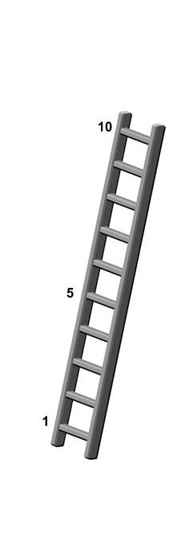

<!-- TOC highlight color -->
<style>
.list-group-item.active, .list-group-item.active:focus, .list-group-item.active:hover {
    background-color: #246B69;
}


<!-- To have nice indentation in toc float -->
.tocify-header {
  text-indent: initial;
}

.tocify-subheader > .tocify-item {
  text-indent: initial;
  padding-left: 2em;
}

/* Third-level header */
.tocify-subheader .tocify-subheader > .tocify-item {
  text-indent: initial;
  padding-left: 4em; /* Adjust the padding as needed */
}

/* Fourth-level header */
.tocify-subheader .tocify-subheader .tocify-subheader > .tocify-item {
  text-indent: initial;
  padding-left: 6em; /* Adjust the padding as needed */
}

</style>


```{r setup, include = FALSE}
library(tidyverse)
library(here)
library(gt)
library(ggplot2)
library(scales)
library(ggpubr)


knitr::opts_chunk$set(warning = FALSE,
                      message = FALSE,
                      echo = FALSE)

theme_set(theme_light())

#import included survey items
# data <- read_csv(here("do_not_push", "tpw_data_77included.csv"))

#import df of calculated survey items
#complete_rnd2 <- read_csv(here("do_not_push", "round_two_measures_data_calc.csv"))

# import telephone survey data 
complete <- read_csv(here("do_not_push","tpw_archive_calc.csv"))

# import survey data header for parsing question text
# Maria to update filename
qualtrics <- read_csv(here("do_not_push", "tpw_raw_qualtrics_5-30-23.csv"))

source(here("functions", "codebook_fun.R"))
```

```{css style settings, echo = FALSE}
blockquote {
    padding: 10px 20px;
    margin: 0 0 20px;
    font-size: 13px;
    border-left: 5px solid #eee;
}
```

```{r plot-style, echo=FALSE}
# Color palettes 
 Two_color = c("#246B69", "#604C41")

# Histogram style 
# hist_style <- geom_histogram(bins=20, color = "white", fill = "#246B69", alpha = 0.7)


bar_style <- geom_bar(color = "white", fill = "#246B69", alpha = 0.7)

THEME <-     theme(panel.grid.major = element_blank(),
          panel.grid.minor = element_blank(),
          panel.background = element_rect(fill = "transparent"),
          panel.border = element_blank(),
          axis.line = element_line(colour = "black",size = .8),
          axis.text = element_text(size = 10), axis.title = element_text(size = 10),
          legend.text = element_text(size = 10),legend.key = element_rect(fill = "White", colour = "transparent"),plot.title = element_text(size= 13),
    )
```

```{r cutoff-plot-function}
#re-work JP cutoff function due to error "cant use `{{` in non-quoting function
cutoff_plot2 <- function(data,
                        x,
                        cutoff = 0,
                        cutoff_color = '#324B4A',
                        cutoff_other = NULL,
                        cutoff_other_color = '#95B1AF',
                        cutoff_other2 = NULL,
                        cutoff_other2_color = '#546085',
                        bins = 20) {

  library(magrittr)
  library(dplyr)
  library(ggplot2)

  x <- enquo(x)

  if (is.null(cutoff_other)) {
    data %>%
      ggplot(aes(!!x)) +
      geom_histogram(bins = bins,
                     color = 'white',
                     fill = '#246B69',
                     alpha = .7) +
      geom_vline(xintercept = cutoff,
                 color = cutoff_color,
                 linetype = 2,
                 linewidth = 1.25)+
    theme(panel.grid.major = element_blank(),
          panel.grid.minor = element_blank(),
          panel.background = element_rect(fill = "transparent"),
          panel.border = element_blank(),
          axis.line = element_line(colour = "black",size = .8),
          axis.text = element_text(size = 10), axis.title = element_text(size = 10),
          legend.text = element_text(size = 10),
          legend.key = element_rect(fill = "White",
                                    colour = "transparent"),
          plot.title = element_text(size= 20),
          #scale_x_discrete(guide = guide_axis(n.dodge=3))
    )
  } else if (is.null(cutoff_other2)) {
    data %>%
      ggplot(aes(!!x)) +
      geom_histogram(bins = bins,
                     color = 'white',
                     fill = '#246B69',
                     alpha = .7) +
      geom_vline(xintercept = cutoff,
                 color = cutoff_color,
                 linetype = 2,
                 linewidth = 1.25) +
      geom_vline(xintercept = cutoff_other,
                 color = cutoff_other_color,
                 linetype = 3,
                 linewidth = 1.25)+
    theme(panel.grid.major = element_blank(),
          panel.grid.minor = element_blank(),
          panel.background = element_rect(fill = "transparent"),
          panel.border = element_blank(),
          axis.line = element_line(colour = "black",size = .8),
          axis.text = element_text(size = 10), axis.title = element_text(size = 10),
          legend.text = element_text(size = 10),
          legend.key = element_rect(fill = "White",
                                    colour = "transparent"),
          plot.title = element_text(size= 13),
          #scale_x_discrete(guide = guide_axis(n.dodge=3))
    )
  } else {
    data %>%
      ggplot(aes(!!x)) +
      geom_histogram(bins = bins,
                     color = 'white',
                     fill = 'black',
                     alpha = .7) +
      geom_vline(xintercept = cutoff,
                 color = cutoff_color,
                 linetype = 2,
                 linewidth = 1.25) +
      geom_vline(xintercept = cutoff_other,
                 color = cutoff_other_color,
                 linetype = 3,
                 linewidth = 1.25) +
      geom_vline(xintercept = cutoff_other2,
                 color = cutoff_other2_color,
                 linetype = 4,
                 linewidth = 1.25)+
    theme(panel.grid.major = element_blank(),
          panel.grid.minor = element_blank(),
          panel.background = element_rect(fill = "transparent"),
          panel.border = element_blank(),
          axis.line = element_line(colour = "black",size = .8),
          axis.text = element_text(size = 10), axis.title = element_text(size = 10),
          legend.text = element_text(size = 10),
          legend.key = element_rect(fill = "White",
                                    colour = "transparent"),
          plot.title = element_text(size= 13),
          #scale_x_discrete(guide = guide_axis(n.dodge=3))
    )
  }
}

# gt-theme-general
apply_tbl_theme <- function(table) {
  table %>% 
  tab_style(style = list(cell_borders(sides = "all", color = "black", weight = px(1))),
            locations = cells_body(columns = everything())) %>% 
  tab_style(style = list(cell_borders(sides = "all", color = "black", weight = px(1)),
                         cell_fill(color = "#246B69", alpha = .7)),
            locations = cells_column_labels()) %>% 
  tab_options(column_labels.border.top.color = "black",
              column_labels.border.bottom.color = "black",
              table_body.border.bottom.color = "black",
              table.border.top.color = "white",
              heading.border.bottom.color = "black",
              table_body.hlines.color = "white")%>% 
  tab_options(table.align = "left")
}

#theme for value label tables
apply_labtab_theme <- function(table) {
  table %>% 
  cols_align(columns = everything(), align = "center") %>% 
  tab_style(style = list(cell_borders(sides = "all", color = "black", weight = px(1))),
            locations = cells_body(columns = everything())) %>% 
  tab_style(style = list(cell_borders(sides = "all", color = "black", weight = px(1)),
                         cell_fill(color = "#246B69", alpha = .7)),
            locations = cells_column_labels()) %>% 
  tab_options(column_labels.border.top.color = "black",
              column_labels.border.bottom.color = "black",
              table_body.border.bottom.color = "black",
              table.border.top.color = "white",
              heading.border.bottom.color = "black",
              table_body.hlines.color = "white") %>% 
  tab_options(table.align = "left")
}
  
```
# Overview

## Longitudinal Study Background  

This study is a longitudinal extension which aims to further our understanding of trajectories of adult offending in a sample of 158 (n = 8 participants are now deceased) women who participated in a randomized intervention trial aimed at reducing conduct problems and delinquency during adolescence. The study was originally supported and funded through the Oregon Youth Authority and by Grant R01 DA015208 (P.I., Patricia Chamberlain, Ph.D.) from the National Institute on Drug Abuse, and by Grant R01 MH054257 (P.I., Patricia Chamberlain, Ph.D.) from the National Institute of Mental Health. In the original study, juvenile justice involved girls ages 13 – 17 who had been referred for out-of-home placement due to chronic delinquency were randomly assigned to participate in services as usual (group care; GC) or in Treatment Foster Care Oregon (TFCO, Chamberlain, 2003). The first extension of this longitudinal study was funded by Grant R01 DA024672 (P.I., Leslie Leve, Ph.D.). That study examined the developmental pathways of risk for juvenile justice involved girls into young adulthood with the original participants who were at the time, ages 16-29 years.


## Study Goals (udpate these TODO Maria)

-   **Goal 1** Explore the constellation of risk factors and risk processes in the lives of adult women with histories in the juvenile justice system   

-   **Goal 2** Understand how justice involvement is related to women's health outcomes, including biological indicators of health and stress.

-   **Goal 3** Examine the potential long-term impact of Treatment Foster Care Oregon, a gender-specific intervention. 

 Maria add references if needed
*Additional info to possibly include: links to
supplemental materials, any disclaimers/info we think data users need to
know to use these data accurately* Shaina/Min anything here? I think we have disclaimers and can use them in each measure, but anything overall?
One I am thinking of is that some publications contain data from other waves. 

### Data and Study Author Contact

If you have questions about the data or study, please contact the Principal Investigator, Maria Schweer-Collins through email and please use the subject "NACJD Turning Points Data Query" in the subject line. You can contact Maria through email at mariasc@iastate.edu.

### Credit Author Statement

**Schweer-Collins** conceptualization; software; validation; data curation (specifically checking code for data cleaning and codebook creation, managed data archival) project administration; supervision; funding acquisition; **Trevino** software; validation; data curation (specifically developing codebook, functions, and protocols, data cleaning, codebook creation; data archival); supervision; **Pedroza** software; data curation (specifically making functions used in codebook, data retrieval from Qualtrics; cleaning; codebook creation, visualization); **Zhang** software; validation; data curation (specifically making functions used in codebook, primary responsibility for data retrieval from Qualtrics; data cleaning, codebook creation, visualization)

## Data Collection Activities in this Wave  

There were several data collection activities. First, one telephone interview was conducted with original participants (*M* = 18 years after each participants’ baseline assessment). This interview lasted approximately 2 hours and included an assessment of the following constructs: parenting, partner characteristics, health-risking behaviors, mental health and trauma/victimization experiences, and public system involvement. The second part of the assessment was a 1 hour biological and physical health assessment. While prior waves collected limited information on self-reported health, this longitudinal extension also included a more robust battery of health conditions and a robust battery of 12 biomarkers, used to assess allostatic load, including cardiovascular, metabolic, and immune system function. This biological assessment was conducted either in person or virtually due to COVID-19 restrictions. Last, arrest records from the adult corrections system were collected. The age at last known arrest, number of arrests, whether each resulted in incarceration, and the length of incarceration was coded from the records and archived in aggregate to ensure that records are not identifiable.

## Data and Codebook Guide

### Study Acronymns

```{r abbreviation_table, results = 'asis'}

abbrev_table_df <- data.frame(
  abbrev = c("TP", "TC", "NIJ", "CINT"),
  descrip = c(
    "This acronym is used to refer to the name of this study, the Turning Points Study for Women. References in this codebook and in subsequent publications regarding the Turning Points study may or may not include data only from this assessment or data that also draw on the prior 13 waves of data, as we use this study name to refer to the entire longitudinal study.",
    "In this study, we refer to original participants as TCs, which means 'Target Child.' This acronym has been continued because the original participants were minors at the start of this longitudinal study. Please note that we have continued to use this acronym to distinguish our original sample from other participants (e.g., partners of original participants, the offspring of original participants). The data represented in this codebook were collected only from original participants, not from partners, caregivers, or offspring.",
    "NIJ is the acronym for the National Institute of Justice. NIJ funded this study and therefore the organization is referred to throughout our documentation and forthcoming publications and presentations.",
    "CINT is our study name for 'Child Interview' and refers to an assessor administered interview that has been delivered to our participants at each wave of the longitudinal study, with some slight variation according to developmental stage and the focus of each assessment. This CINT interview includes information about demographics, substance use, and relationship variables. "
  ),
  stringsAsFactors = FALSE
)

#create table
abbrev_table <- abbrev_table_df %>%
  gt() %>% 
  tab_options(table.border.top.width = 1, table.border.bottom.width = 1,
              table.border.left.width = 1, table.border.right.width = 1) %>% 
  cols_width(abbrev ~ px(100),
             descrip ~ px(600)) %>%
  tab_style(style = cell_text(align = "left"),locations = cells_body(columns = vars("descrip"))) %>%
 # cols_align(align = "left") %>%
  cols_label(abbrev = "Abbreviation",
            descrip = "Full Name and Explanation") %>%
  apply_labtab_theme()


# Print the table
print(abbrev_table)

```


### Introduction to Codebook Structure

This document provides a summary of each measure assessed in the Turning Points for Women Study. Most of the measures described here have actual or potential computed scale scores. Some measures, however, are simply collections of individual items (e.g., demographic variables). We have tried to use the official name of each measure as the heading for each section; many measures, however, do not have official names and therefore the chosen name is arbitrary. If you cannot find a study measure in the table of contents, you may want to search for a keyword in this document.

For each measure, this document typically contains the following descriptive information:

-   A brief description of what the instrument measures  

-   Pertinent references  

-   All measures were collected from the original study participant unless otherwise indicated  

-   Variable name, variable description, and notes about the variable, for example, if a variable should be reverse scored or if a variable was not adminstered to participants who were incarcerated at the time of the assessment   

-   Description of how missing data is coded and handled in scale scores. Generally, this information is covered in the introductory materials as missing codes are consistent across *all* study variables, but if exceptions apply, they will be noted in the cleaning script and this codebook.  

-   Formulas for creating scale scores and the resulting variables  

-   Coefficient alphas of scales or subscale scores and notes about their distribution and valid ranges of the data  


### Missing Data

-   Truly missing = `NA` (blank in file or -99): The question should
    have been asked of the respondent, but for a reason other than those
    listed below, no answer was given or recorded.

    This -99 is also given in the case of a computed subscale or total
    score or other summary when the percentage of missing data is
    outside what is allowable for missing data rules

-   Not Applicable = -55: The subject was never asked a question for
    some reason (conditional question)

-   Don't Know = -66: The subject was unable to answer a question,
    either because he or she had no opinion or because the required
    information was not available (could not recall).

-   Refusal/No Answer = -77: The subject explicitly refused to answer a
    question or did not answer it when he or she should have.

-   No Match = -88: This situation arises when data are drawn from
    different sources (for example, a survey questionnaire and an
    administrative database), and information from one source cannot be
    located.

-   Processing Error = -44: For some reason, there is no answer to the
    question, although the subject provided one. This can result from
    interviewer error, incorrect coding, machine failure, or other
    problems

### Missing Data Rule

For summary or subscale scores that are computed with individual items, any of the above reasons are included in computing the percent of missing data. The following missing data rules are below and follow procedures used throughout the history of this longitudinal study. In some cases, measure specific guidelines for handling missing data were used when those guidelines were more stringent. Exceptions are called out within individual measure documentation.
Note that 

-   For scales with [10 or more items]{.underline}, a composite score
    (average/total) is computed for each participant that have less than
    [20%]{.underline} of the items from that measure missing

-   For scales with [7 to 9 items]{.underline}, a composite score
    (average/total) is computed for each participant that have less than
    [30%]{.underline} of the items from that measure missing

-   For scales with [3 to 6 items]{.underline}, a composite score
    (average/total) is computed for each participant that have less than
    [33%]{.underline} of the items from that measure missing

-   For scales with [only 2 items]{.underline}, composite scores
    (average/total) are calculated on a [case by case basis]{.underline}


# CINT 

CINT is our study name for 'Child Interview' and refers to an assessor administered interview that has been delivered to our participants at each wave of the longitudinal study, with some slight variation according to developmental stage and the focus of each assessment. This CINT interview includes information about demographics, substance use, and relationship variables. 

## CINT-Sociodemographics (CINT-SOCIO)

### CINT-SOCIO Description


-   Numbering retains the original numbers as the data were collected. Although the numbers are slightly out of order and appear to be missing items, this is by design as other CINT items are documented in other CINT sections or are variables that were for skip rules or screening only. 

-   No items need to be reverse scored. 

-   This is not a standardized questionnaire, so the missing data rule was not applied. No total or subscale scores were computed. 


Reference:
Oregon Social Learning Center (OSLC) Instrument [Unpublished]

### CINT-SOCIO Variables

#### Value Labels and Survey Items 

All CINT-SOCIO variables have multiple responses options, value labels for each variable can be found in the survey items table below. 

CINT-SOCIO survey items are presented in the following table:


```{r CINT-SOCIODEMS-var-prep}
# Pull question wording from Qualtrics data
cint_sociodems_word <- qualtrics %>% 
  select(`CINT-0`: `CINT Income Support`, CINTIdentity, CINTIdentity_8_TEXT) %>%
  # When participants seleced option 1 in CINT1, they were permitted to select a second option. We divided these into two variables below 
  mutate(cint1_choice1 = CINT1) %>%
  rename(cint1_choice2 = CINT1) %>%
  rename(cint_income_support = `CINT Income Support`) %>%
  rename(cint_income = `CINT-Income`)  %>%
  relocate(cint1_choice1, .after = `CINT-0`) %>%
  rename(cint_0 = `CINT-0`)  %>%
  slice(1)

#create table with variable name, description, and notes
cint_sociodems_word_long <- cint_sociodems_word %>% 
  pivot_longer(cols = everything(), 
               names_to = "var_name",
               values_to = "description") %>% 
  mutate(description = str_replace(description, "^\\d+\\.\\s*", ""),
         description = str_replace(description, "READ:", ""),
         description = str_replace(description, "DO NOT READ THE FOLLOWING TEXT ALOUD", ""),
         var_name = str_to_lower(var_name),
         value = case_when(row_number() %in% c(4,5,6,7,8) ~ "1 = Yes 
                                             \n0 = No",
                           row_number() %in% c(1) ~ "1 = 8th grade or less or working towards GED
                                            \n 2 = Completed GED/Alternative H.S. diploma
                                            \n 3 = Completed some high school, but did not graduate
                                            \n 4 = Graduated high school
                                            \n 5 = Taking/have taken community college classes or working toward Associates Degree
                                            \n 6 = Completed/obtained an Associate's Degree
                                            \n 7 = Taking/have taken vocational classes or working toward Vocational Training
                                            \n 8 = Completed Vocational Training
                                            \n 9 = Taking/have taken 4 yr college classes or working toward 4 year college degree
                                            \n 10 = Completed 4 year college degree
                                            \n 11 = Taking/have taken graduate classes or working toward post-college degree
                                            \n 12 = Completed post-college degree
                                            \n -77 = Decline to Answer",
                           row_number() %in% c(2,3) ~ "1 = Currently Working
                                            \n 2 = Temporarily laid off
                                            \n 3 = On Leave
                                            \n 4 = Unemployed or looking for work
                                            \n 5 = Retired
                                            \n 6 = Disabled, permanently or temporarily
                                            \n 7 = Student
                                            \n 8 = Something else, please briefly describe
                                            \n -77 = Decline to Answer",
                           row_number() %in% c(9, 10) ~ "1 = Always or almost always
                                            \n 2 = Often
                                            \n 3 = About half the time
                                            \n 4 = Occasionally
                                            \n 5 = Never or almost never
                                            \n -55 = N/A, no bills to pay
                                            \n -77 = Decline to Answer", 
                           row_number() %in% c(11) ~ "1 = Always or almost always
                                            \n 2 = Often
                                            \n 3 = About half the time
                                            \n 4 = Occasionally
                                            \n 5 = Never or almost never
                                            \n -77 = Decline to Answer", 
                           row_number() %in% c(13) ~ "1 = Cisgender female or woman
                                            \n 2 = Cisgender male or man
                                            \n 3 = Female/Woman
                                            \n 4 = Male/Man
                                            \n 5 = Trans female/woman
                                            \n 6 = Trans male/man
                                            \n 7 = Non-binary
                                            \n 8 = Prefer to self-identify
                                            \n -77 = Decline to Answer")
         ) %>% 
# Edits Variable description and value
  mutate(description = if_else(var_name == "cint_0", "I have some questions about your school and work experiences. What is the highest level of education you have completed?", description)) %>%
  mutate(description = if_else(var_name == "cint1_choice1", "What is your current employment status? (Indicate all that apply)", description)) %>%
  mutate(description = if_else(var_name == "cint1_choice2", "What is your current employment status? (if option 1 was selected in cint1_choice1 than the participant can select another option)", description)) %>%
  mutate(description = if_else(var_name == "cint3", "Is this due to COVID-19 (if participant select 'temporarily laid off' in CINT1)", description)) %>%
  mutate(description = if_else(var_name == "cint4", "Is this due to COVID-19 (if participant select 'on leave' in CINT1)", description)) %>%
  mutate(description = if_else(var_name == "cint5", "Is this due to COVID-19 (if participant select 'unemployed or looking for work' in CINT1)", description)) %>%
  mutate(description = if_else(var_name == "cint1_8_text", "If 'something else, please briefly describe' was selected in cint1", description)) %>%
  mutate(description = if_else(var_name == "cintidentity", "What is your gender identity?", description)) %>%
  mutate(description = if_else(var_name == "cintidentity_8_text", "What is your gender identity? - Prefer to self-identify selected", description)) %>%
  mutate(description = if_else(var_name == "cint18", "During the past 6 months, how often have you had enough money to pay your bills/make your payments?", description)) %>%
  mutate(description = if_else(var_name == "cint_income", "What is your annual (gross) household income?", description)) %>%
  mutate(description = if_else(var_name == "cint_income_support", "How many people does that income support?", description)) %>%
  mutate(description = if_else(var_name == "cintpregnancy screen", "Has TC reported that she is currently pregnant?", description)) %>%
  mutate(value = if_else(var_name == "cint1_8_text", "Open Text Entry", value)) %>%
  mutate(value = if_else(var_name == "cint_income", "Open Text Entry", value)) %>%
  mutate(value = if_else(var_name == "cint_income_support", "Open Text Entry", value)) %>%
  mutate(value = if_else(var_name == "cintidentity_8_text", "Open Text Entry", value)) %>%
  rename(`Value` = value )
```

```{r cint_sociodems-var-table, results ='asis'}
# Create the gt table object and apply generic theme
cint_sociodems_gt_table <- gt(cint_sociodems_word_long)

# Table-specific formatting (col width, names)
cint_sociodems_gt_table <- cint_sociodems_gt_table %>% 
  cols_label(var_name = "Variable", 
            description = "Description"
            #notes = "Notes"
            ) %>% 
  apply_tbl_theme() %>% 
  cols_width(description ~ px(300),
             var_name ~ px(100)
             ) %>%
  tab_style(style = cell_text(align = "left"), locations = cells_column_labels())

# Print the table
print(cint_sociodems_gt_table)
```
### Summary Statistics

#### Descriptive Statistics

Only missing percentages for each variable are presented. 
  
```{r cint_socio-missing}
# Create subset of items
cint_socio_data_subset <- complete %>%
  select(cint_0:cint_income_support, cint_identity)

# Calculate the summary statistics for each variable
## mean is showing 2 decimals per authors
cint_socio_summary_data <- lapply(cint_socio_data_subset, function(x) {
  x <- replace(x, (x < -40 & x!= -55 & x!= -88), NA)  # Your original recoding
  x <- replace(x, (x == "-44" | x== "-77" | x== "-99"), NA)  # Additional recoding
  # Exclude negative values and specific negative values from calculations
  x_no_negatives <- replace(x, (x < 0 | x == -44 | x == -77 | x == -99), NA)
#  mean_val <- ifelse(all(is.na(x_no_negatives)), NA, sprintf("%.2f", round(mean(x_no_negatives, na.rm = TRUE), 2)))
#  sd_val <- ifelse(all(is.na(x_no_negatives)), NA, round(sd(x_no_negatives, na.rm = TRUE), 2))
#  range_val <- ifelse(all(is.na(x_no_negatives)), NA, paste(min(x_no_negatives, na.rm = TRUE), max(x_no_negatives, na.rm = TRUE), sep = "-"))
  miss_val <- round(mean(is.na(x)) * 100, 2)  # Calculate missing value percentage using original x
  c(Missing = paste(miss_val, "%", sep = ""))
})


# Convert summary_data to a data frame
cint_socio_summary_data <- as.data.frame(cint_socio_summary_data)

# Set items as first row
cint_socio_summary_data <- rbind(names(cint_socio_summary_data), cint_socio_summary_data) %>% 
  t() %>% 
  as.data.frame()

# Create the gt table
cint_socio_tbl <- cint_socio_summary_data %>%
  gt() %>%
  cols_label(`1` = "Variable",
             Missing = "% Missing") %>% 
  # cols_width(everything() ~ pct(100)) %>%
  cols_align(columns = c("Missing"), align = "left")  %>%
  # tab_options(table.border.bottom.style = "hidden") %>%
  apply_tbl_theme()

# Render the table
cint_socio_tbl

```


## CINT-Subjective Socioeconomic Status (CINT-SSES)
  
  
### CINT-SSES Description
  
To assess subjective socioeconomic status (SES), the MacArthur Scale of Subjective Social Status – Adult Version was administered as part of the CINT.

-   There are two items. 

-   No items need to be reverse scored. 

-   This measure has two single items, thus the missing data rule was not applicable. One participant is missing data. No total scores or subscales were computed. 

-   Participants rated themselves 1-10 using the image of a ladder shown below, with higher numbers indicating greater subjective socioeconomic status.

```{r ladder image, echo=FALSE, out.width = "30%", fig.align = "center"}

```

Reference:
[@adler1994socioeconomic](https://psycnet.apa.org/fulltext/1994-29613-001.pdf)
  
### CINT-SSES Variables
  
#### Value Labels and Survey Items 

CINT-SSES survey items are presented in the following table:

  
```{r CINT-LADDER-var-prep}
# Pull question wording from Qualtrics data
cint_ladder_word <- qualtrics %>% 
  select(`CINT-Ladder1`, `CINT-Ladder2`) %>%
  slice(1)

#create table with variable name, description, and notes
cint_ladder_word_long <- cint_ladder_word %>% 
  rename(cint_sses1 = `CINT-Ladder1`) %>%
  rename(cint_sses2 = `CINT-Ladder2`) %>%
  pivot_longer(cols = everything(), 
               names_to = "var_name",
               values_to = "description") %>%
  mutate(description = str_replace(description, "^\\d+\\.\\s*", ""),
         var_name = str_to_lower(var_name)) %>%
  # Edits Variable description and value
  mutate(description = if_else(var_name == "cint_sses1", "L1. Think of this ladder as representing where people stand in the United States. 
                               At the top of the ladder are the people who are the best off — those who have the most money, the most education, 
                               and the most respected jobs. At the bottom are the people who are the worst off – who have the least money, least 
                               education, and the least respected jobs or no job. The higher up you are on this ladder, the closer you are to the 
                               people at the very top; the lower you are, the closer you are to the people at the very bottom. Where would you 
                               place yourself on the ladder? Please take a moment to pick a rung where you think you stand at this time in your life, 
                               relative to other people in the United States. \nNow count starting from the bottom of the ladder to the top. 
                               Which number of rung did you place yourself on?", description)) %>%
  mutate(description = if_else(var_name == "cint_sses2", "L2. Think of this ladder as representing where people stand in their communities. 
                               People define community in different ways; please define it in whatever way is most meaningful to you. At the top 
                               of the ladder are the people who have the highest standing in their community. At the bottom are the people who 
                               have the lowest standing in their community. Where would you place yourself on this ladder. Please take a moment 
                               to pick a rung where you think you stand at this time in your life, relative to other people in your community. 
                               \n Now count starting from the bottom of the ladder to the top. Which number of rung did you place yourself on?", description))

 
```

```{r cint_ladder-var-table, results ='asis'}
# Create the gt table object and apply generic theme
cint_ladder_gt_table <- gt(cint_ladder_word_long)

# Table-specific formatting (col width, names)
cint_ladder_gt_table <- cint_ladder_gt_table %>% 
  cols_label(var_name = "Variable", 
             description = "Description"
             #notes = "Notes"
  ) %>% 
  apply_tbl_theme() %>% 
  cols_width(description ~ px(600),
             var_name ~ px(100)
  ) %>%
  tab_style(style = cell_text(align = "left"), locations = cells_column_labels())

# Print the table
print(cint_ladder_gt_table)
```


### Summary Statistics

#### Descriptive Statistics

```{r cint_ladder-missing}
# Create subset of items
cint_ladder_data_subset <- complete %>%
  select(cint_sses1, cint_sses2) 

# Calculate the summary statistics for each variable
## mean is showing 2 decimals per authors
cint_ladder_summary_data <- lapply(cint_ladder_data_subset, function(x) {
  x <- replace(x, (x < -40 & x!= -55 & x!= -88), NA)  # Your original recoding
  x <- replace(x, (x == "-44" | x== "-77" | x== "-99"), NA)  # Additional recoding
  # Exclude negative values and specific negative values from calculations
  x_no_negatives <- replace(x, (x < 0 | x == -44 | x == -77 | x == -99), NA)
  mean_val <- ifelse(all(is.na(x_no_negatives)), NA, sprintf("%.2f", round(mean(x_no_negatives, na.rm = TRUE), 2)))
  sd_val <- ifelse(all(is.na(x_no_negatives)), NA, round(sd(x_no_negatives, na.rm = TRUE), 2))
  range_val <- ifelse(all(is.na(x_no_negatives)), NA, paste(min(x_no_negatives, na.rm = TRUE), max(x_no_negatives, na.rm = TRUE), sep = "-"))
  miss_val <- round(mean(is.na(x)) * 100, 2)  # Calculate missing value percentage using original x
  c(mean_val, sd_val, range_val, Missing = paste(miss_val, "%", sep = ""))
})

# Convert summary_data to a data frame
cint_ladder_summary_data <- as.data.frame(cint_ladder_summary_data)

# Set items as first row
cint_ladder_summary_data <- rbind(names(cint_ladder_summary_data), cint_ladder_summary_data) %>% 
  t() %>% 
  as.data.frame()

# Create the gt table
cint_ladder_tbl <- cint_ladder_summary_data %>%
  gt() %>%
  cols_label(V1 = "Variable",
             V2 = "Mean",
             V3 = "SD",
             V4 = "Range",
             V5 = "% Missing") %>% 
  # cols_width(everything() ~ pct(100)) %>%
  cols_align(columns = c(V1:V5), align = "left") %>% 
  tab_footnote("*Range of data values") %>% 
  tab_options(table.border.bottom.style = "hidden") %>%
  apply_tbl_theme()

# Render the table
cint_ladder_tbl

```

## CINT-Relationship (CINT-R)

  
### CINT-R Description
  
This set of questions was administered as part of the CINT focus on the participant's relationships.

-   There are 18 items. 

-   No items need to be reverse scored. 

-   This measure is not a standardized questionnaire with scoring, thus the missing data rule was not applicable. No total scores or subscales were computed. 
 

Reference:
Oregon Social Learning Center (OSLC) Instrument [Unpublished]
  
### CINT-R Variables
  
#### Value Labels and Survey Items 
  
All CINT-R variables have multiple responses options, value labels for each variable can be found in the following table:

```{r CINT-relation-var-prep}
# Pull question wording from Qualtrics wording
cint_relation_word <- qualtrics %>% 
  select(`CINT20`: `CINT37`) %>%
  slice(1)

#create table with variable name, description, and notes
cint_relation_word_long <- cint_relation_word  %>% 
  pivot_longer(cols = everything(), 
               names_to = "var_name",
               values_to = "description") %>%
  mutate(var_name = str_to_lower(var_name)) %>%
  mutate(description = str_replace(description, "^\\d+\\.\\s*", ""),
         description = str_replace(description, "READ:", ""))%>%
         #description = str_replace(description, "Assessor Note: Assessor give them a few moments to decide.", "\n"),
  # Edits Variable description and value
  mutate(description = if_else(var_name == "cint20", " How many people in total have you been involved with romantically or 
                               sexually in the last 6 months (including current or any others)?", description)) %>%
  mutate(description = if_else(var_name == "cintq2", "Please think about the longest or most serious relationship 
                               over the past 6 months. How old was that partner?", description)) %>%
  mutate(description = if_else(var_name == "cintq3", "What was your relationship with that partner?", description)) %>% 
  mutate(description = if_else(var_name == "cint27", "On a scale of 1 to 10, with 1 being not at all well and 10 being 
                               very well, how well did you and your partner get along in the last 6 months 
                               (when seeing/dating your partner)?", description)) %>% 
  mutate(description = if_else(var_name == "cint27", "On a scale of 1 to 10, with 1 being not at all well and 10 being 
                               very well, how well did you and your partner get along in the last 6 months 
                               (when seeing/dating your partner)?", description)) %>% 
   mutate(description = if_else(var_name == "cint30", "How would you describe the way your partner drinks alcohol, 
                                on average, in the past 6 months?", description)) %>%    
    mutate(description = if_else(var_name == "cint30_7_text", "How would you describe the way your partner drinks 
                                 alcohol, on average, in the past 6 months? 'Other' selected, please specify:", description)) %>%     
    mutate(description = if_else(var_name == "cint31", "How would you describe the way your partner smokes pot, on average, 
                                 in the past 6 months?", description)) %>%     
    mutate(description = if_else(var_name == "cint31_7_text", "How would you describe the way your partner smokes pot, 
                                 on average, in the past 6 months? 'Other' selected, please specify", description)) %>%
    mutate(description = if_else(var_name == "cint31_7_text", "How would you describe the way your partner uses hard drugs, 
                                 on average, in the past 6 months? ", description)) %>%    
    mutate(description = if_else(var_name == "cint32_7_text", "How would you describe the way your partner uses hard drugs, 
                                 on average, in the past 6 months? 'Other' selected, please specify", description)) %>%    
    mutate(description = if_else(var_name == "cint33", "What is the highest level of school your partner has finished so far?", description)) %>%  
    mutate(description = if_else(var_name == "cint34", "On a scale of 1-10, with 1 being not at all supportive and 10 being very supportive, 
                                 how emotionally supportive is/was your partner of you in the last 6 months?", description)) %>%
    mutate(description = if_else(var_name == "cint35", "Now, I'd like to ask you about friends and other support in your life. 
                                 About how many close friends do you have?", description)) %>%
    mutate(description = if_else(var_name == "cint36", "Thinking about your life in the past 6 months, on average, how many days a week do 
                                 you currently get together socially with your friends outside of school or work?", description)) %>%
      mutate(description = if_else(var_name == "cint37", "Now, please think about all of your friends (all genders). Have any of your 
                                   friends been arrested in the last 6 months?", description)) %>%
    mutate(`Lable Value` = "") %>%
    mutate(`Lable Value` = if_else(var_name %in% c("cint28", "cint29", "cint37"), "1 = Yes
                                                                                   \n 0 = No
                                                                                   \n -66 = Don't Know
                                                                                   \n -77  = Decline to Answer", `Lable Value`)) %>%
    mutate(`Lable Value` = if_else(var_name %in% c( "cint20", "cintq2", "cint12", "cint30_7_text", "cint31_7_text", "cint32_7_text"), "Open Text Entry", `Lable Value`)) %>%
    mutate(`Lable Value` = if_else(var_name %in% c("cintq3"), "1 = Married
                                                               \n 2 = Living together
                                                               \n 3 = Dating or seeing each other, but not living together. This includes casual dating.
                                                               \n 4 = Married, but separated
                                                               \n -77 = Decline to Answer", `Lable Value`)) %>%
      mutate(`Lable Value` = if_else(var_name %in% c("cint26"), "1 = Not at all close
                                                                 \n 2
                                                                 \n 3 
                                                                 \n 4 
                                                                 \n 5 
                                                                 \n 6 
                                                                 \n 7 
                                                                 \n 8 
                                                                 \n 9 
                                                                 \n 10 = Extremely Close
                                                                 \n -77 = Decline to Answer", `Lable Value`)) %>%
      mutate(`Lable Value` = if_else(var_name %in% c("cint27"), "1 = Not at all well
                                                                 \n 2 
                                                                 \n 3 
                                                                 \n 4 
                                                                 \n 5 
                                                                 \n 6 
                                                                 \n 7 
                                                                 \n 8 
                                                                 \n 9 
                                                                 \n 10 = Very Well
                                                                 \n -77 = Decline to Answer", `Lable Value`)) %>%
      mutate(`Lable Value` = if_else(var_name %in% c("cint30"), "0 = Never                                                                  \n 1 = Drank alcohol only a few times during the year                                                                                             \n 2 = Drinks regularly for a few weeks or more, then doesn't for a few weeks or more or drinks, then stops drinking (ex: became clean and sober)
                                                                 \n 3 = Drinks about once a month
                                                                 \n 4 = Drinks on weekends or mostly on weekends
                                                                 \n 5 = Drinks daily or almost daily
                                                                 \n 6 = Other: (Specify)
                                                                 \n -66 = Don't know
                                                                 \n -77 = Decline to Answer", `Lable Value`)) %>%
      mutate(`Lable Value` = if_else(var_name %in% c("cint31"), "0 = Never
                                                              \n 1 = Smoked only a few times during the year
                                                              \n 2 = Smokes regularly for a few weeks or more, then doesn't for a few weeks or more or used, then stopped (ex: became clean and sober)
                                                              \n 3 = Smokes about once a month
                                                              \n 4 = Smokes on weekends or mostly on weekends or a few times a week
                                                              \n 5 = Smokes daily or almost daily
                                                              \n 6 = Other: (Specify)
                                                              \n -66 = Don't know
                                                              \n -77 = Decline to Answer" , `Lable Value`)) %>%
     mutate(`Lable Value` = if_else(var_name %in% c("cint32"), "0 = Never
                                                              \n 1 = Used hard drugs a limited number of times
                                                              \n 2 = Uses drugs regularly for a few weeks or more, then don't for a few weeks or more, or used, then stopped (ex: became clean and sober)
                                                              \n 3 = Uses drugs about once a month
                                                              \n 4 = Uses hard drugs on weekends or mostly on weekends or a few times a week
                                                              \n 5 = Uses hard drugs daily or almost daily
                                                              \n 6 = Other: (Specify)
                                                              \n -66 = Don't know
                                                              \n -77 = Decline to Answer", `Lable Value`)) %>%
     mutate(`Lable Value` = if_else(var_name %in% c("cint33"), "1 = Any grade up to the 12th grade, but not having a High School Diploma/GED
                                                             \n 2 = GED or Equivalency
                                                             \n 3 = High School Diploma
                                                             \n 4 = Attended Community College but no A.A.(Associates) degree
                                                             \n 5 = Community College degree, (A.A.)
                                                             \n 6 = Attended 4 year University or College, but no degree
                                                             \n 7 = B.A., B.S., BSN degree
                                                             \n 8 = Graduate degree (MA, MS, PhD)
                                                             \n 9 = Other (Technical, Vocational school)
                                                             \n -66 = Don't know
                                                             \n -77 = Decline to Answer" , `Lable Value`)) %>%
       mutate(`Lable Value` = if_else(var_name %in% c("cint34"), "1 = (Not at all Supportive)
                                                                 \n 2 
                                                                 \n 3 
                                                                 \n 4 
                                                                 \n 5 
                                                                 \n 6 
                                                                 \n 7
                                                                 \n 8 
                                                                 \n 9 
                                                                 \n 10 = 10 (Very Supportive)
                                                                 \n -77 = Decline to Answer" , `Lable Value`)) %>%
         mutate(`Lable Value` = if_else(var_name %in% c("cint35"), "0 = None
                                                                 \n 1 = One
                                                                 \n 2 = Two or three
                                                                 \n 3 = Four or more
                                                                 \n -77 = Decline to Answer" , `Lable Value`)) %>%
           mutate(`Lable Value` = if_else(var_name %in% c("cint36"), "0 = Never
                                                                 \n 1 = Less than once a week
                                                                 \n 2 = One
                                                                 \n 3 = Two or three
                                                                 \n 4 = Four or five
                                                                 \n 5 = Six or seven
                                                                 \n 6 = N/A, current living situation/setting provides no opportunity for socialization ( if says she is in a locked setting)
                                                                 \n -77 = Decline to Answer" , `Lable Value`))
  
  
```


```{r cint_relation-var-table, results ='asis'}
# Create the gt table object and apply generic theme
cint_relation_gt_table <- gt(cint_relation_word_long)

# Table-specific formatting (col width, names)
cint_relation_gt_table <- cint_relation_gt_table %>% 
  cols_label(var_name = "Variable", 
             description = "Description"
             #notes = "Notes"
  ) %>% 
  apply_tbl_theme() %>% 
  cols_width(description ~ px(300),
             var_name ~ px(100)
  ) %>%
  tab_style(style = cell_text(align = "left"), locations = cells_column_labels())

# Print the table
print(cint_relation_gt_table)
```


### Summary Statistics

#### Descriptive Statistics

Only missing percentages of variables are presented.

```{r cint_relation-missing}
# Create subset of items
cint_relation_data_subset <- complete %>%
  select(cint20, cintq2, cintq3, cint26:cint37)

# Calculate the summary statistics for each variable
## mean is showing 2 decimals per authors
cint_relation_summary_data <- lapply(cint_relation_data_subset, function(x) {
  x <- replace(x, (x < -40 & x!= -55 & x!= -88), NA)  # Your original recoding
  x <- replace(x, (x == "-44" | x== "-77" | x== "-99"), NA)  # Additional recoding
  # Exclude negative values and specific negative values from calculations
  x_no_negatives <- replace(x, (x < 0 | x == -44 | x == -77 | x == -99), NA)
#  mean_val <- ifelse(all(is.na(x_no_negatives)), NA, sprintf("%.2f", round(mean(x_no_negatives, na.rm = TRUE), 2)))
#  sd_val <- ifelse(all(is.na(x_no_negatives)), NA, round(sd(x_no_negatives, na.rm = TRUE), 2))
#  range_val <- ifelse(all(is.na(x_no_negatives)), NA, paste(min(x_no_negatives, na.rm = TRUE), max(x_no_negatives, na.rm = TRUE), sep = "-"))
  miss_val <- round(mean(is.na(x)) * 100, 2)  # Calculate missing value percentage using original x
  c(Missing = paste(miss_val, "%", sep = ""))
})

# Convert summary_data to a data frame
cint_relation_summary_data <- as.data.frame(cint_relation_summary_data)

# Set items as first row
cint_relation_summary_data <- rbind(names(cint_relation_summary_data), cint_relation_summary_data) %>% 
  t() %>% 
  as.data.frame()

# Create the gt table
cint_relation_tbl <- cint_relation_summary_data %>%
  gt() %>%
  cols_label(`1` = "Variable",
             Missing = "% Missing") %>% 
  # cols_width(everything() ~ pct(100)) %>%
  cols_align(columns = c("Missing"), align = "left") %>%
  tab_options(table.border.bottom.style = "hidden") %>%
  tab_footnote("") %>%
  apply_tbl_theme()


# Render the table
cint_relation_tbl

```


## CINT-Substances (CINT-Sub)

### CINT-Sub Description

This set of questions was administered as part of the CINT focus on the participant's substance use. All questions for substance use were drawn from an unpublished measure  but are aligned with typical retrospective reports of substance use similar to the widely used Timeline Follow-Back procedure (Sobell and Sobell, 1992).

-   There are 49 items. 

-   No items need to be reverse scored. 

-   This measure is not a standardized questionnaire with scoring, thus the missing data rule was not applicable. No total scores or subscales were computed. 

-   This survey was not administered for participants who were incarcerated at the time of the assessment. 

 

References:  

-   Oregon Social Learning Center (OSLC) Instrument [Unpublished]

-   [@rhoades2014drug]( https://doi.org/10.1111/jora.12077)

-   [@sobell1992timeline](https://link.springer.com/chapter/10.1007/978-1-4612-0357-5_3)
  
  
### CINT-Sub Variables
  
#### Value Labels and Survey Items 
  
All CINT-Sub variables have multiple responses options, value labels for each variable can be found in the following table:
  
  
```{r CINT-substance-var-prep}
# Pull question wording from Qualtrics data
cint_substance_word <- qualtrics %>% 
  select(`CINTPregnancy Screen`,`CINT39`: `CINT84`) %>%
  slice(1)

# create table with variable name, description, and notes
cint_substance_word_long <- cint_substance_word %>% 
  pivot_longer(cols = everything(), 
               names_to = "var_name",
               values_to = "description") %>% 
  mutate(description = str_replace(description, "^\\d+\\.\\s*", ""),
         description = str_replace(description, "READ:", ""),
         description = str_replace(description, "DO NOT READ THE FOLLOWING TEXT ALOUD", "\n"),
         var_name = str_to_lower(var_name)) %>%
  # Edits Variable description and value
   mutate(description = if_else(var_name == "cintpregnancy screen", "Has TC reported that they are currently pregnanct?", description)) %>%
  mutate(description = if_else(var_name == "cint40", "How many days have you smoked cigarettes in the past 6 months? _____ Days", description)) %>%
  mutate(description = if_else(var_name == "cint42", "On average, how many cigarettes did you smoke a day in the past 6 months? _______ Cigarettes", description)) %>%
  mutate(description = if_else(var_name == "cint44", "How many days did you drink beer, wine or hard liquor in the last six months? _________ Days", description)) %>% 
  mutate(description = if_else(var_name == "cint46", "When you drank alcohol, did you usually get drunk?", description)) %>% 
  mutate(description = if_else(var_name == "cint47", "How would you describe the way you drank alcohol over the past 6 months?", description)) %>% 
    mutate(description = if_else(var_name == "cint47_6_text", "How would you describe the way you drank alcohol over the past 6 months? - Other: Specify", description)) %>%     
    mutate(description = if_else(var_name == "cint31", "How would you describe the way your partner smokes pot, on average, 
                                 in the past 6 months?", description)) %>%     
    mutate(description = if_else(var_name == "cint48", "Thinking about all types of alcohol, like beer, wine, or hard liquor, how many drinks have you usually 
                                 had at one time in the past 6 months? _______ Drinks in the past 6 months", description)) %>%
    mutate(description = if_else(var_name == "cint49", "About how much time would you usually take to drink that? ______ Minutes", description)) %>%    
    mutate(description = if_else(var_name == "cint51", "What is the largest number of drinks you have had (the most drinks you have had), on at least 2 
                                 different days or occasions in the last 6 months? ______ Drinks", description)) %>%    
    mutate(description = if_else(var_name == "cint53", "How long does it usually take you to drink that amount? _________ Minutes", description)) %>%  
    mutate(description = if_else(var_name == "cint59", "How many times have you smoked pot in the last 6 months? _______ Times", description)) %>%
    mutate(description = if_else(var_name == "cint61", "When you have smoked pot in the last 6 months, how high have you gotten?", description)) %>%
    mutate(description = if_else(var_name == "cint62", "How would you describe the way you smoked pot over the last 6 months?", description)) %>%
  mutate(description = if_else(var_name == "cint62_6_text", "How would you describe the way you smoked pot over the last 6 months? - Other - Specify", description)) %>%  
  mutate(description = if_else(var_name == "cint78", "Have you used prescription drugs, such as antidepressants, steroids, mood stabilizers, antibiotics, 
                               birth control, muscle relaxers, or allergy medications, in the past 6 months?", description)) %>%
  mutate(description = if_else(var_name == "cint80", "Have you injected any drugs in the past 6 months?", description)) %>%
  mutate(`Value` = "") %>%
  mutate(description = if_else(var_name == "cint84", "With whom did you share needles? (Indicate all that apply)", description)) %>%
  mutate(`Value` = "") %>%
  mutate(`Value` = if_else(var_name %in% c("cintpregnancy screen", "cint39", "cint41", "cint43", "cint45", "cint50", "cint54",
                                           "cint56", "cint58", "cint60", "cint63", "cint64","cint65", "cint66", 
                                           "cint68", "cint70", "cint72", "cint74", "cint76", "cint78", "cint80", "cint82"), "1 = Yes
                                                                                   \n 0 = No
                                                                                   \n -66 = Don't Know
                                                                                   \n -77  = Decline to Answer", `Value`)) %>%
      mutate(`Value` = if_else(var_name %in% c( "cint40", "cint42", "cint44", "cint47_6_text", "cint48", "cint49", "cint51", "cint52", "cint53", 
                                                "cint55", "cint57", "cint59", "cint62_6_text", "cint67", "cint69", "cint71", "cint73", "cint75" , 
                                                "cint77", "cint79", "cint81", "cint83"), "Open Text Entry", `Value`)) %>%
      mutate(`Value` = if_else(var_name %in% c( "cint46"), "0 = Not at all
        1 = A little drunk
        2 = Quite drunk
        3 = Very drunk
      -77 = Decline to Answer", `Value`)) %>%
      mutate(`Value` = if_else(var_name %in% c( "cint47"), "1 = Drank alcohol only a few times during the past 6 months (up to 5 times)
                                                        \n 2 = Drink regularly for a few weeks or more, then don't for a few weeks or more or drank for a period and then stopped altogether
                                                        \n 3 = Drink about once a month
                                                        \n 4 = Drink on weekends or mostly weekends or a few times a week
                                                        \n 5 = Drink daily or almost daily
                                                        \n 6 = Other: Specify
                                                        \n -77 = Decline to Answer", `Value`)) %>%
       mutate(`Value` = if_else(var_name %in% c( "cint61"), "1 = A little high
                                                           \n 2 = Quite high
                                                           \n 3 = Very high
                                                           \n -77  = Decline to Answer", `Value`)) %>%
         mutate(`Value` = if_else(var_name %in% c( "cint62"), "1 = Smoked only a few times during the past 6 months
                                                           \n 2 = Smoked regularly for a few weeks or more, then didn't for a few weeks or more or smoked for some time and then stopped
                                                           \n 3 = Smoked about once a month
                                                           \n 4 = Smoked on weekends or mostly weekends or a few times a week
                                                           \n 5 = Smoked daily or almost daily
                                                           \n 6 = Other
                                                           \n -77  = Decline to Answer", `Value`)) %>%
        mutate(`Value` = if_else(var_name %in% c( "cint63"), "1 = Yes
                                                           \n 0 = No
                                                           \n -55 = NA -- not in school and not employed in last 6 months
                                                           \n -66 = Don't Know
                                                           \n -77  = Decline to Answer", `Value`)) %>%
          mutate(`Value` = if_else(var_name %in% c( "cint84"), "1 = Stranger
                                                          \n 2 = Acquaintance
                                                          \n 3 = Friend
                                                          \n 4 = Family member
                                                          \n 5 = Romantic partner
                                                          \n 6 = Other
                                                          \n -77 = Decline to Answer", `Value`)) %>%
  mutate(var_name = ifelse(var_name == "cintpregnancy screen", "cint_pregnancy_screen", var_name))


```

```{r cint_substance-var-table, results ='asis'}
# Create the gt table object and apply generic theme
cint_substance_gt_table <- gt(cint_substance_word_long)

# Table-specific formatting (col width, names)
cint_substance_gt_table <- cint_substance_gt_table %>% 
  cols_label(var_name = "Variable", 
             description = "Description"
             #notes = "Notes"
  ) %>% 
  apply_tbl_theme() %>% 
  cols_width(description ~ px(300),
             var_name ~ px(100)
  ) %>%
  tab_style(style = cell_text(align = "left"), locations = cells_column_labels())

# Print the table
print(cint_substance_gt_table)
```


#### Descriptive Statistics

For binary items:

```{r cintsub-binary-desc}
# Create subset of  items
cint_sub_data_subset_binary <- complete %>%
  select(cint_pregnancy_screen, cint39, cint41,cint43, cint45, cint50, cint54, cint56, cint58, cint60, cint63, cint64, cint65, cint66, cint68, cint70,cint72,cint74,cint76,cint78,cint80,cint82)


# Calculate the dichotomous summary statistics for each variable
cint_sub_summary_data_binary <- lapply(cint_sub_data_subset_binary, function(x) {
  x <- replace(x, (x < -40 & x!= -55 & x!= -88), NA)  # Your original recoding
  x <- replace(x, (x == "-44" | x== "-77" | x== "-99"), NA)  # Additional recoding
  # Exclude negative values and specific negative values from calculations
  x_no_negatives <- replace(x, (x < 0 | x == -44 | x == -77 | x == -99), NA) 
  per_no <- paste0(round(sum(x == 0, na.rm = TRUE) / length(x) *100, 1), "%")
  per_yes <- paste0(round(sum(x == 1, na.rm = TRUE) / length(x) *100, 1), "%")
  num_no <- sum(x == 0, na.rm = TRUE)
  num_yes <-sum(x == 1, na.rm = TRUE)
  miss_val <- round(mean(is.na(x)) * 100, 2)
  c(per_no = per_no, per_yes = per_yes, num_no = num_no, num_yes = num_yes, Missing = paste(miss_val, "%", sep = ""))
})

# Convert summary_data to a data frame
cint_sub_summary_data_binary <- as.data.frame(cint_sub_summary_data_binary)

# Set items as first row
cint_sub_summary_data_binary <- rbind(names(cint_sub_summary_data_binary), cint_sub_summary_data_binary) %>% 
  t() %>% 
  as.data.frame()

# Create the gt table
cint_sub_tbl_binary <- cint_sub_summary_data_binary %>%
  gt() %>%
  cols_label(`1` = "Variable",
             num_no = "N",
             per_no = "%",
             num_yes = "N",
             per_yes = "%",
             Missing = "% Missing") %>% 
  tab_options(table.width = pct(100))%>%
  cols_align(columns = c("per_no", "per_yes", "num_no", "num_yes", "Missing"), align = "center") %>% 
  tab_spanner(label = "No", columns = c(num_no, per_no)) %>% 
  tab_spanner(label = "Yes", columns = c(num_yes, per_yes)) %>% 
  tab_style(style = list(cell_fill(color = "#9BB6D1")),
            locations = cells_column_spanners()) %>% 
  apply_tbl_theme() %>% 
  tab_footnote("*% may not equal 100%; % is of total sample, not the subsample for whom these items are applicable") %>%
  tab_style(style = list(cell_fill(color = colorspace::lighten("#9BB6D1", .4))),
            locations = cells_column_labels(columns = c(num_yes, num_no, per_yes, per_no))) 

# Render the table
cint_sub_tbl_binary


```
For continuous items:
# Maria double check range once Kaylee queries data

```{r cintsub-cont-desc}


# Create subset of  items
cint_sub_data_subset <- complete %>%
  select(cint40, cint42, cint44,  cint48, cint49, cint51, cint52, cint53, cint55, cint57, cint59, cint67, cint69, cint71, cint73, cint75, cint77, cint81, cint83)

# Calculate the continuous summary statistics for each variable
cint_sub_summary_data <- lapply(cint_sub_data_subset, function(x) {
  x <- replace(x, (x < -40 & x!= -55 & x!= -88), NA)  # Your original recoding
  x <- replace(x, (x == "-44" | x== "-77" | x== "-99"), NA)  # Additional recoding
  # Exclude negative values and specific negative values from calculations
  x_no_negatives <- replace(x, (x < 0 | x == -44 | x == -77 | x == -99), NA)
  mean_val <- sprintf("%.2f", round(mean(x_no_negatives, na.rm = TRUE), 2))
  sd_val <- round(sd(x_no_negatives, na.rm = TRUE), 2)
  range_val <- paste(min(x_no_negatives, na.rm = TRUE), max(x_no_negatives, na.rm = TRUE), sep = "-")
  miss_val <- round(mean(is.na(x)) * 100, 2)
  c(Mean = mean_val, SD = sd_val, Range = range_val, Missing = paste(miss_val, "%", sep = ""))
})

# Convert summary_data to a data frame
cint_sub_summary_data <- as.data.frame(cint_sub_summary_data) 

# Set items as first row
cint_sub_summary_data <- rbind(names(cint_sub_summary_data), cint_sub_summary_data) %>% 
  t() %>% 
  as.data.frame() %>%
  mutate(Mean = if_else(Mean == "NaN", "NA", Mean)) %>%
  mutate(Range = if_else(Range == "Inf--Inf", "NA", Range))

 


# Create the gt table
cint_sub_tbl <- cint_sub_summary_data %>%
  gt() %>%
  cols_label(`1` = "Variable",
             Range = "Range",
             Missing = "% Missing") %>% 
  cols_width(everything() ~ px(115)) %>%
  tab_options(table.width = pct(100))%>%
  cols_align(columns = c("Mean", "SD", "Range", "Missing"), align = "center") %>% 
  tab_footnote("*Range of data values") %>% 
  tab_options(table.border.bottom.style = "hidden") %>%
  apply_tbl_theme()

# Render the table
cint_sub_tbl

```

Missing percentages of other non-continuous and non-dichotomous variables are presented.


```{r cint_sub-missing}
# Create subset of items
cint_sub_data_subset_2 <- complete %>%
  select(cint46, cint47, cint47_6_text, cint49, cint61, cint62,  cint62_6_text, cint79, cint84)

# Calculate the summary statistics for each variable
## mean is showing 2 decimals per authors
cint_sub_summary_data_2 <- lapply(cint_sub_data_subset_2, function(x) {
  x <- replace(x, (x < -40 & x!= -55 & x!= -88), NA)  # Your original recoding
  x <- replace(x, (x == "-44" | x== "-77" | x== "-99"), NA)  # Additional recoding
  # Exclude negative values and specific negative values from calculations
  x_no_negatives <- replace(x, (x < 0 | x == -44 | x == -77 | x == -99), NA)
#  mean_val <- ifelse(all(is.na(x_no_negatives)), NA, sprintf("%.2f", round(mean(x_no_negatives, na.rm = TRUE), 2)))
#  sd_val <- ifelse(all(is.na(x_no_negatives)), NA, round(sd(x_no_negatives, na.rm = TRUE), 2))
#  range_val <- ifelse(all(is.na(x_no_negatives)), NA, paste(min(x_no_negatives, na.rm = TRUE), max(x_no_negatives, na.rm = TRUE), sep = "-"))
  miss_val <- round(mean(is.na(x)) * 100, 2)  # Calculate missing value percentage using original x
  c(Missing = paste(miss_val, "%", sep = ""))
})

# Convert summary_data to a data frame
cint_sub_summary_data_2 <- as.data.frame(cint_sub_summary_data_2)

# Set items as first row
cint_sub_summary_data_2 <- rbind(names(cint_sub_summary_data_2), cint_sub_summary_data_2) %>% 
  t() %>% 
  as.data.frame()

# Create the gt table
cint_sub_tbl_2 <- cint_sub_summary_data_2 %>%
  gt() %>%
  cols_label(`1` = "Variable",
             Missing = "% Missing") %>% 
  # cols_width(everything() ~ pct(100)) %>%
  cols_align(columns = c("Missing"), align = "left") %>%
  tab_options(table.border.bottom.style = "hidden") %>%
  tab_footnote("") %>%
  apply_tbl_theme()

# Render the table
cint_sub_tbl_2

```
## CINT-COVID (EPII)

  
### Epidemic-Pandemic Impacts Inventory (EPII)
  
This survey was administered as part of the CINT. As shared in the original publication, the EPII is a newly developed measure designed to learn about the impact of the coronavirus disease pandemic and future epidemics and pandemics on various domains of personal and family life. Because the EPII is a newly developed measure, there are no psychometric properties yet available and optimal scoring procedures are not yet determined. 

-   No items need to be reverse scored. 

-   This is not a a standardized questionnaire, so the missing data rules were not applied. No total or subscale scores were computed 

-   The original measure contains 14 items. We have cleaned the data to create dichotomous variables for the impact on self and others. In the administration of the survey, participants were read each item once and asked if changes impacted the participant (_self), another person in their home (_other), or did not affect them. 


Reference:
[@grasso2020epidemic](https://www.phenxtoolkit.org/toolkit_content/PDF/Grasso_EPII.pdf)
  
### EPII Variables
  
#### Value Labels
  
All EPII variables have the same response options.

```{r cint-covid-label-table, results = 'asis'}
cint_covid_label_df <- data.frame(
  value = c("0", "1"),
  label = c("No",
            "Yes")) %>% 
  t() %>% 
  as.data.frame()

cint_covid_label_df <- setNames(cint_covid_label_df[-1, ], unlist(cint_covid_label_df[1, ]))


#create table
cint_covid_label_table <- cint_covid_label_df %>%
  gt() %>% 
  tab_options(table.border.top.width = 1, table.border.bottom.width = 1,
              table.border.left.width = 1, table.border.right.width = 1) %>% 
  cols_width(everything() ~ pct(100)) %>% 
  apply_labtab_theme()

# Print the table
print(cint_covid_label_table)
```

#### Survey Items


**Question stem: Since the coronavirus disease pandemic began, what has changed for you or your family?**  

  
```{r CINT-covid-var-prep}
# Pull question wording from Qualtrics data
cint_covid_word <- qualtrics %>% 
  select(`CINTPregnancy Screen`, `CINTC1`: `CINTC14`) %>%
  mutate(across(everything(), ~., .names = "{.col}_other")) %>%
  # reorder
  select(
    CINTC1, CINTC1_other,
    CINTC2, CINTC2_other,
    CINTC3, CINTC3_other,
    CINTC4, CINTC4_other,
    CINTC5, CINTC5_other,
    CINTC6, CINTC6_other,
    CINTC7, CINTC7_other,
    CINTC8, CINTC8_other,
    CINTC9, CINTC9_other,
    CINTC10, CINTC10_other,
    CINTC11, CINTC11_other,
    CINTC12, CINTC12_other,
    CINTC13, CINTC13_other,
    CINTC14, CINTC14_other
  ) %>%
  rename_with(~ifelse(grepl("_other$", .), ., paste0(., "_self")), everything()) %>%
  slice(1)


#create table with variable name, description, and notes
cint_covid_word_long <- cint_covid_word %>% 
  pivot_longer(cols = everything(), 
               names_to = "var_name",
               values_to = "description") %>% 
  mutate(description = str_replace(description, "^\\d+\\.\\s*", ""),
         description = str_replace(description, "READ:", ""),
         description = str_replace(description, "DO NOT READ THE FOLLOWING TEXT ALOUD", "\n"),
         var_name = str_to_lower(var_name)) 

```

```{r cint_covid-var-table, results ='asis'}
# Create the gt table object and apply generic theme
cint_covid_gt_table <- gt(cint_covid_word_long)

# Table-specific formatting (col width, names)
cint_covid_gt_table <- cint_covid_gt_table %>% 
  cols_label(var_name = "Variable", 
             description = "Description"
             #notes = "Notes"
  ) %>% 
  apply_tbl_theme() %>% 
  cols_width(#description ~ px(300),
             var_name ~ px(100)
  ) %>%
  tab_style(style = cell_text(align = "left"), locations = cells_column_labels())

# Print the table
print(cint_covid_gt_table)
```

### Summary Statistics

#### Descriptive Statistics


```{r cint_covid-missing}
# Create subset of items
cint_covid_data_subset <- complete %>%
  select(cintc1_self:cintc14_self)


# Calculate the dichotomous summary statistics for each variable
cint_covid_summary_data <- lapply(cint_covid_data_subset, function(x) {
  x <- replace(x, (x < -40 & x!= -55 & x!= -88), NA)  # Your original recoding
  x <- replace(x, (x == "-44" | x== "-77" | x== "-99"), NA)  # Additional recoding
  # Exclude negative values and specific negative values from calculations
  x_no_negatives <- replace(x, (x < 0 | x == -44 | x == -77 | x == -99), NA) 
  per_no <- paste0(round(sum(x == 0, na.rm = TRUE) / length(x) *100, 1), "%")
  per_yes <- paste0(round(sum(x == 1, na.rm = TRUE) / length(x) *100, 1), "%")
  num_no <- sum(x == 0, na.rm = TRUE)
  num_yes <-sum(x == 1, na.rm = TRUE)
  miss_val <- round(mean(is.na(x)) * 100, 2)
  c(per_no = per_no, per_yes = per_yes, num_no = num_no, num_yes = num_yes, Missing = paste(miss_val, "%", sep = ""))
})

# Convert summary_data to a data frame
cint_covid_summary_data <- as.data.frame(cint_covid_summary_data)

# Set items as first row
cint_covid_summary_data <- rbind(names(cint_covid_summary_data), cint_covid_summary_data) %>% 
  t() %>% 
  as.data.frame()

# Create the gt table
cint_covid_tbl_ <- cint_covid_summary_data %>%
  gt() %>%
  cols_label(`1` = "Variable",
             num_no = "N",
             per_no = "%",
             num_yes = "N",
             per_yes = "%",
             Missing = "% Missing") %>% 
  tab_options(table.width = pct(100))%>%
  cols_align(columns = c("per_no", "per_yes", "num_no", "num_yes", "Missing"), align = "center") %>% 
  tab_spanner(label = "No", columns = c(num_no, per_no)) %>% 
  tab_spanner(label = "Yes", columns = c(num_yes, per_yes)) %>% 
  tab_style(style = list(cell_fill(color = "#9BB6D1")),
            locations = cells_column_spanners()) %>% 
  apply_tbl_theme() %>% 
  tab_style(style = list(cell_fill(color = colorspace::lighten("#9BB6D1", .4))),
            locations = cells_column_labels(columns = c(num_yes, num_no, per_yes, per_no))) 

# Render the table
cint_covid_tbl_


```

# Delinquency and Crime 


## Elliott Delinquency Scale (EDS) Friends/Peers report

### EDS Description

The EDS is a 39-item questionnaire designed to measure *insert*.

For the present study, 39 items from the EDS were collected in order to
#TODO: insert text here

All 39 items need to be reverse scored. Since it applied to ALL variables, we did not save reverse scored data in separate variable, all data in the data file are already reverse scored. The value below are also reversed. 

The missing data rule was applied. Calculations were completed for
participants with 33% or less missing data (this includes -77 responses)

This survey was not administered for participants who were incarcerated at the time of the assessment.

## edit this this is the number matching with original scale 
01 = 01, 02 = 03, 03 = 04, 04 = 05, 05 = 06, 06 = 07, 07 = 08, 08 = 09, 09 = 10, 10 = 11, 11 = 12, 12 = 13, 13 = N/A, 14 = 14, 15 = 15, 16 = 16, 17 = 17, 18 = 19, 19 = 20, 20 = 22, 21 = 24, 22 = 25, 23 = N/A, 24 = 26, 25 = 27, 26 = 28, 27 = 29, 28 = 30, 29 = 32, 30 = 34, 31 = 35, 32 = 37, 33 = 38, 34 = 40, 35 = 41, 36 = 42, 37 = 43, 38 = 44, 39 = 45

Reference:
[@feiring2005persistence](https://journals.sagepub.com/doi/abs/10.1177/1077559505276686);
[DOI](https://doi.org/10.1177/1077559505276686)

### EDS Variables

#### Value Labels

All EDS variables have the same response options.

```{r EDS-label-table, results = 'asis'}

eds_label_df <- data.frame(
  value = c("4", "3", "2", "1", "0", "0 "),
  label = c("All",
            "Most",
            "Some",
            "Very Few",
            "None",
            "Does not apply")) %>% 
  t() %>% 
  as.data.frame()

eds_label_df <- setNames(eds_label_df[-1, ], unlist(eds_label_df[1, ]))


#create table
eds_label_table <- eds_label_df %>%
  gt() %>% 
  tab_options(table.border.top.width = 1, table.border.bottom.width = 1,
              table.border.left.width = 1, table.border.right.width = 1) %>% 
  #cols_width(everything() ~ px(150)) %>% 
  tab_options(table.width = pct(100))%>%
  apply_labtab_theme()

# Print the table
print(eds_label_table)


```

#### Survey Items

EDS survey items are presented in the following table:

```{r eds-var-prep}
# Pull question wording from qualtrics data
eds_word <- qualtrics %>% 
  select(starts_with("elf")) %>% 
  slice(1)


#create table with variable name, description, and notes
eds_word_long <- eds_word %>% 
  pivot_longer(cols = everything(), 
               names_to = "var_name",
               values_to = "description") %>% 
  mutate(description = str_replace(description, "^\\d+\\.\\s*", ""),
         var_name = str_to_lower(var_name),
          notes = ("")
          # notes = paste0("This item should be reverse scored. `", var_name, "_c` is reverse scored")
           ) %>% 
  slice(1:39)
# TODO: need double check reverse code variable name, it's inconsistant with other measure's reverse score name 

```

```{r eds-var-table, results ='asis'}
# Create the gt table object and apply generic theme
eds_gt_table <- gt(eds_word_long)

# Table-specific formatting (col width, names)
eds_gt_table <- eds_gt_table %>% 
  cols_label(var_name = "Variable", 
             description = "Description",
             notes = "Notes") %>% 
  apply_tbl_theme() %>% 
  cols_width(notes ~ px(150),
             var_name ~ px(100)) %>%
  tab_options(table.width = pct(100))%>%
  tab_style(style = cell_text(align = "left"), locations = cells_column_labels())


# Print the table
print(eds_gt_table)


```

<Maria, pleas add note about we are note presenting calculated variable> 

### Summary Statistics

#### Descriptive Statistics

Descriptive statistics are presented below for each item, total, and
subscale score:

```{r eds-mean-items}
eds_descrip <-
  complete %>%
  select(
    matches(
      "^elf"
    )
  )

# Calculate the summary statistics for each variable
eds_summary_data <- lapply(eds_descrip, function(x) {
  x <- replace(x, (x < -40 & x!= -55 & x!= -88), NA)  # Your original recoding
  x <- replace(x, (x == "-44" | x== "-77" | x== "-99"), NA)  # Additional recoding
  # Exclude negative values and specific negative values from calculations
  x_no_negatives <- replace(x, (x < 0 | x == -44 | x == -77 | x == -99), NA)
  mean_val <- ifelse(all(is.na(x_no_negatives)), NA, sprintf("%.2f", round(mean(x_no_negatives, na.rm = TRUE), 2)))
  sd_val <- ifelse(all(is.na(x_no_negatives)), NA, round(sd(x_no_negatives, na.rm = TRUE), 2))
  range_val <- ifelse(all(is.na(x_no_negatives)), NA, paste(min(x_no_negatives, na.rm = TRUE), max(x_no_negatives, na.rm = TRUE), sep = "-"))
  miss_val <- round(mean(is.na(x)) * 100, 2)  # Calculate missing value percentage using original x
  c(Mean = mean_val, SD = sd_val, Range = range_val, Missing = paste(miss_val, "%", sep = ""))
})

# Convert summary_data to a data frame
eds_summary_data <- as.data.frame(eds_summary_data)

# Set items as first row
eds_summary_data <- rbind(names(eds_summary_data), eds_summary_data) %>% 
  t() %>% 
  as.data.frame()


# Create the gt table
eds_tbl <- eds_summary_data %>%
  gt() %>%
  cols_label(`1` = "Variable",
             Range = "Range*",
             Missing = "% Missing") %>% 
 #cols_width(everything() ~ px(115)) %>%
    tab_options(table.width = pct(100))%>%
  cols_align(columns = c("Mean", "SD", "Range", "Missing"), align = "center") %>% 
  tab_footnote("*Range of data values") %>% 
  tab_options(table.border.bottom.style = "hidden") %>%
  apply_tbl_theme()

# Render the table
eds_tbl

```


## Elliott Delinquency Scale Self Report (ELL)

### ELL Description

The Ell is a 39-item questionnaire designed to measure *insert*.

For the present study, 39 items from the ELL were collected in order to
#TODO: insert text here

No items need to be reverse scored. *TODO: need change text here Higher
scores indicate more severe mental health symptoms.*

The missing data rule was applied. Calculations were completed for
participants with 33% or less missing data (this includes -77 responses)

Reference:
[@feiring2005persistence](https://journals.sagepub.com/doi/abs/10.1177/1077559505276686);
[DOI](https://doi.org/10.1177/1077559505276686)

### ELL Variables

#### Value Labels

Variable Scale (for variables that end with a) and for any item that has
been done 10 or more times.
TODO: Shaina: please review text above as I altered JP's text.

```{r ELL-label-table, results = 'asis'}
ell_label_df <- data.frame(
  value = c("1", "2", "3", "4", "5", "6"),
  label = c("Once a month",
            "Once every 2-3 weeks",
            "Once a week",
            "2-3 times a dday",
            "Once a day",
            "2-3 times a day")) %>% 
  t() %>% 
  as.data.frame()

ell_label_df <- setNames(ell_label_df[-1, ], unlist(ell_label_df[1, ]))


#create table
ell_label_table <- ell_label_df %>%
  gt() %>% 
  tab_options(table.border.top.width = 1, table.border.bottom.width = 1,
              table.border.left.width = 1, table.border.right.width = 1) %>% 
  #cols_width(everything() ~ px(180)) %>% 
  tab_options(table.width = pct(100))%>%
  apply_labtab_theme()

# Print the table
print(ell_label_table)


```

#### Survey Items

ELL survey items are presented in the following table. Variables are not ending with a are open ended. Vairable end with a only been ask for item that has been done 10 or more times. 

```{r ell-var-prep}
# Pull question wording from qualtrics data
ell_word <- qualtrics %>% 
  select(starts_with("ell"))%>%
  slice(1)

#create table with variable name, description, and notes
ell_word_long <- ell_word %>% 
  pivot_longer(cols = everything(), 
               names_to = "var_name",
               values_to = "description") %>% 
  mutate(description = str_replace(description, "^\\d+\\.\\s*", ""),
         description = str_replace(description, "^\\d+a.\\s*", ""),
         var_name = str_to_lower(var_name), 
         notes = as.character("")) %>% 
  mutate(description = gsub("ASSESSOR NOTE.*","",description))# %>%
  # slice(1:78)

```

```{r ell-var-table, results ='asis'}
# Create the gt table object and apply generic theme
ell_gt_table <- gt(ell_word_long)

# Table-specific formatting (col width, names)
ell_gt_table <- ell_gt_table %>% 
  cols_label(var_name = "Variable", 
             description = "Description",
             notes = "Notes") %>% 
  apply_tbl_theme() %>% 
  cols_width(notes ~ px(150),
             var_name ~ px(100)) %>%
  tab_style(style = cell_text(align = "left"), locations = cells_column_labels()) 

# Print the table
print(ell_gt_table)


```

#### Scale and Subscales

Information on the total score and subscale variables are below.
Variables were constructed by summing included items.


```{r ell alpha, echo = FALSE, eval = TRUE, message = FALSE, warning = FALSE}
#Calculate internal reliability 
#TODO:JP doesn't include alpha in his script. Please review and delete if not needed


```

```{r ELL-scale-table, results = 'asis'}
# Create the table as a data frame
ell_scale_df <- data.frame(
  var_name = c("ell_raw_total", "ell_total_index_offenses ", "ell_total_index_minor_offenses"),
  scale = c("ELL Total Score (Raw) (38)", "Total Index Offenses(9)", "Total Index of Minor Offenses (29)"),
  scale_construction = c("`ell1`, `ell2`, `ell3`,`ell4`, `ell5`, `ell6`, 
                          `ell7`,  `ell8`, `ell9`, `ell10`, `ell11`,                      
                          `ell12`, `ell13`, `ell14`, `ell15`,                       
                          `ell16`, `ell17`, `ell18`, `ell19`,                       
                          `ell20`, `ell21`, `ell22`, `ell24`, 
                          `ell25`, `ell26`, `ell27`, `ell28`, `ell29`, `ell30`, `ell31`,                       
                          `ell32`, `ell33`, `ell34`, `ell35`,                       
                          `ell36`, `ell37`, `ell38`, `ell39`",                       

      "`ell4`, `ell5`, `ell10 `, `ell16`, `ell25`, `ell29`, `ell32`, `ell38`, `ell39`",
      
      "`ell1`, `ell2`, `ell3`, `ell6`, `ell7`, `ell8`, 
       `ell9`, `ell11`, `ell12`, `ell13`, `ell14`, `ell15`, 
      `ell17`, `ell18`, `ell19`, `ell20`, `ell21`, `ell22`, 
      `ell24`, `ell26`, `ell27`, `ell28`, `ell30`, `ell31`, 
      `ell33`, `ell34`, `ell35`, `ell36`, `ell37`"),
  scale_range = c("0-- no upper limit","0-- no upper limit","0-- no upper limit") 
  #alpha = c(round(eds_alpha$total$raw_alpha, 3))
)

# Create the gt table object
ell_scale_df <- gt(ell_scale_df) %>%
  cols_align(columns = c("scale_range"), align = "center") %>% 
  cols_label(var_name = "Variable Name",
             scale = "Scale (# of items)", 
             scale_construction = "Scale Construction",
             scale_range = "Range*",
             # alpha = "Alpha"
             ) %>% 
  tab_footnote(footnote = "*Range of possible values; `_r` Reverse scored variable") %>% 
  tab_options(table.border.bottom.style = "hidden") %>% 
  #cols_width(scale ~ px(135)) %>% 
  tab_options(table.width = pct(100))%>%
  apply_tbl_theme() 

# Print the table
print(ell_scale_df)


```

### Summary Statistics

#### Descriptive Statistics

Descriptive statistics are presented below for each item, total, and
subscale score:

```{r ell-mean-items}
# Create subset of items
ell_data_subset <- complete %>%
  select(ell1:ell_total_index_minor_offenses)

# Calculate the summary statistics for each variable
ell_summary_data <- lapply(ell_data_subset, function(x) {
 x <- replace(x, (x < -40 & x!= -55 & x!= -88), NA)  # Your original recoding
  x <- replace(x, (x == "-44" | x== "-77" | x== "-99"), NA)  # Additional recoding
  # Exclude negative values and specific negative values from calculations
  x_no_negatives <- replace(x, (x < 0 | x == -44 | x == -77 | x == -99), NA)
  mean_val <- ifelse(all(is.na(x_no_negatives)), NA, sprintf("%.2f", round(mean(x_no_negatives, na.rm = TRUE), 2)))
  sd_val <- ifelse(all(is.na(x_no_negatives)), NA, round(sd(x_no_negatives, na.rm = TRUE), 2))
  range_val <- ifelse(all(is.na(x_no_negatives)), NA, paste(min(x_no_negatives, na.rm = TRUE), max(x_no_negatives, na.rm = TRUE), sep = "-"))
  miss_val <- round(mean(is.na(x)) * 100, 2)  # Calculate missing value percentage using original x
  c(Mean = mean_val, SD = sd_val, Range = range_val, Missing = paste(miss_val, "%", sep = ""))
})

# Convert summary_data to a data frame
ell_summary_data <- as.data.frame(ell_summary_data)

# Set items as first row
ell_summary_data <- rbind(names(ell_summary_data), ell_summary_data) %>%
  t() %>%
  as.data.frame()

# Create the gt table
ell_tbl <- ell_summary_data %>%
  gt() %>%
  cols_label(`1` = "Variable",
             Range = "Range*",
             Missing = "% Missing") %>%
  #cols_width(everything() ~ px(115)) %>%
  tab_options(table.width = pct(100))%>%
  cols_width(`1` ~ px(250)) %>%
  cols_align(columns = c("Mean", "SD", "Range", "Missing"), align = "center") %>%
  tab_footnote("*Range of data values") %>%
  tab_options(table.border.bottom.style = "hidden") %>%
  apply_tbl_theme()

# Render the table
ell_tbl

```

#### Distributions

Distributions are presented below for the total score and each subscale:

```{r ell-distributions, class.source='fold', echo = FALSE}
p_ell_total <- complete %>%
  filter(ell_total >= 0) %>%
  composite_hist(
    x = ell_total
  ) +
  labs(title = 'Total Scores')

p_ell_total_index_offenses <- complete %>%
  filter(ell_total_index_offenses >= 0) %>%
  composite_hist(
    x = ell_total_index_offenses
  ) +
  labs(title = 'Index Offenses')

p_ell_total_index_minor_offenses <- complete %>%
  filter(ell_total_index_minor_offenses >= 0) %>%
  composite_hist(
    x = ell_total_index_minor_offenses
  ) +
  labs(title = "Index Minor Offenses")

ggarrange(p_ell_total, p_ell_total_index_offenses + rremove("ylab"),
          p_ell_total_index_minor_offenses) %>%
  annotate_figure(top = text_grob( "Distribution for Elliott Delinquency Scale Self Report \n(x-axis and y-axis are in different scales)"))
```

# Mental Health/Psychological

## Brief Symptom Inventory (BSI)

### BSI Description

The Brief Symptom Inventory (BSI) is designed to reflect psychological symptom patterns of psychiatric and medical patients. The BSI instrument is especially appropriate in clinical situations where debilitation results in reduced attention and endurance, in research with limited interview schedules, and in outpatient clinics where testing procedures demand brevity. The BSI instrument is also frequently used in measuring patient progress during treatment or in the assessment of treatment outcome.

*   For the present study, 19 items from the BSI were collected in order to calculate the **Somatization**, **Anxiety**, and **Depression** raw subscales.

    + **Somatization** reflects distress arising from perceptions of bodily dysfunction.
    + **Anxiety** reflects general signs such as nervousness and tension are included in the Anxiety dimension, as are panic attacks and feelings of terror.
    + **Depression** reflects symptoms of dysphoric mood and affect are represented as are lack of motivation and loss of interest in life.  
&nbsp; 
*   Item numbers in this data set may not match original item numbers from the BSI. Please reference this guide to see match with original BSI (original BSI item number in *italics*): 01 = *01*, 02 = *02*, 03 = *07*, 04 = *09*, 05 = *12*, 06 = *16*, 07 = *17*, 08 = *18*, 09 = *19*, 10 = *23*, 11 = *29*, 12 = *30*, 13 = *33*, 14 = *35*, 15 = *37*, 16 = *38*, 17 = *45*, 18 = *49*, 19 = *50* 

  * No items need to be reverse scored. 

  * **Higher** scores indicate **more** severe
psychological symptoms.

  * The missing data rule was not applied. The only missing data in this measure reflects responses not collected on `bsi4` due to our protocols for participants who were incarcerated at the time of the assessment. According to the BSI manual, up to one item can be missing from each subscale to obtain valid subscale scores.

Reference:
[@derogatis1983brief](https://www.cambridge.org/core/journals/psychological-medicine/article/abs/brief-symptom-inventory-an-introductory-report/307F805810B165ED58581E355F24329F)

### BSI Variables

#### Value Labels

All BSI variables have the same response options.

```{r BSI-label-table, results = 'asis'}

bsi_label_df <- data.frame(
  value = c("0", "1", "2", "3", "4"),
  label = c("Not at all",
            "A little bit",
            "Moderately",
            "Quite a bit",
            "Very much")
) %>% 
  t() %>% 
  as.data.frame()

bsi_label_df <- setNames(bsi_label_df[-1, ], unlist(bsi_label_df[1, ]))


#create table
bsi_label_table <- bsi_label_df %>%
  gt() %>% 
  tab_options(table.border.top.width = 1, table.border.bottom.width = 1,
              table.border.left.width = 1, table.border.right.width = 1) %>% 
  cols_width(everything() ~ pct(100)) %>% 
  apply_labtab_theme()

# Print the table
print(bsi_label_table)


```

#### Survey Items

BSI survey items are presented in the following table:

**Question stem: During the past week, how much were you bothered by...**

```{r BSI-var-prep}
# Pull question wording from Qualtrics data
bsi_word <- qualtrics %>% 
  select(starts_with("BSI")) %>% 
  slice(1)

#create table with variable name, description, and notes
bsi_word_long <- bsi_word %>% 
  pivot_longer(cols = everything(), 
               names_to = "var_name",
               values_to = "description") %>% 
  mutate(description = str_replace(description, "^\\d+\\.\\s*", ""),
         description = str_replace(description, "During the past week,", ""),
         description = str_replace(description, regex("how much were you bothered by", ignore_case = TRUE), ""),
         var_name = str_to_lower(var_name), 
          notes = case_when(var_name == "bsi4" ~ "This was not asked for participants who were incarcerated at the time of the assessment",
                           TRUE ~ as.character(""))) %>% 
  slice(1:19)

```

```{r BSI-var-table, results ='asis'}
# Create the gt table object and apply generic theme
my_gt_table <- gt(bsi_word_long)

# Table-specific formatting (col width, names)
my_gt_table <- my_gt_table %>% 
  cols_label(var_name = "Variable", 
            description = "Description",
            notes = "Notes") %>% 
  apply_tbl_theme() %>% 
  cols_width(description ~ px(300),
             var_name ~ px(100)
             ) %>%
  tab_style(style = cell_text(align = "left"), locations = cells_column_labels())

# Print the table
print(my_gt_table)

#WHEN RENDERING WITH PDF USE: 
#my_gt_table
```

#### Scale and Subscales

Information on the subscale variables are below.
Variables were constructed by averaging the included items. 

```{r bsi alpha, echo = FALSE, eval = TRUE, message = FALSE, warning = FALSE}
#Calculate internal reliability 

bsi_alpha_som <-
  complete %>%
  select(bsi2,bsi3,
         bsi10, bsi11, bsi12, bsi13,
         bsi15) %>%
  psych::alpha(check.keys = TRUE)

bsi_alpha_anx <-
  complete %>%
  select(bsi1, bsi5, bsi9, bsi16, bsi17, bsi18) %>%
  psych::alpha(check.keys = TRUE)

bsi_alpha_dep <- complete %>%
  select(bsi4, bsi6, bsi7, bsi8, bsi14, bsi19) %>%
  filter(across(everything(), ~. >= 0)) %>%
  psych::alpha(check.keys = TRUE)

```

```{r BSI-scale-table, results = 'asis'}
# Create the table as a data frame
bsi_scale_df <- data.frame(
  var_name = c("bsi_soma", "bsi_anx", "bsi_dep"),
  scale = c("Somatization (7)", "Anxiety (6)", "Depression (6)"),
  scale_construction = c("`bsi2`, `bsi3`, `bsi10`, `bsi11`, `bsi12`, `bsi13`, `bsi15`",
                           "`bsi1`, `bsi5`, `bsi9`, `bsi16`, `bsi17`, `bsi18`",
                           "`bsi4`, `bsi6`, `bsi7`, `bsi8`, `bsi14`, `bsi19`"),
  scale_range = c("0-4", "0-4", "0-4"),
  alpha = c(round(bsi_alpha_som$total$raw_alpha, 3), 
            round(bsi_alpha_anx$total$raw_alpha, 3), 
            round(bsi_alpha_dep$total$raw_alpha, 3))
)

# Create the gt table object
bsi_scale_table <- gt(bsi_scale_df) %>%
  cols_align(columns = c("scale_range"), align = "center") %>% 
  cols_label(var_name = "Variable Name",
            scale = "Scale (# of items)", 
            scale_construction = "Scale Construction",
            scale_range = "Range*",
            alpha = "Alpha") %>% 
  tab_footnote(footnote = "*Range of possible values") %>% 
  tab_options(table.border.bottom.style = "hidden") %>% 
  #cols_width(scale_construction ~ pct(100)) %>% 
  apply_tbl_theme() 

# Print the table
print(bsi_scale_table)

```

### Summary Statistics

#### Descriptive Statistics

Descriptive statistics are presented below for each item and subscale raw score:

```{r bsi-mean-items}
# Create subset of BSI items
data_subset <- complete %>%
  select(bsi1:bsi19, bsi_soma, bsi_anx, bsi_dep)

# Calculate the summary statistics for each variable
## mean is showing 2 decimals per authors
summary_data <- lapply(data_subset, function(x) {
  x <- replace(x, (x < -40 & x!= -55 & x!= -88), NA)  # Your original recoding
  x <- replace(x, (x == "-44" | x== "-77" | x== "-99"), NA)  # Additional recoding
  # Exclude negative values and specific negative values from calculations
  x_no_negatives <- replace(x, (x < 0 | x == -44 | x == -77 | x == -99), NA)
  mean_val <- ifelse(all(is.na(x_no_negatives)), NA, sprintf("%.2f", round(mean(x_no_negatives, na.rm = TRUE), 2)))
  sd_val <- ifelse(all(is.na(x_no_negatives)), NA, round(sd(x_no_negatives, na.rm = TRUE), 2))
  range_val <- ifelse(all(is.na(x_no_negatives)), NA, paste(min(x_no_negatives, na.rm = TRUE), max(x_no_negatives, na.rm = TRUE), sep = "-"))
  miss_val <- round(mean(is.na(x)) * 100, 2)  # Calculate missing value percentage using original x
  c(Mean = mean_val, SD = sd_val, Range = range_val, Missing = paste(miss_val, "%", sep = ""))
})

# Convert summary_data to a data frame
summary_data <- as.data.frame(summary_data)

# Set items as first row
summary_data <- rbind(names(summary_data), summary_data) %>% 
  t() %>% 
  as.data.frame()

# Create the gt table
tbl <- summary_data %>%
  gt() %>%
  cols_label(`1` = "Variable",
             Range = "Range*",
             Missing = "% Missing") %>% 
  cols_width(everything() ~ pct(100)) %>%
  cols_align(columns = c("Mean", "SD", "Range", "Missing"), align = "center") %>% 
  tab_footnote("*Range of data values") %>% 
  tab_options(table.border.bottom.style = "hidden") %>%
  apply_tbl_theme()

# Render the table
tbl

```

#### Distributions

Distributions are presented below for each subscale:

```{r bsi-distributions, class.source='fold', echo = FALSE}

p_bsi_soma <- complete %>%
  composite_hist(x = bsi_soma) 

p_bsi_anx <- complete %>%
  composite_hist(x = bsi_anx) 

p_bsi_dep <- complete %>%
  composite_hist(x = bsi_dep) 

ggarrange(p_bsi_soma + rremove("ylab"), 
          p_bsi_anx, p_bsi_dep + rremove("ylab")) %>%
  annotate_figure(top = text_grob( "Distribution for BSI Subscales \n(x-axis and y-axis are in different scales)"))
```


## Center for Epidemiologic Studies Depression Scale (CES-D)

### CES-D Description

The Center for Epidemiological Studies – Depression Scale (CES-D) is a self-report measure with 20 items comprising six scales reflecting major dimensions of depression: depressed mood, feelings of guilt and worthlessness, feelings of helplessness and hopelessness, psychomotor retardation, loss of appetite, and sleep disturbance.

  * All 20 items from the CES-D were collected and a depression subscale was calculated: **depressive symptoms**. 
  
  * Four items (`c4`, `c8`, `c12`, and `c16`) should be reverse scored which is noted in the variable table below and the reverse scored variables are provided (`c4_r`, `c8_r`, `c12_r`, and `c16_r`). 

  * **Higher** scores indicate the presence of **greater** depression symptoms.

  * Four additional variables (`c21`-`c24`) were included in this section to assess suicidality. Variables `c22` and `c23` are only applicable if
participants responded "Yes" to `c21`.

  * The missing data rule was not applied since all participants had less than 20% missing data. Missing data for each variable is presented in the descriptive statistics table below.

Reference:
[@radloff1977ces](https://journals.sagepub.com/doi/abs/10.1177/014662167700100306);


-   Additional References:

    -   Cutoff Information:
        [@henry2018determining](https://www.sciencedirect.com/science/article/pii/S0165032717319274?casa_token=Aan1lg2Z8mUAAAAA:aun9j7DwQRQLhRqhbBJQfpPQG4fDv4yjN1WGHvzv-Hh9Pu58f7IhyGyPTDJmeAUZWonwmO7tfi4)
      

    -   Items for Potential Subscales:
        [@canady2009measurement](https://connect.springerpub.com/content/sgrjnm/17/2/91.abstract)

### CES-D Variables

#### Value Labels

All CES-D survey items (`c1`-`c20`) have the same response options.

```{r CESD-label-table, results = 'asis'}

cesd_label_df <- data.frame(
  value = c("0", "1", "2", "3"),
  label = c("Rarely or none of the time",
            "Some or a little of the time",
            "Occasionally or a moderate amount of time",
            "Most or all of the time")
) %>% 
  t() %>% 
  as.data.frame()

cesd_label_df <- setNames(cesd_label_df[-1, ], unlist(cesd_label_df[1, ]))


#create table
cesd_label_table <- cesd_label_df %>%
  gt() %>% 
  tab_options(table.border.top.width = 1, table.border.bottom.width = 1,
              table.border.left.width = 1, table.border.right.width = 1) %>% 
  cols_width(everything() ~ pct(100)) %>% 
  apply_labtab_theme()

# Print the table
print(cesd_label_table)


```

Additional variables on suicidality (`c21`-`c24`) share the same response options.

```{r CESD-label-table2, results = 'asis'}

cesd2_label_df <- data.frame(
  value = c("0", "1"),
  label = c("No",
            "Yes")
) %>% 
  t() %>% 
  as.data.frame()

cesd2_label_df <- setNames(cesd2_label_df[-1, ], unlist(cesd2_label_df[1, ]))


#create table
cesd2_label_table <- cesd2_label_df %>%
  gt() %>% 
  tab_options(table.border.top.width = 1, table.border.bottom.width = 1,
              table.border.left.width = 1, table.border.right.width = 1) %>% 
  cols_width(everything() ~ pct(100)) %>% 
  apply_labtab_theme() 

# Print the table
print(cesd2_label_table)


```

#### Survey Items

All CES-D survey items are presented in the following table:

**Question stem: During the past week...**

```{r CESD-var-prep}
# Pull question wording from qualtrics data
cesd_word <- qualtrics %>% 
  select(C1:C24) %>% 
  slice(1)

#create table with variable name, description, and notes
cesd_word_long <- cesd_word %>% 
  pivot_longer(cols = everything(), 
               names_to = "var_name",
               values_to = "description") %>% 
  mutate(description = str_replace(description, "^\\d+\\.\\s*", ""),
         var_name = str_to_lower(var_name), 
         #description = case_when(var_name == "c21" ~ "In the past 6 months, have you ever thought about killing yourself?"),
         notes = case_when(var_name == "c4" ~ "This item should be reverse scored. `c4_r` is reverse scored",
                           var_name == "c8" ~ "This item should be reverse scored. `c8_r` is reverse scored",
                           var_name == "c12" ~ "This item should be reverse scored. `c12_r` is reverse scored",
                           var_name == "c16" ~ "This item should be reverse scored. `c16_r` is reverse scored",
                           
                           var_name %in% c("c22", "c23") ~ "Skipped if answered No for `c21`. \nThis was not asked for participants who were incarcerated at the time of the assessment",
                           var_name %in% c("c21","c24") ~ "This was not asked for participants who were incarcerated at the time of the assessment",
                           TRUE ~ as.character(""))) %>%
  mutate(description = if_else(var_name == "c21", "In the past 6 months, have you ever thought about killing yourself?", description))
  

```

```{r CESD-var-table, results ='asis'}
# Create the gt table object and apply generic theme
cesd_gt_table <- gt(cesd_word_long)

# Table-specific formatting (col width, names)
cesd_gt_table <- cesd_gt_table %>% 
  cols_label(var_name = "Variable", 
            description = "Description",
            notes = "Notes") %>% 
  apply_tbl_theme() %>% 
  cols_width(notes ~ px(250),
             var_name ~ px(100)) %>%
  tab_style(style = cell_text(align = "left"), locations = cells_column_labels())

# Print the table
print(cesd_gt_table)

```

#### Scale and Subscales

Information on the depression subscale is shown below. The depression symptoms subscale was constructed by summing corresponding items.

```{r cesd-alpha, echo = FALSE, eval = TRUE, message = FALSE, warning = FALSE}
#Calculate internal reliability 

cesd_alpha <-
  complete %>%
  select(c1:c3,c4_r,c5:c7,c8_r,c9:c11,c12_r,c13:c15,c16_r,c17:c20) %>%
  filter(across(everything(), ~. >= 0)) %>%
  psych::alpha(check.keys = TRUE)


cesd_alpha_table <- tibble(
  Scale = c('CESD - Depressive Symptoms'),
  Alpha = c(round(cesd_alpha$total$raw_alpha, 3)
  )
)
```

```{r CESD-scale-table, results = 'asis'}
# Create the table as a data frame

cesd_scale_df <- data.frame(
  var_name = c("cesd_dep_symp"),
  scale = c("Depression Symptoms (20)"),
  scale_construction = c("`c1`, `c2`, `c3`, `c4_r`, `c5`, `c6`, `c7`, `c8_r`, `c9`, `c10`, `c11`, `c12_r`, `c13`, `c14`, `c15`, `c16_r`, `c17`, `c18`, `c19`, `c20`"),
  scale_range = c("0-60"),
  alpha = c(round(cesd_alpha$total$raw_alpha, 3))
)

# Create the gt table object
cesd_scale_table <- gt(cesd_scale_df) %>%
  cols_align(columns = c("scale_range"), align = "center") %>% 
  cols_label(var_name = "Variable Name",
            scale = "Scale (# of items)", 
            scale_construction = "Scale Construction",
            scale_range = "Range*",
            alpha = "Alpha") %>% 
  tab_footnote(footnote = "*Range of possible values; `_r` Reverse scored variable") %>% 
  tab_options(table.border.bottom.style = "hidden") %>% 
  cols_width(scale_construction ~ pct(100)) %>% 
  apply_tbl_theme()

# Print the table
print(cesd_scale_table)

```

### Summary Statistics

#### Descriptive Statistics

Descriptive statistics are presented below for each item and subscale score:

```{r cesd-mean-items}
# Create subset of CESD items
data_subset_cesd <- complete %>%
  select(c1:c24, cesd_dep_symp)

# Calculate the summary statistics for each variable
summary_df_cesd <- lapply(data_subset_cesd, function(x) {
  x <- replace(x, (x < -40 & x!= -55 & x!= -88), NA)  # Your original recoding
  x <- replace(x, (x == "-44" | x== "-77" | x== "-99"), NA)  # Additional recoding
  # Exclude negative values and specific negative values from calculations
  x_no_negatives <- replace(x, (x < 0 | x == -44 | x == -77 | x == -99), NA)
  mean_val <- ifelse(all(is.na(x_no_negatives)), NA, sprintf("%.2f", round(mean(x_no_negatives, na.rm = TRUE), 2)))
  sd_val <- ifelse(all(is.na(x_no_negatives)), NA, round(sd(x_no_negatives, na.rm = TRUE), 2))
  range_val <- ifelse(all(is.na(x_no_negatives)), NA, paste(min(x_no_negatives, na.rm = TRUE), max(x_no_negatives, na.rm = TRUE), sep = "-"))
  miss_val <- round(mean(is.na(x)) * 100, 2)  # Calculate missing value percentage using original x
  c(Mean = mean_val, SD = sd_val, Range = range_val, Missing = paste(miss_val, "%", sep = ""))
})

# Convert summary_data to a data frame
summary_df_cesd <- as.data.frame(summary_df_cesd) %>% 
  rbind(names(summary_df_cesd)) %>% 
  t() %>% 
  as.data.frame() %>% 
  select(`5`, everything())

# Create the gt table
cesd_tbl <- summary_df_cesd %>%
  gt() %>%
  cols_label(`5` = "Variable",
             Range = "Range*",
             Missing = "% Missing") %>% 
  cols_width(`5` ~ px(170)) %>%
  tab_options(table.width = pct(100))%>%
  cols_align(columns = c("Mean", "SD", "Range", "Missing"), align = "center") %>% 
  tab_footnote("*Range of data values") %>% 
  tab_options(table.border.bottom.style = "hidden") %>%
  apply_tbl_theme()

# Render the table
cesd_tbl

```

#### Distributions

Distributions are presented below for depression symptoms subscale:

```{r cesd-distributions, class.source='fold', echo = FALSE}
p_cesd_dep_symp <- complete %>%
  composite_hist(
    cesd_dep_symp
    ) +
  labs(
    title = 'Depression Symptoms'
    )

ggarrange(p_cesd_dep_symp) %>%
  annotate_figure(top = text_grob( "Distribution for CESD Depression Symtpoms"))

```


## Coronavirus Impacts Questionnaire (CIQ)

### CIQ Description

The CIQ is self-report survey used to assess the financial, resource, and psychological impacts of the COVID-19 pandemic.

*   For the present study, 3 items from the CIQ were collected in order to construct the psychological impacts subscale. We made this decision because data collection launched in the COVID-19 pandemic, whereas prior waves occurred before the onset of the COVID-19 pandemic.

*   `ciq1` should be reverse scored. 

*   **Higher** scores indicate **greater** psychological impacts of COVID-19.

*   The missing data rule was not applied since there is no missing data among CIQ variables.

Reference: [@conway2020social](https://psyarxiv.com/z2x9a/)

### CIQ Variables

#### Value Labels

All CIQ variables have the same response options.

```{r ciq-label-table, results = 'asis'}

ciq_label_df <- data.frame(
  value = seq(1:7),
  label = c("Not true of me at all",
            "2",
            "3",
            "4",
            "5",
            "6",
            "Very true of me")) %>% 
  t() %>% 
  as.data.frame()

ciq_label_df <- setNames(ciq_label_df[-1, ], unlist(ciq_label_df[1, ]))


#create table
ciq_label_table <- ciq_label_df %>%
  gt() %>% 
  tab_options(table.border.top.width = 1, table.border.bottom.width = 1,
              table.border.left.width = 1, table.border.right.width = 1) %>% 
  cols_width(everything() ~ pct(100)) %>% 
  apply_labtab_theme()

# Print the table
print(ciq_label_table)


```

#### Survey Items

All CIQ survey items are presented in the following table:

```{r ciq-var-prep}
# Pull question wording from qualtrics data
# ciq is from BSI question 20-22
ciq_word <- qualtrics %>% 
  select(starts_with("BSI")) %>% 
  slice(1)

#create table with variable name, description, and notes
ciq_word_long <- ciq_word %>% 
  pivot_longer(cols = everything(), 
               names_to = "var_name",
               values_to = "description") %>% 
  mutate(description = str_replace(description, "^\\d+\\.\\s*", ""),
         var_name = str_to_lower(var_name),
         notes = case_when(var_name == "bsi22" ~ "This item should be reverse scored. `ciq3_r` is reverse scored",
                           TRUE ~ as.character("")
                           )) %>% 
  mutate(description = if_else(var_name == "bsi20", "I have become depressed because of the Coronavirus (COVID-19).", description)) %>%
  mutate(var_name = case_when(var_name == "bsi20" ~ "ciq1",
                              var_name == "bsi21" ~ "ciq2",
                              var_name == "bsi22" ~ "ciq3",
                              TRUE ~ var_name)) %>% 
  slice(20:22)

```

```{r ciq-var-table, results ='asis'}
# Create the gt table object and apply generic theme
ciq_gt_table <- gt(ciq_word_long)

# Table-specific formatting (col width, names)
ciq_gt_table <- ciq_gt_table %>% 
  cols_label(var_name = "Variable", 
             description = "Description",
             notes = "Notes") %>% 
  apply_tbl_theme() %>% 
  cols_width(notes ~ px(150),
             var_name ~ px(100)) %>%
   tab_options(table.width = pct(100))%>%
  tab_style(style = cell_text(align = "left"), locations = cells_column_labels())

# Print the table
print(ciq_gt_table)

#WHEN RENDERING WITH PDF USE: 
#ciq_gt_table
```

#### Scale and Subscales

Information on the psychological impacts subscale and associated variables are below. The subscale was constructed by averaging the included items.

```{r ciq alpha, echo = FALSE, eval = TRUE, message = FALSE, warning = FALSE}
#Calculate internal reliability 
ciq_alpha <-
  complete %>%
  select(ciq1,ciq2,ciq3_r) %>%
  psych::alpha(check.keys = TRUE)

```

```{r ciq-scale-table, results = 'asis'}
# Create the table as a data frame
ciq_scale_df <- data.frame(
  var_name = c("ciq_psych_total"),
  scale = c("Total Score (3)"),
  scale_construction = c("`ciq1`, `ciq2`, `ciq3_r`"),
  scale_range = c("1-7"),
  alpha = c(round(ciq_alpha$total$raw_alpha, 3))
)

# Create the gt table object
ciq_scale_table <- gt(ciq_scale_df) %>%
  cols_align(columns = c("scale_range"), align = "center") %>% 
  cols_label(var_name = "Variable Name",
             scale = "Scale (# of items)", 
             scale_construction = "Scale Construction",
             scale_range = "Range*",
             alpha = "Alpha") %>% 
  tab_footnote(footnote = "*Range of possible values; `_r` Reverse scored variable") %>% 
  tab_options(table.border.bottom.style = "hidden") %>% 
  cols_width(var_name ~ pct(25),
             scale ~ pct(25),
             scale_construction ~ pct(25)
             ) %>% 
   tab_options(table.width = pct(100))%>%
  apply_tbl_theme() 

# Print the table
print(ciq_scale_table)

```

### Summary Statistics

#### Descriptive Statistics

Descriptive statistics are presented below for each item and the psychological impacts subscale:

```{r ciq-mean-items}
# subset items
ciq_data_subset <- complete %>%
  select(ciq1:ciq2, ciq3, ciq_psych_total)

# Calculate the summary statistics for each variable
ciq_summary_data <- lapply(ciq_data_subset, function(x) {
  x <- replace(x, x < -40, NA)
  mean_val <- sprintf("%.2f", round(mean(x, na.rm = TRUE), 2))
  sd_val <- round(sd(x, na.rm = TRUE), 2)
  range_val <- paste(min(x, na.rm = TRUE), max(x, na.rm = TRUE), sep = "-")
  miss_val <- round(mean(is.na(x)) * 100, 2)
  c(Mean = mean_val, SD = sd_val, Range = range_val, Missing = paste(miss_val, "%", sep = ""))
})

# Convert summary_data to a data frame
ciq_summary_data <- as.data.frame(ciq_summary_data)

# Set items as first row
ciq_summary_data <- rbind(names(ciq_summary_data), ciq_summary_data) %>% 
  t() %>% 
  as.data.frame()

# Create the gt table
ciq_tbl <- ciq_summary_data %>%
  gt() %>%
  cols_label(`1` = "Variable",
             Range = "Range*",
             Missing = "% Missing") %>% 
  cols_width(everything() ~ pct(100)) %>%
  cols_align(columns = c("Mean", "SD", "Range", "Missing"), align = "center") %>% 
  tab_footnote("*Range of data values") %>% 
  tab_options(table.border.bottom.style = "hidden") %>%
  apply_tbl_theme()

# Render the table
ciq_tbl

```

#### Distributions

The distribution for the subscale is presented below:

```{r csi-distributions, class.source='fold', echo = FALSE}
complete %>%
  composite_hist(
    x = ciq_psych_total,
    bins = 10
    ) +
  labs(title = 'Distribution for CIQ Psychological Subscale')
```


## Life Events Checklist (LEC-5)

### LEC Description

The Life Events Checklist for DSM-5 (LEC-5) is a self-report measure designed to screen for potentially traumatic events in a respondent's lifetime. The LEC-5 assesses exposure to 16 events known to potentially result in PTSD or distress and includes one additional item assessing any other extraordinarily stressful event not captured in the first 16 items. In this study, we used a modified version of the LEC-5 extended; we also incorporated two additional items:

-   `LEC_18_...` "Unfairly treated or discriminated against because of your race, ethnicity, or culture"

-   `LEC_17_...` "Unfairly stopped, searched, questioned, physically threatened or abused by the police"

-   No items in this measure are reverse scored

-   There are 439 LEC-5 items in our data file. Many of these were derived from follow up questions from each of the 19 life events that were asked about.

    + We asked about whether each event was experienced ("happened to me"), witnessed , or learned about. 
    + We asked the developmental time period in which each event was experienced or witnessed (`0-5`, `6-11`, `12-19`, `adulthood`). 
    + We asked about the frequency of the life experience for those events that participants endorsed as having happened to them or those they witnessed.
    + We also asked about the relationship of the participant to the person involved in the life event, only for those events that happened to the participant or those events the participants witnessed. 
  
-   Our datafile also contains computed variables that provide information as to the first developmental period in which an event happened to each participant (ex., `lec1_devperiod`)

-   `lec_total_happen` is a computed total score of the number of life events that happened to each participant. 

-   `lec_total_witness` is a computed total score of the number of life events that each participant witnessed.


Reference:
[@gray2004psychometric](https://journals.sagepub.com/doi/epdf/10.1177/1073191104269954)
  
### LEC Variables
  
#### Value Labels
Answer Option A
```{r LEC-label-table, results = 'asis'}
lec_label_df <- data.frame(
  value = c("0", "1"),
  label = c("Not Endorsed","Happen to me"),
  label2 = c("Not Endorsed","Witnessed it"),
  label3 = c("Not Endorsed","Learned about it"),
  label4 = c("Not Endorsed","No (Did not happen)")
  ) %>% 
  t() %>% 
  as.data.frame()

lec_label_df <- setNames(lec_label_df[-1, ], unlist(lec_label_df[1, ]))


#create table
lec_label_table <- lec_label_df %>%
  gt() %>% 
  tab_options(table.border.top.width = 1, table.border.bottom.width = 1,
              table.border.left.width = 1, table.border.right.width = 1) %>% 
  cols_width(everything() ~ px(400)) %>%
  tab_options(table.width = pct(100))%>%
  apply_labtab_theme()


# Print the table
print(lec_label_table)
```

Answer Option B
```{r LEC-label-table-2, results = 'asis'}
lec_label_df_2 <- data.frame(
  value = c("0", "1"),
  label = c("Not Endorsed","Ages 0-5"),
  label2 = c("Not Endorsed","Ages 6-11"),
  label3 = c("Not Endorsed","Ages 12-19"),
  label4 = c("Not Endorsed","Adulthood")
  ) %>% 
  t() %>% 
  as.data.frame()

lec_label_df_2 <- setNames(lec_label_df_2[-1, ], unlist(lec_label_df_2[1, ]))


#create table
lec_label_table_2 <- lec_label_df_2 %>%
  gt() %>% 
  tab_options(table.border.top.width = 1, table.border.bottom.width = 1,
              table.border.left.width = 1, table.border.right.width = 1) %>% 
  cols_width(everything() ~ px(400)) %>%
  tab_options(table.width = pct(100))%>%
  apply_labtab_theme()


# Print the table
print(lec_label_table_2)
```
  
  
Answer Option C
```{r LEC-label-table-3, results = 'asis'}
lec_label_df_3 <- data.frame(
  value = c("1", "2", "3", "4"),
  label = c("Ages 0-5","Ages 6-11", "Ages 12-19", "Adulthood")
  ) %>% 
  t() %>% 
  as.data.frame()

lec_label_df_3 <- setNames(lec_label_df_3[-1, ], unlist(lec_label_df_3[1, ]))


#create table
lec_label_table_3 <- lec_label_df_3 %>%
  gt() %>% 
  tab_options(table.border.top.width = 1, table.border.bottom.width = 1,
              table.border.left.width = 1, table.border.right.width = 1) %>% 
  #cols_width(everything() ~ px(180)) %>%
  tab_options(table.width = pct(100))%>%
  apply_labtab_theme()


# Print the table
print(lec_label_table_3)
```

Answer Option D
```{r LEC-label-table-4, results = 'asis'}
lec_label_df_4 <- data.frame(
  value = c("0", "1", "2", "3", "4", "5", "6"),
  label = c("None - did not experience","1 time ever", "2 or more times", "1-2 month", "1-2 times per week", "2-3 times each week", "Almost daily")
  ) %>% 
  t() %>% 
  as.data.frame()

lec_label_df_4 <- setNames(lec_label_df_4[-1, ], unlist(lec_label_df_4[1, ]))


#create table
lec_label_table_4 <- lec_label_df_4 %>%
  gt() %>% 
  tab_options(table.border.top.width = 1, table.border.bottom.width = 1,
              table.border.left.width = 1, table.border.right.width = 1) %>% 
  #cols_width(everything() ~ px(180)) %>%
  tab_options(table.width = pct(100))%>%
  apply_labtab_theme()


# Print the table
print(lec_label_table_4)
```

Answer Option E
```{r LEC-label-table-5, results = 'asis'}
lec_label_df_5 <- data.frame(
  value = c("0", "1"),
  label = c("No","Yes")) %>% 
  t() %>% 
  as.data.frame()

lec_label_df_5 <- setNames(lec_label_df_5[-1, ], unlist(lec_label_df_5[1, ]))


#create table
lec_label_table_5 <- lec_label_df_5 %>%
  gt() %>% 
  tab_options(table.border.top.width = 1, table.border.bottom.width = 1,
              table.border.left.width = 1, table.border.right.width = 1) %>% 
  cols_width(everything() ~ px(400)) %>%
  tab_options(table.width = pct(100))%>%
  apply_labtab_theme()


# Print the table
print(lec_label_table_5)
```
#### LEC Survey Items 

LEC survey items are presented in the following table:

```{r lec-var-prep}
# Pull question wording from Qualtrics data
lec_word <- qualtrics %>% 
  select(starts_with("lec"), -lec_total_happen, -lec_total_witness) %>%
  slice(1) 


#create table with variable name, description, and notes
lec_word_long <- lec_word %>% 
  pivot_longer(cols = everything(), 
               names_to = "var_name",
               values_to = "description") %>% 
  mutate(description = str_replace(description, "^\\d+\\.\\s*", ""),
         description = str_replace(description, "\\d+[a-zA-Z]\\. ", ""),
         description = str_replace(description, "READ: Please use the answer choices below follow up 1.", ""),
         description = str_replace(description, "\\d+[a-zA-Z]\\d+ READ:", ""),
         var_name = str_to_lower(var_name),
         notes = as.character("")) %>% 
  # Edits Variable value label
  mutate(notes = if_else(endsWith(var_name, "_happen") | endsWith(var_name, "_witness")| endsWith(var_name, "_learn") | endsWith(var_name, "_no"),
                         "Answer option A", 
                         notes)) %>%
  mutate(notes = if_else(endsWith(var_name, "_hapwit_ages_0_5") | endsWith(var_name, "_hapwit_ages_6_11") | endsWith(var_name, "_hapwit_ages_12_19") | endsWith(var_name, "_hapwit_adulthood"),
                         "Answer option B", 
                         notes)) %>%
  mutate(notes = if_else(endsWith(var_name, "_hapwit_dev") |endsWith(var_name, "_devperiod"),
                         "Answer option C", 
                         notes)) %>%
  mutate(notes = if_else(endsWith(var_name, "_freq0-5") | endsWith(var_name, "_freq6-11") | endsWith(var_name, "_freq12-19") | endsWith(var_name, "_freqadult"),
                         "Answer option D", 
                         notes)) %>%
  mutate(notes = if_else(endsWith(var_name, "_text"),
                         "Open Text Entry", 
                         notes)) %>%
  mutate(notes = if_else(grepl("_relation", var_name), 
                       paste("a. Your child/offspring",
                             "b. Someone you were close to (romantic partner/family member, friend)",
                             "c. Someone you were not close to",
                             "Did not witness it at this age",
                             "Decline to Answer",
                             collapse = "\n"), 
                       notes)) 
```

```{r lec-var-table}
# Create the gt table object and apply generic theme
lec_gt_table <- gt(lec_word_long)

# Table-specific formatting (col width, names)
lec_gt_table <- lec_gt_table %>% 
  cols_label(var_name = "Variable", 
             description = "Description"
             #notes = "Notes"
  ) %>% 
  apply_tbl_theme() %>% 
  cols_width(notes ~ px(170),
             var_name ~ px(100)
  ) %>%
  tab_style(style = cell_text(align = "left"), locations = cells_column_labels())

# Print the table
lec_gt_table
```

### Summary Statistics

#### Descriptive Statistics

Descriptive statistics are presented below for each item and continuous total and subscale score:

```{r cont_graph}
# subset items
lec_data_subset <- complete %>%
  select(matches("^lec\\d+_freq"),  lec_total_happen, lec_total_witness, -ends_with("text"))

# Calculate the summary statistics for each variable
lec_summary_data <- lapply(lec_data_subset, function(x) {
   x <- replace(x, (x < -40 & x!= 0 & x!= -55 & x!= -88), NA)  # Your original recoding
  x <- replace(x, (x == "-44" | x== "-77" | x== "-99"), NA)  # Additional recoding
  # Exclude negative values and specific negative values from calculations
  x_no_negatives <- replace(x, (x < 0 | x == -44 | x == -77 | x == -99), NA)
  mean_val <- ifelse(all(is.na(x_no_negatives)), NA, sprintf("%.2f", round(mean(x_no_negatives, na.rm = TRUE), 2)))
  sd_val <- ifelse(all(is.na(x_no_negatives)), NA, round(sd(x_no_negatives, na.rm = TRUE), 2))
  range_val <- ifelse(all(is.na(x_no_negatives)), NA, paste(min(x_no_negatives, na.rm = TRUE), max(x_no_negatives, na.rm = TRUE), sep = "-"))
  miss_val <- round(mean(is.na(x)) * 100, 2)  # Calculate missing value percentage using original x
  c(Mean = mean_val, SD = sd_val, Range = range_val, Missing = paste(miss_val, "%", sep = ""))
})

# Convert summary_data to a data frame
lec_summary_data <- as.data.frame(lec_summary_data)
# correct column name 
names(lec_summary_data) <- gsub("\\.", "-", names(lec_summary_data))

# Set items as first row
lec_summary_data <- rbind(names(lec_summary_data), lec_summary_data) %>% 
  t() %>% 
  as.data.frame()

# Create the gt table
lec_tbl <- lec_summary_data %>%
  gt() %>%
  cols_label(`1` = "Variable",
             Range = "Range*",
             Missing = "% Missing") %>% 
  cols_width(everything() ~ pct(100)) %>%
  cols_align(columns = c("Mean", "SD", "Range", "Missing"), align = "center") %>% 
  tab_footnote("*Range of data values") %>% 
  tab_options(table.border.bottom.style = "hidden") %>%
  apply_tbl_theme()

# Render the table
lec_tbl
```
For binary items: 
  
```{r lec-missing}
# Create subset of items
lec_data_subset_binary <- complete %>%
  select(starts_with("lec"), -ends_with("_hapwit_dev"),-ends_with("_freq0-5"),-ends_with("_freq6-11"),-ends_with("_freq12-19") , -ends_with("_freqadult"), -ends_with("_text"), -contains("relation"), -ends_with("_devperiod"), -lec_total_happen, -lec_total_witness)


# Calculate the dichotomous summary statistics for each variable
lec_summary_data <- lapply(lec_data_subset_binary, function(x) {
  x <- replace(x, (x < -40 & x!= -55 & x!= -88), NA)  # Your original recoding
  x <- replace(x, (x == "-44" | x== "-77" | x== "-99"), NA)  # Additional recoding
  # Exclude negative values and specific negative values from calculations
  x_no_negatives <- replace(x, (x < 0 | x == -44 | x == -77 | x == -99), NA)
  per_no <- paste0(round(sum(x_no_negatives == 0, na.rm = TRUE) / length(x) *100, 1), "%")
  per_yes <- paste0(round(sum(x_no_negatives == 1, na.rm = TRUE) / length(x) *100, 1), "%")
  num_no <- sum(x_no_negatives == 0, na.rm = TRUE)
  num_yes <-sum(x_no_negatives == 1, na.rm = TRUE)
  miss_val <- round(mean(is.na(x)) * 100, 2)
  c(per_no = per_no, per_yes = per_yes, num_no = num_no, num_yes = num_yes, Missing = paste(miss_val, "%", sep = ""))
})

# Convert summary_data to a data frame
lec_summary_data <- as.data.frame(lec_summary_data)

# Set items as first row
lec_summary_data <- rbind(names(lec_summary_data), lec_summary_data) %>% 
  t() %>% 
  as.data.frame()

# Create the gt table
lec_tbl_binary <- lec_summary_data %>%
  gt() %>%
  cols_label(`1` = "Variable",
             num_no = "N",
             per_no = "%",
             num_yes = "N",
             per_yes = "%",
             Missing = "% Missing") %>% 
  tab_options(table.width = pct(100))%>%
  cols_width(`1` ~ px(200)) %>%
  cols_align(columns = c("per_no", "per_yes", "num_no", "num_yes", "Missing"), align = "center") %>% 
  tab_spanner(label = "No", columns = c(num_no, per_no)) %>% 
  tab_spanner(label = "Yes", columns = c(num_yes, per_yes)) %>% 
  tab_style(style = list(cell_fill(color = "#9BB6D1")),
            locations = cells_column_spanners()) %>% 
  apply_tbl_theme() %>% 
  tab_style(style = list(cell_fill(color = colorspace::lighten("#9BB6D1", .4))),
            locations = cells_column_labels(columns = c(num_yes, num_no, per_yes, per_no))) %>%
  tab_footnote("*% may not equal 100%; % is of total sample, not the subsample for whom these items are applicable")

# Render the table
lec_tbl_binary


```

#### Distributions

Distributions are presented below for each total score:

```{r lec-distributions, class.source='fold', echo = FALSE}
p_lec_total_witness <- complete %>%
  composite_hist(
    x = lec_total_witness,
    bins = 8
  ) +
  labs(title = "Lec Total Witness")

p_lec_total_happen <- complete %>%
  filter(lec_total_happen >= 0) %>%
  composite_hist(
    x = lec_total_happen,
    bins = 8
  ) +
  labs(title = "LEC Total Happened")


ggarrange(p_lec_total_witness, p_lec_total_happen + rremove("ylab")
          ) %>%
  annotate_figure(top = text_grob( "Distribution for LEC Subscale \n(x-axis and y-axis are in different scales)"))

```


## International Trauma Questionnaire (ITQ)

### ITQ Description

The ITQ is a 9-item questionnaire designed to measure *insert*.

For the present study, 9 items from the ITQ were collected in order to
#TODO: insert text here We introduced the measure with the following text: 

>
"Below are a number of problems that people sometimes report in response to traumatic or stressful life events. Please read each item carefully, then circle one of the numbers to the right to indicate how much you have been bothered by that problem in the past month."
>

No items need to be reverse scored. *TODO: need change text here Higher
scores indicate more severe mental health symptoms.*

The missing data rule was applied. Calculations were completed for
participants with 33% or less missing data (this includes -77 responses)
<Maria, we removed missing rule> 

Reference:
[@cloitre2018international](https://onlinelibrary.wiley.com/doi/full/10.1111/acps.12956?casa_token=K4GIoIIYOkwAAAAA%3ABuaGU3cOQZwsFiM78FxHp_PHTQXDc72xABnVp8nlMCYRCHzf4c0oOMropyrzVjdClA3pFA-m01heootZ)

### ITQ Variables

#### Value Labels

All ITQ variables have the same response options.

```{r itq-label-table, results = 'asis'}
itq_label_df <- data.frame(
  value = c("0", "1", "2", "3", "4"),
  label = c("Not at All",
            "A Little Bit",
            "Moderately",
            "Quite a Bit",
            "Extremely")) %>% 
  t() %>% 
  as.data.frame()

itq_label_df <- setNames(itq_label_df[-1, ], unlist(itq_label_df[1, ]))


#create table
itq_label_table <- itq_label_df %>%
  gt() %>% 
  tab_options(table.border.top.width = 1, table.border.bottom.width = 1,
              table.border.left.width = 1, table.border.right.width = 1) %>% 
  cols_width(everything() ~ pct(100)) %>% 
  apply_labtab_theme()

# Print the table
print(itq_label_table)


```

#### Survey Items

ITQ survey items are presented in the following table:

```{r itq-var-prep}
# Pull question wording from qualtrics data
itq_word <- qualtrics %>% 
  select(starts_with("itq"))%>%
  slice(1)

#create table with variable name, description, and notes
itq_word_long <- itq_word %>% 
  pivot_longer(cols = everything(), 
               names_to = "var_name",
               values_to = "description") %>% 
  mutate(description = str_replace(description, "^\\d+\\.\\s*", ""),
         var_name = str_to_lower(var_name), 
         notes = as.character("")) %>% 
  slice(1:9)
```


```{r itq-var-table, results ='asis'}
# Create the gt table object and apply generic theme
itq_gt_table <- gt(itq_word_long)

# Table-specific formatting (col width, names)
itq_gt_table <- itq_gt_table %>% 
  cols_label(var_name = "Variable", 
             description = "Description",
             notes = "Notes") %>% 
  apply_tbl_theme() %>% 
  cols_width(notes ~ px(150),
             var_name ~ px(100)) %>%
  tab_options(table.width = pct(100))%>%
  tab_style(style = cell_text(align = "left"), locations = cells_column_labels())

# Print the table
print(itq_gt_table)


```

#### Scale and Subscales

Information on the total score and subscale variables are below.
Variables were constructed by summing included items.

```{r itq df, echo = FALSE, eval = TRUE, message = FALSE, warning = FALSE}
itq_complete <- complete %>%
  select(
    starts_with("itq") 
    )
```

```{r itq alpha, echo = FALSE, eval = TRUE, message = FALSE, warning = FALSE}
#Calculate internal reliability 
itq_re_alpha <- itq_complete %>% 
  select(itq1,itq2) %>% 
  psych::alpha(check.keys = TRUE)

itq_av_alpha <- itq_complete %>% 
  select(itq3,itq4) %>% 
  psych::alpha(check.keys = TRUE)

itq_th_alpha <- itq_complete %>% 
  select(itq5,itq6) %>% 
  psych::alpha(check.keys = TRUE)
```


```{r itq-scale-table, results = 'asis'}
# Create the table as a data frame
# MARIA TO DO SHIFT
itq_scale_df <- data.frame(
  var_name = c("Re-experiencing Subscale (2)", " Avoidance Subscale (2)", 
               "Thread Subscale (2)"),
  scale = c("itq_re_total", "itq_av_total", "itq_th_total"),
  scale_construction = c("`itq1`, `itq2`", "`itq3`, `itq4`", "`itq5`,`itq6`"), # Maria, after you figure this out, please double check the scale construction 
  scale_range = c("0-8","0-8","0-8"), 
  alpha = c(round(itq_re_alpha$total$raw_alpha, 3), 
            round(itq_av_alpha$total$raw_alpha, 3), 
            round(itq_th_alpha$total$raw_alpha, 3)
            )
)

# Create the gt table object
itq_scale_df <- gt(itq_scale_df) %>%
  cols_align(columns = c("scale_range"), align = "center") %>% 
  cols_label(var_name = "Variable Name",
             scale = "Scale (# of items)", 
             scale_construction = "Scale Construction",
             scale_range = "Range*",
             # alpha = "Alpha"
             ) %>% 
  tab_footnote(footnote = "*Range of possible values; `_r` Reverse scored variable") %>% 
  tab_options(table.border.bottom.style = "hidden") %>% 
 # cols_width(var_name ~ px (300)) %>% 
  tab_options(table.width = pct(100))%>%
  apply_tbl_theme() 

# Print the table
print(itq_scale_df)


```

### Summary Statistics

#### Descriptive Statistics

Descriptive statistics are presented below for each item, total, and
subscale score:

```{r itq-mean-items}
# Calculate the summary statistics for each variable
itq_summary_data <- lapply(itq_complete, function(x) {
  x <- replace(x, (x < -40 & x!= -55 & x!= -88), NA)  # Your original recoding
  x <- replace(x, (x == "-44" | x== "-77" | x== "-99"), NA)  # Additional recoding
  # Exclude negative values and specific negative values from calculations
  x_no_negatives <- replace(x, (x < 0 | x == -44 | x == -77 | x == -99), NA)
  mean_val <- ifelse(all(is.na(x_no_negatives)), NA, sprintf("%.2f", round(mean(x_no_negatives, na.rm = TRUE), 2)))
  sd_val <- ifelse(all(is.na(x_no_negatives)), NA, round(sd(x_no_negatives, na.rm = TRUE), 2))
  range_val <- ifelse(all(is.na(x_no_negatives)), NA, paste(min(x_no_negatives, na.rm = TRUE), max(x_no_negatives, na.rm = TRUE), sep = "-"))
  miss_val <- round(mean(is.na(x)) * 100, 2)  # Calculate missing value percentage using original x
  c(Mean = mean_val, SD = sd_val, Range = range_val, Missing = paste(miss_val, "%", sep = ""))
})

# Convert summary_data to a data frame
itq_summary_data <- as.data.frame(itq_summary_data)

# Set items as first row
itq_summary_data <- rbind(names(itq_summary_data), itq_summary_data) %>% 
  t() %>% 
  as.data.frame()

# Create the gt table
itq_tbl <- itq_summary_data %>%
  gt() %>%
  cols_label(`1` = "Variable",
             Range = "Range*",
             Missing = "% Missing") %>% 
  cols_width(everything() ~ pct(100)) %>%
  cols_align(columns = c("Mean", "SD", "Range", "Missing"), align = "center") %>% 
  tab_footnote("*Range of data values") %>% 
  tab_options(table.border.bottom.style = "hidden") %>%
  apply_tbl_theme()

# Render the table
itq_tbl

```

#### Distributions

Distributions are presented below for the total score and each subscale:

```{r itq-distributions, class.source='fold', echo = FALSE}
# Maria, I'm comment out this section, so I can render, after we have the computation figured out we can work on this section
p_itq_re_total <- itq_complete %>%
  composite_hist(
    x = itq_re_total,
    bins = 8
  ) +
  labs(title = "Re-experiencing Subscale Subscale")

p_itq_av_total <- itq_complete %>%
  composite_hist(
    x = itq_av_total,
    bins = 8
  ) +
  labs(title = "Avoidance Subscale Subscale")

p_itq_th_total <- itq_complete %>%
  composite_hist(
    x = itq_th_total,
    bins = 8
  ) +
  labs(title = "Thread Subscale Subscale")


ggarrange(p_itq_re_total, p_itq_av_total + rremove("ylab"),
          p_itq_th_total
          ) %>%
  annotate_figure(top = text_grob( "Distribution for ITQ Subscale \n(x-axis and y-axis are in different scales)"))

```


## Institutional Betrayal Questionnaire (IBQ)

### IBQ Description

The IBQ is a 10-item questionnaire originally designed to measure institutional betrayal that occurs following a sexual assault; however, in the current study we appended this measure to our trauma assessment battery and introduced the measure with the following language to asses institutional betrayal for any type of trauma experience: 

>
"For this section, I will ask you to think about larger institutions or systems which you may have been part of or enrolled in, which may or may not call to mind specific individuals. This may include large systems such as a school or college, the child welfare system, juvenile justice, a medical or mental health clinic, foster care, local police, the legal system, or an organized religion. Additionally, this can refer to parts of these systems such as a specific school or sports club, a specific foster care placement, or a particular church."
>

-   For the present study, 10 items from the IBQ were collected. Additionally, through data cleaning we created 11 additional variables, thus, there are 21 IBQ variables in this dataset.

-   No items need to be reverse scored.  

-   We did not apply the missing data rule to this measure.

Reference:
[@smith2013dangerous](https://onlinelibrary.wiley.com/doi/full/10.1002/jts.21778?casa_token=2m5ZSrH6mjkAAAAA%3AOnxlt5T633N8PJ8KABcms0ZAFOHr5ByDBon9qb8tKStrfgjwUqMPmWeJRjirmXjHfdNToPDCW1zrMw)

### IBQ Variables

#### Value Labels

IBQ variables response options for `ibq1` - `ibq10` and all `ibq10` options with the exception of `ibq10_9_text` 

```{r ibq-label-table, results = 'asis'}
ibq_label_df <- data.frame(
  value = c("0", "1"),
  label = c("No",
            "Yes")) %>% 
  t() %>% 
  as.data.frame()

ibq_label_df <- setNames(ibq_label_df[-1, ], unlist(ibq_label_df[1, ]))


#create table
ibq_label_table <- ibq_label_df %>%
  gt() %>% 
  tab_options(table.border.top.width = 1, table.border.bottom.width = 1,
              table.border.left.width = 1, table.border.right.width = 1) %>% 
  cols_width(everything() ~ pct(100)) %>% 
  apply_labtab_theme()

# Print the table
print(ibq_label_table)
```

#### Survey Items

All IBQ variables have the same response options.

```{r ibq-var-prep}
# Pull question wording from qualtrics data
ibq_word <- qualtrics %>% 
  select(starts_with("ibq"))%>%
  mutate(ibq10_school = "Part of question ibq10: Does TC select School/University/College") %>%
  mutate(ibq10_juvenile_justice = "Part of question ibq10: Does TC select Juvenile Justice
") %>%
  mutate(ibq10_legal_system = "Part of question ibq10: Does TC select Legal System") %>%
  mutate(ibq10_police = "Part of question ibq10: Does TC select Police") %>%
  mutate(ibq10_medical = "Part of question ibq10: Does TC select Medical or Mental Health Clinic") %>%
  mutate(ibq10_church = "Part of question ibq10: Does TC select Church") %>%
  mutate(ibq10_foster_care = "Part of question ibq10: Does TC select Foster Care") %>%
  mutate(ibq10_child_welfare = "Part of question ibq10: Does TC select Child Welfare") %>%
  mutate(ibq10_other = "Part of question ibq10: Does TC select Other") %>%
  relocate(IBQ10_9_TEXT, .after = "ibq10_other") %>%
  slice(1)

#create table with variable name, description, and notes
ibq_word_long <- ibq_word %>% 
  pivot_longer(cols = everything(), 
               names_to = "var_name",
               values_to = "description") %>% 
  mutate(description = str_replace(description, "^\\d+\\.\\s*", ""),
         var_name = str_to_lower(var_name), 
         notes = as.character("")) %>%
  mutate(description = if_else(var_name == "ibq10", "Total number of institutions involved.", description)) %>%
  mutate(description = if_else(var_name == "ibq10_9_text", "Part of question ibq10: Does TC select Other", description)) %>%
  mutate(notes = if_else(var_name == "ibq10_9_text", "Open text response", notes)) 
```

```{r ibq-var-table, results ='asis'}
# Create the gt table object and apply generic theme
ibq_gt_table <- gt(ibq_word_long)

# Table-specific formatting (col width, names)
ibq_gt_table <- ibq_gt_table %>% 
  cols_label(var_name = "Variable", 
             description = "Description",
             notes = "Notes") %>% 
  apply_tbl_theme() %>% 
  cols_width(notes ~ px(90),
             var_name ~ px(170)) %>%
  tab_options(table.width = pct(100))%>%
  tab_style(style = cell_text(align = "left"), locations = cells_column_labels())

# Print the table
print(ibq_gt_table)
```

#### Scale and Subscales

Information on the computed variables are below.
Variables were constructed by summing included items.

```{r ibq df, echo = FALSE, eval = TRUE, message = FALSE, warning = FALSE}
ibq_complete <- complete %>%
  select(
    starts_with("ibq") 
    )
```

```{r ibq alpha, echo = FALSE, eval = TRUE, message = FALSE, warning = FALSE}
#No internal reliability calculated for this measure per type of measure
```

```{r ibq-scale-table, results = 'asis'}
# Create the table as a data frame
ibq_scale_df <- data.frame(
  var_name = c("ibq_total", "ibq10"),
  scale = c("IBQ Total Score(7)", "ibq10"),
  scale_construction = c("`ibq1`, `ibq2`, `ibq3`, `ibq4`, `ibq5`,`ibq6`, `ibp7`",
                         "Total number of all institutions endorsed in ibq10_ variables"),
  scale_range = c("0-7", "0-9") 
)

# Create the gt table object
ibq_scale_df <- gt(ibq_scale_df) %>%
  cols_align(columns = c("scale_range"), align = "center") %>% 
  cols_label(var_name = "Variable Name",
             scale = "Scale (# of items)", 
             scale_construction = "Scale Construction",
             scale_range = "Range*"
             ) %>% 
  tab_footnote(footnote = "*Range of possible values") %>% 
  tab_options(table.border.bottom.style = "hidden") %>% 
  cols_width(var_name ~ px (170),
             scale ~ px(150),
             scale_construction ~ px(360)) %>% 
  tab_options(table.width = pct(100))%>%
  apply_tbl_theme() 

# Print the table
print(ibq_scale_df)
```

### Summary Statistics

#### Descriptive Statistics

Descriptive statistics are presented below for each item, total, and subscale score:

```{r ibq-mean-items}

ibq_continuous <- complete %>%
  select("ibq10", "ibq_total") 
    
# Calculate the summary statistics for each variable
ibq_summary_data <- lapply(ibq_continuous, function(x) {
   x <- replace(x, (x < -40 & x!= -55 & x!= -88), NA)  # Your original recoding
  x <- replace(x, (x == "-44" | x== "-77" | x== "-99"), NA)  # Additional recoding
  # Exclude negative values and specific negative values from calculations
  x_no_negatives <- replace(x, (x < 0 | x == -44 | x == -77 | x == -99), NA)
  mean_val <- ifelse(all(is.na(x_no_negatives)), NA, sprintf("%.2f", round(mean(x_no_negatives, na.rm = TRUE), 2)))
  sd_val <- ifelse(all(is.na(x_no_negatives)), NA, round(sd(x_no_negatives, na.rm = TRUE), 2))
  range_val <- ifelse(all(is.na(x_no_negatives)), NA, paste(min(x_no_negatives, na.rm = TRUE), max(x_no_negatives, na.rm = TRUE), sep = "-"))
  miss_val <- round(mean(is.na(x)) * 100, 2)  # Calculate missing value percentage using original x
  c(Mean = mean_val, SD = sd_val, Range = range_val, Missing = paste(miss_val, "%", sep = ""))
})

# Convert summary_data to a data frame
ibq_summary_data <- as.data.frame(ibq_summary_data)

# Set items as first row
ibq_summary_data <- rbind(names(ibq_summary_data), ibq_summary_data) %>% 
  t() %>% 
  as.data.frame()

# Create the gt table
ibq_tbl <- ibq_summary_data %>%
  gt() %>%
  cols_label(`1` = "Variable",
             Range = "Range*",
             Missing = "% Missing") %>% 
  #cols_width(everything() ~ pct(100)) %>%
  tab_options(table.width = pct(100))%>%
  cols_width(`1` ~ px(170)) %>%
  
  cols_align(columns = c("Mean", "SD", "Range", "Missing"), align = "center") %>% 
  tab_footnote("*Range of data values") %>% 
  tab_options(table.border.bottom.style = "hidden") %>%
  apply_tbl_theme()

# Render the table
ibq_tbl

```

For binary items:
```{r ibq-binary}
# Create subset of IBQ items
ibq_data_subset_binary <- complete %>%
  select(ibq1:ibq9,ibq10_school:ibq10_other)

# Calculate the dichotomous summary statistics for each variable
ibq_summary_data_binary <- lapply(ibq_data_subset_binary, function(x) {
   x <- replace(x, (x < -40 & x!= -55 & x!= -88), NA)  # Your original recoding
  x <- replace(x, (x == "-44" | x== "-77" | x== "-99"), NA)  # Additional recoding
  # Exclude negative values and specific negative values from calculations
  x_no_negatives <- replace(x, (x < 0 | x == -44 | x == -77 | x == -99), NA)
  per_no <- paste0(round(sum(x_no_negatives == 0, na.rm = TRUE) / length(x) *100, 1), "%")
  per_yes <- paste0(round(sum(x_no_negatives == 1, na.rm = TRUE) / length(x) *100, 1), "%")
  num_no <- sum(x_no_negatives == 0, na.rm = TRUE)
  num_yes <-sum(x_no_negatives == 1, na.rm = TRUE)
  miss_val <- round(mean(is.na(x)) * 100, 2)
  c(per_no = per_no, per_yes = per_yes, num_no = num_no, num_yes = num_yes, Missing = paste(miss_val, "%", sep = ""))
})

# Convert summary_data to a data frame
ibq_summary_data_binary <- as.data.frame(ibq_summary_data_binary)

# Set items as first row
ibq_summary_data_binary <- rbind(names(ibq_summary_data_binary), ibq_summary_data_binary) %>% 
  t() %>% 
  as.data.frame()

# Create the gt table
ibq_tbl_binary <- ibq_summary_data_binary %>%
  gt() %>%
  cols_label(`1` = "Variable",
             num_no = "N",
             per_no = "%",
             num_yes = "N",
             per_yes = "%",
             Missing = "% Missing") %>% 
  tab_options(table.width = pct(100))%>%
    cols_width(#everything() ~ px(115),
             `1` ~ px(170),
             num_no ~ px(120),
             num_yes ~ px(120),
             per_no ~ px(120),
             per_yes ~ px(120)) %>%
  cols_align(columns = c("per_no", "per_yes", "num_no", "num_yes", "Missing"), align = "center") %>% 
  tab_spanner(label = "No", columns = c(num_no, per_no)) %>% 
  tab_spanner(label = "Yes", columns = c(num_yes, per_yes)) %>% 
  tab_style(style = list(cell_fill(color = "#9BB6D1")),
            locations = cells_column_spanners()) %>% 
  apply_tbl_theme() %>% 
  tab_style(style = list(cell_fill(color = colorspace::lighten("#9BB6D1", .4))),
            locations = cells_column_labels(columns = c(num_yes, num_no, per_yes, per_no))) %>%
  tab_footnote("*% may not equal 100%; % is of total sample, not the subsample for whom these items are applicable")

# Render the table
ibq_tbl_binary


```
#### Distributions

Distributions are presented below for the total score and each subscale:

```{r ibq-distributions, class.source='fold', echo = FALSE}
ibq_complete %>%
  filter(ibq10 >= 0) %>%
  composite_hist(
    x = ibq10, 
    bins = 8
  ) +
  labs(title = "Distribution for IBQ10 Score")

ibq_complete %>%
  filter(ibq_total >= 0) %>%
  composite_hist(
    x = ibq_total, 
    bins = 7
  ) +
  labs(title = "Distribution for IBQ Total Score")
```


## Pregnancy and Childbirth Trauma (PCT)

### PCT Description
  
The Pregnancy and Childbirth Trauma Measure used in this study is an adaptation of the Birth Experiences Questionnaire (*BEQ*; Saxbe et al., 2018). Adaptations include our introduction to the measure to acknowledge that we had asked participants about their pregnancy losses at other assessment waves. Additionally, we included a screening item that asked if the participant considered any prior pregnancy or childbirth loss traumatic. Participants endorsed each child and pregnancy trauma with 'yes' or 'no' rather than on a likert scale.  

-   Because this is a sensitive topic and participants in this study have told us about their pregnancy losses previously, we introduced the measure with the following text:  

>  
**"We know that pregnancy loss and trauma is a much more common experience than is often acknowledged. In this study, we are interested in better understanding any experience that has contributed stress to women’s lives, so we are going to ask a few follow-up questions about your experiences in pregnancy and childbirth. Remember, you do not have to answer any question that you do not want to answer."**
>   

-   If a participant answered "no" to the screening item `pct1` they skipped this questionnaire (`-55`). 

-   This measure contains 12 items, including one item asking about pregnancies and one screening item.

-   This measure contains two subscales: 

    + `pct_preg_total` is the total number of traumatic pregnancy experiences the participant endorsed. 

    + `pct_childbirth_total` is the total number of traumatic childbirth experiences the participants endorsed. 

-   **Higher** scores represent **greater** pregnancy and childbirth trauma. 

-   No items need to be reverse scored. 

-   This survey was not administered for participants who were incarcerated at the time of the assessment.

-   Missing data rules were applied.


Reference: [@saxbe2018birth](https://psycnet.apa.org/fulltext/2018-14802-010.pdf)
  
### PCT Variables
  
#### Value Labels

Response options for the measure are listed below.

```{r pct-label-table, results = 'asis'}

pct_label_df <- data.frame(
  value = c("0", "1"),
  label = c("No",
  "Yes")
) %>% 
  t() %>% 
  as.data.frame()


pct_label_df <- setNames(pct_label_df[-1, ], unlist(pct_label_df[1, ]))


#create table
pct_label_table <- pct_label_df %>%
  gt() %>% 
  tab_options(table.border.top.width = 1, table.border.bottom.width = 1,
              table.border.left.width = 1, table.border.right.width = 1) %>% 
  #cols_width(everything() ~ pct(100)) %>% 
  tab_options(table.width = pct(100))%>%
  apply_labtab_theme()

# Print the table
print(pct_label_table)


```


  
### PCT Survey Items
PCT survey items are presented in the following table:

```{r pct-var-prep}
# Pull question wording from Qualtrics data
pct_word <- qualtrics %>% 
  select(P00a, starts_with("PCT")) %>%
  slice(1)

#create table with variable name, description, and notes

pct_word_long <- pct_word %>%
  pivot_longer(cols = everything(), 
               names_to = "var_name",
               values_to = "description") %>%
  mutate(description = str_replace(description, "^\\d+\\.\\s*", ""),
         description = str_replace(description, "READ:", ""),
         description = str_replace(description, "\\d+[a-zA-Z]\\. ", ""),
         var_name = str_to_lower(var_name),
         notes = as.character("")) %>%
  mutate(description = case_when(
    var_name == "p00a" ~ "How many times have you been pregnant since we last talked on _____, (last interview date mm/yyyy)? Please include if you were pregnant at that interview.",
    var_name == "pct2e" ~ "During which pregnancy or pregnancies did this occur?",
    var_name == "pct3e" ~ "During which pregnancy or pregnancies did this occur?",
    TRUE ~ description
  )) %>%
  slice(-2,-8,-13)  # remove not in codebook and/or identifiable data
  # Edits Variable description and value


```

```{r pct-var-table, results ='asis'}
# Create the gt table object and apply generic theme
pct_gt_table <- gt(pct_word_long)

# Table-specific formatting (col width, names)
pct_gt_table <- pct_gt_table %>% 
  cols_label(var_name = "Variable", 
             description = "Description"
             #notes = "Notes"
  ) %>% 
  apply_tbl_theme() %>% 
  cols_width(notes ~ px(150),
             var_name ~ px(100)) %>%
   tab_options(table.width = pct(100))%>%
  tab_style(style = cell_text(align = "left"), locations = cells_column_labels())

# Print the table
print(pct_gt_table)
```
#### Scale and Subscales

Information on the subscale variables are below.
Variables were constructed by summing the included items. 

```{r pct alpha, echo = FALSE, eval = TRUE, message = FALSE, warning = FALSE}
#Calculate internal reliability 

pct_preg_trauma_alpha <-
  complete %>%
  select(pct2a, pct2b, pct2c, pct2d) %>%
  psych::alpha(check.keys = TRUE)

pct_childbirth_trauma_alpha <-
  complete %>%
  select(pct3a, pct3b, pct3c, pct3d) %>%
  psych::alpha(check.keys = TRUE)


```

```{r pct-scale-table, results = 'asis'}
# Create the table as a data frame
pct_scale_df <- data.frame(
  var_name = c("pct_preg_total", "pct_childbirth_total"),
  scale = c("Pregnancy Trauma (4)", "Childbirth Trauma (4)"),
  scale_construction = c("`pct2a`, `pct2b`, `pct2c`, `pct2d`",
                           "`pct3a`, `pct3b`, `pct3c`, `pct3d`"),
  scale_range = c("0-4", "0-4"),
  alpha = c(round(pct_preg_trauma_alpha$total$raw_alpha, 3), 
            round(pct_childbirth_trauma_alpha$total$raw_alpha, 3))
)

# Create the gt table object
pct_scale_table <- gt(pct_scale_df) %>%
  cols_align(columns = c("scale_range"), align = "center") %>% 
  cols_label(var_name = "Variable Name",
            scale = "Scale (# of items)", 
            scale_construction = "Scale Construction",
            scale_range = "Range*",
            alpha = "Alpha") %>% 
  tab_footnote(footnote = "*Range of possible values") %>% 
  tab_options(table.border.bottom.style = "hidden") %>% 
  cols_width(scale_construction ~ pct(100)) %>% 
  #cols_width(scale_construction ~ pct(100)) %>% 
  apply_tbl_theme() 

# Print the table
print(pct_scale_table)

```


### Summary Statistics

#### Descriptive Statistics

Descriptive statistics for binary variables

```{r pct-missing}
# Create subset of items
pct_data_subset_binary <- complete %>%
  select(p00a, starts_with("pct")) %>%
  select(-pct_preg_total, - pct_childbirth_total)


# Calculate the dichotomous summary statistics for each variable
pct_summary_data <- lapply(pct_data_subset_binary, function(x) {
  x <- replace(x, (x < -40 & x!= -55 & x!= -88), NA)  # Your original recoding
  x <- replace(x, (x == "-44" | x== "-77" | x== "-99"), NA)  # Additional recoding
  # Exclude negative values and specific negative values from calculations
  x_no_negatives <- replace(x, (x < 0 | x == -44 | x == -77 | x == -99), NA)
  per_no <- paste0(round(sum(x_no_negatives == 0, na.rm = TRUE) / length(x) *100, 1), "%")
  per_yes <- paste0(round(sum(x_no_negatives == 1, na.rm = TRUE) / length(x) *100, 1), "%")
  num_no <- sum(x_no_negatives == 0, na.rm = TRUE)
  num_yes <-sum(x_no_negatives == 1, na.rm = TRUE)
  miss_val <- round(mean(is.na(x)) * 100, 2)
  c(per_no = per_no, per_yes = per_yes, num_no = num_no, num_yes = num_yes, Missing = paste(miss_val, "%", sep = ""))
})

# Convert summary_data to a data frame
pct_summary_data <- as.data.frame(pct_summary_data)

# Set items as first row
pct_summary_data <- rbind(names(pct_summary_data), pct_summary_data) %>% 
  t() %>% 
  as.data.frame()

# Create the gt table
pct_tbl_binary <- pct_summary_data %>%
  gt() %>%
  cols_label(`1` = "Variable",
             num_no = "N",
             per_no = "%",
             num_yes = "N",
             per_yes = "%",
             Missing = "% Missing") %>% 
  tab_options(table.width = pct(100))%>%
  cols_align(columns = c("per_no", "per_yes", "num_no", "num_yes", "Missing"), align = "center") %>% 
  tab_spanner(label = "No", columns = c(num_no, per_no)) %>% 
  tab_spanner(label = "Yes", columns = c(num_yes, per_yes)) %>% 
  tab_style(style = list(cell_fill(color = "#9BB6D1")),
            locations = cells_column_spanners()) %>% 
  apply_tbl_theme() %>% 
  tab_style(style = list(cell_fill(color = colorspace::lighten("#9BB6D1", .4))),
            locations = cells_column_labels(columns = c(num_yes, num_no, per_yes, per_no))) %>%
  tab_footnote("*% may not equal 100%; % is of total sample, not the subsample for whom these items are applicable")

# Render the table
pct_tbl_binary

```

Descriptive statistics for continuous variables

```{r pct-missing_cont}
# Create subset of items
pct_data_subset_cont <- complete %>%
  select(pct_preg_total, pct_childbirth_total)


# Calculate the continuous summary statistics for each variable
pct_summary_data_cont <- lapply(pct_data_subset_cont, function(x) {
  x <- replace(x, (x < -40 & x!= -55 & x!= -88), NA)  # Your original recoding
  x <- replace(x, (x == "-44" | x== "-77" | x== "-99"), NA)  # Additional recoding
  # Exclude negative values and specific negative values from calculations
  x_no_negatives <- replace(x, (x < 0 | x == -44 | x == -77 | x == -99), NA)
  mean_val <- ifelse(all(is.na(x_no_negatives)), NA, sprintf("%.2f", round(mean(x_no_negatives, na.rm = TRUE), 2)))
  sd_val <- ifelse(all(is.na(x_no_negatives)), NA, round(sd(x_no_negatives, na.rm = TRUE), 2))
  range_val <- ifelse(all(is.na(x_no_negatives)), NA, paste(min(x_no_negatives, na.rm = TRUE), max(x_no_negatives, na.rm = TRUE), sep = "-"))
  miss_val <- round(mean(is.na(x)) * 100, 2)  # Calculate missing value percentage using original x
  c(Mean = mean_val, SD = sd_val, Range = range_val, Missing = paste(miss_val, "%", sep = ""))
})

# Convert summary_data to a data frame
pct_summary_data_cont <- as.data.frame(pct_summary_data_cont)

# Set items as first row
pct_summary_data_cont <- rbind(names(pct_summary_data_cont), pct_summary_data_cont) %>% 
  t() %>% 
  as.data.frame()

# Create the gt table
pct_tbl_cont <- pct_summary_data_cont %>%
  gt() %>%
  cols_label(`1` = "Variable",
             Range = "Range*",
             Missing = "% Missing") %>% 
  cols_width(everything() ~ pct(100)) %>%
  tab_options(table.width = pct(100))%>%
  cols_align(columns = c("Mean", "SD", "Range", "Missing"), align = "center") %>% 
  tab_footnote("*Range of data values") %>% 
  tab_options(table.border.bottom.style = "hidden") %>%
  apply_tbl_theme()


# Render the table
pct_tbl_cont

```
#### Distributions

Distributions are presented below for each subscale:

```{r pct-distributions, class.source='fold', echo = FALSE}

p_pct_preg <- complete %>%
  filter(pct_preg_total >= 0) %>%
  composite_hist(pct_preg_total, bins = 4) 

p_pct_childbirth <- complete %>%
  filter(pct_childbirth_total >= 0) %>%
  composite_hist(pct_childbirth_total, bins = 4) 


ggarrange(p_pct_preg, p_pct_childbirth + rremove("ylab")) %>%
  annotate_figure(top = text_grob( "Distribution for PCT Subscales"))
```

## Posttraumatic Risk Seeking Scale (PRSS)

### PRSS Description

The PRSS is a brief 5-item questionnaire designed to assess the construct of posttraumatic risk-seeking (Kerig, 2019) which proposes that, following trauma exposure, some individuals, particularly youth, engage in behaviors that that involve fear-defiance, rushing toward danger, and the cultivation of risky situations that might result in harm to themselves or others. This description was taken from the measure documentation. 

-   Please note that because PRSS is hypothesized to follow from trauma, individuals who do not endorse a trauma exposure will not have valid scores on the measure. Although our study appended the PRSS to other trauma indices, no decision rules were built in, thus individuals who analyze these data should be sure to check variable `lec_total_happen` and `lec_total_witness` to ensure that trauma exposure has occurred and that PRSS data are valid for analysis. 

-   No items need to be reverse scored. 

-   **Higher** scores indicate **greater** posttraumatic risk-seeking behaviors.

-   There are 6 total items presented below, included the computed total score.

-   The missing data rule was applied. Calculations were completed for participants with 33% or less missing data (this includes `-77` responses)

Reference: [@kerig2019linking](https://onlinelibrary.wiley.com/doi/abs/10.1111/cpsp.12280)

### PRSS Variables

#### Value Labels

All PRSS variables have the same response options.

```{r PRSS-label-table, results = 'asis'}
prss_label_df <- data.frame(
  value = c("0", "1", "2", "3", "4"),
  label = c("None of the time",
            "A little of the time",
            "Some of the time",
            "Much of the time",
            "Most of the time")) %>% 
  t() %>% 
  as.data.frame()

prss_label_df <- setNames(prss_label_df[-1, ], unlist(prss_label_df[1, ]))


#create table
prss_label_table <- prss_label_df %>%
  gt() %>% 
  tab_options(table.border.top.width = 1, table.border.bottom.width = 1,
              table.border.left.width = 1, table.border.right.width = 1) %>% 
  #cols_width(everything() ~ px(150)) %>% 
  tab_options(table.width = pct(100))%>%
  apply_labtab_theme()

# Print the table
print(prss_label_table)


```

#### Survey Items

PRSS survey items are presented in the following table:

```{r prss-var-prep}
# Pull question wording from Qualtrics data
prss_word <- qualtrics %>% 
  select(starts_with("ps")) %>% 
  rename_with(~ paste0("prss", as.numeric(str_replace(., "^PS", "")) - 8), starts_with("PS")) %>%
  slice(1)

#create table with variable name, description, and notes
prss_word_long <- prss_word %>% 
  pivot_longer(cols = everything(), 
               names_to = "var_name",
               values_to = "description") %>% 
  mutate(description = str_replace(description, "^\\d+\\.\\s*", ""),
         var_name = str_to_lower(var_name), 
         notes = as.character(""))%>%
  slice(9:13)

```

```{r prss-var-table, results ='asis'}
# Create the gt table object and apply generic theme
# this sould be ps9-ps13
prss_gt_table <- gt(prss_word_long)

# Table-specific formatting (col width, names)
prss_gt_table <- prss_gt_table %>% 
  cols_label(var_name = "Variable", 
             description = "Description",
             notes = "Notes") %>% 
  apply_tbl_theme() %>% 
  cols_width(notes ~ px(150),
             var_name ~ px(100)) %>%
  tab_style(style = cell_text(align = "left"), locations = cells_column_labels())

# Print the table
print(prss_gt_table)

#WHEN RENDERING WITH PDF USE: 
#my_gt_table
```

#### Scale and Subscales

Information on the total score is below.
The total score was constructed by summing included items.

```{r prss alpha, echo = FALSE, eval = TRUE, message = FALSE, warning = FALSE}
#Calculate internal reliability 
prss_alpha <-
  complete %>%
  select(prss1:prss5) %>%  
  psych::alpha(check.keys = TRUE)
```

```{r PRSS-scale-table, results = 'asis'}
# Create subset of prss items
prss_data_subset <- complete %>%
  select(prss1:prss5, prss_total)


# Create the table as a data frame
prss_scale_df <- data.frame(
  var_name = c("prss_total"),
  scale = c("PRSS Total score (5) "),
  scale_construction = c("`prss1`, `prss2`, `prss3`, `prss4`, `prss5`"),
  scale_range = c("0-20"), 
   alpha = c(round(prss_alpha$total$raw_alpha, 3))
  )

# Create the gt table object
prss_scale_df <- gt(prss_scale_df) %>%
  cols_align(columns = c("scale_range"), align = "center") %>% 
  cols_label(var_name = "Variable Name",
            scale = "Scale (# of items)", 
            scale_construction = "Scale Construction",
            scale_range = "Range*",
            alpha = "Alpha") %>% 
  tab_footnote(footnote = "*Range of possible values") %>% 
  tab_options(table.border.bottom.style = "hidden") %>% 
  #cols_width(scale ~ px(135)) %>% 
  tab_options(table.width = pct(100))%>%
  apply_tbl_theme() 

# Print the table
print(prss_scale_df)


```

### Summary Statistics

#### Descriptive Statistics

Descriptive statistics are presented below for each item and the total score.

```{r prss-mean-items}

prss_data_subset <- complete %>%
  select(prss1, prss2, prss3, prss4, prss5, prss_total)

# Calculate the summary statistics for each variable
prss_summary_data <- lapply(prss_data_subset, function(x) {
  x <- replace(x, (x < -40 & x!= -55 & x!= -88), NA)  # Your original recoding
  x <- replace(x, (x == "-44" | x== "-77" | x== "-99"), NA)  # Additional recoding
  # Exclude negative values and specific negative values from calculations
  x_no_negatives <- replace(x, (x < 0 | x == -44 | x == -77 | x == -99), NA)
  mean_val <- ifelse(all(is.na(x_no_negatives)), NA, sprintf("%.2f", round(mean(x_no_negatives, na.rm = TRUE), 2)))
  sd_val <- ifelse(all(is.na(x_no_negatives)), NA, round(sd(x_no_negatives, na.rm = TRUE), 2))
  range_val <- ifelse(all(is.na(x_no_negatives)), NA, paste(min(x_no_negatives, na.rm = TRUE), max(x_no_negatives, na.rm = TRUE), sep = "-"))
  miss_val <- round(mean(is.na(x)) * 100, 2)  # Calculate missing value percentage using original x
  c(Mean = mean_val, SD = sd_val, Range = range_val, Missing = paste(miss_val, "%", sep = ""))
})


# Convert summary_data to a data frame
prss_summary_data <- as.data.frame(prss_summary_data)

# Set items as first row
prss_summary_data <- rbind(names(prss_summary_data), prss_summary_data) %>% 
  t() %>% 
  as.data.frame() 

# Create the gt table
prss_tbl <- prss_summary_data %>%
  gt() %>%
  cols_label(`1` = "Variable",
             Range = "Range*",
             Missing = "% Missing") %>% 
  cols_width(everything() ~ px(115)) %>%
  cols_align(columns = c("Mean", "SD", "Range", "Missing"), align = "center") %>% 
  tab_footnote("*Range of data values") %>% 
  tab_options(table.border.bottom.style = "hidden") %>%
  tab_options(table.width = pct(100))%>%
  apply_tbl_theme()

# Render the table
prss_tbl

```

#### Distributions

The distribution for the total score is presented below:

```{r PRSS-distributions, class.source='fold', echo = FALSE}
complete %>%
   filter(prss_total >= 0) %>%  # Filter out missing data
  composite_hist(
    x = prss_total
  ) +
  labs(title = "Distribution of Total Scores for the PRSS")
```


## Stigma & Shame Questionnaire (SSQ)

### SSQ Description

The SSQ is a 8-item questionnaire designed to measure abuse-related stigma and shame. These emotions are important to assess in the context of trauma exposure given they have been shown to promote cognitive and behavioral avoidance and therefore may contribute to prolonged or exacerbated posttraumatic stress symptoms. 

-   No items need to be reverse scored. 

-   **Higher** scores indicate **greater** experiences of stigma and shame. 

-   There are 10 total items presented below, included the computed total score `ssq_total` and the empirical cutoff score for high and low shame `ssq_total_cutoff`.

-   The cutoffs for `ssq_total_cutoff` are as follows: >= 12 represents "high shame" and <= 11 represents "low shame." As stated by the measure authors, scores of 12 or higher were considered evidence of high shame because this indicated that a participant felt at least a moderate ('somewhat true') to high levels of shame on at least six of the eight items. 

-   The missing data rule was applied. Calculations were completed for participants with 30% or less missing data (this includes `-77` responses)

Reference: [@feiring2005persistence](https://journals.sagepub.com/doi/abs/10.1177/1077559505276686)

### SSQ Variables

#### Value Labels

All SSQ variables have the same response options.

```{r SSQ-label-table, results = 'asis'}

ssq_label_df <- data.frame(
  value = c("0", "1", "2", "3", "4"),
  label = c("None of the time",
            "A little of the time",
            "Some of the time",
            "Much of the time",
            "Most of the time")) %>% 
  t() %>% 
  as.data.frame()

ssq_label_df <- setNames(ssq_label_df[-1, ], unlist(ssq_label_df[1, ]))


#create table
ssq_label_table <- ssq_label_df %>%
  gt() %>% 
  tab_options(table.border.top.width = 1, table.border.bottom.width = 1,
              table.border.left.width = 1, table.border.right.width = 1) %>% 
  #cols_width(everything() ~ px(180)) %>% 
  tab_options(table.width = pct(100))%>%
  apply_labtab_theme()

# Print the table
print(ssq_label_table)


```

#### Survey Items

SSQ survey items are presented in the following table.

**Measure introduction: In the next section, I will ask you about thoughts or behaviors people can have after bad things happen. Please think about the bad things that have happened to you and that bother you now. Please tell me how often you have had the thought in the *past month*.**

```{r ssq-var-prep}
# Pull question wording from qualtrics data
ssq_word <- qualtrics %>% 
  select(starts_with("ps")) %>% 
  rename_with(~ paste0("ssq", as.numeric(str_replace(., "^PS", ""))), starts_with("ps")) %>%
  slice(1)

#create table with variable name, description, and notes
ssq_word_long <- ssq_word %>% 
  pivot_longer(cols = everything(), 
               names_to = "var_name",
               values_to = "description") %>% 
  mutate(description = str_replace(description, "^\\d+\\.\\s*", ""),
         var_name = str_to_lower(var_name), 
         notes = as.character("")) %>% 
  slice(1:8)


```

```{r ssq-var-table, results ='asis'}
# Create the gt table object and apply generic theme
ssq_gt_table <- gt(ssq_word_long)

# Table-specific formatting (col width, names)
ssq_gt_table <- ssq_gt_table %>% 
  cols_label(var_name = "Variable", 
             description = "Description",
             notes = "Notes") %>% 
  apply_tbl_theme() %>% 
  cols_width(notes ~ px(150),
             var_name ~ px(100)) %>%
  tab_style(style = cell_text(align = "left"), locations = cells_column_labels())

# Print the table
print(ssq_gt_table)
```


#### Scale and Subscales

Information on the total score is presented below.
The total score was constructed by summing included items.

```{r ssq alpha, echo = FALSE, eval = TRUE, message = FALSE, warning = FALSE}
#Calculate internal reliability 

ssq_alpha <- complete %>% 
  select(
    ssq1:ssq8
  ) %>% 
  psych::alpha(check.keys = TRUE)
```

```{r SSQ-scale-table, results = 'asis'}
# Create subset of ssq items
ssq_data_subset <-
  complete %>%
  select(ssq1:ssq_total) # Min does not include cutoff

# Create the table as a data frame
ssq_scale_df <- data.frame(
  var_name = c("ssq_total", "ssq_total_cutoff"),
  scale = c("SSQ Total score (8)", "SSQ High and Low Shame Cutoff"),
  scale_construction = c("`ssq1`, `ssq2`, `ssq3`, `ssq4`,`ssq5`, `ssq6`, `ssq7`, `ssq8`",
                         "ssq_total >= 12 ~ `high shame`        \nssq_total <= 11 ~ `low shame`"),
  scale_range = c("0-32", "NA"), # possible range
  alpha = c(round(ssq_alpha$total$raw_alpha, 3),
            "NA")
)


# Create the gt table object
ssq_scale_df <- gt(ssq_scale_df) %>%
  cols_align(columns = c("scale_range"), align = "center") %>% 
  cols_label(var_name = "Variable Name",
             scale = "Scale (# of items)", 
             scale_construction = "Scale Construction",
             scale_range = "Range*",
             alpha = "Alpha") %>% 
  tab_footnote(footnote = "*Range of possible values") %>% 
  tab_options(table.border.bottom.style = "hidden") %>% 
  # cols_width(scale ~ px(135)) %>% 
  tab_options(table.width = pct(100))%>%
  apply_tbl_theme() 

# Print the table
print(ssq_scale_df)


```

### Summary Statistics

#### Descriptive Statistics

Descriptive statistics are presented below for each item and the total score:

```{r ssq-mean-items}
# Calculate the summary statistics for each variable
ssq_summary_data <- lapply(ssq_data_subset, function(x) {
  x <- replace(x, (x < -40 & x!= -55 & x!= -88), NA)  # Your original recoding
  x <- replace(x, (x == "-44" | x== "-77" | x== "-99"), NA)  # Additional recoding
  # Exclude negative values and specific negative values from calculations
  x_no_negatives <- replace(x, (x < 0 | x == -44 | x == -77 | x == -99), NA)
  mean_val <- ifelse(all(is.na(x_no_negatives)), NA, sprintf("%.2f", round(mean(x_no_negatives, na.rm = TRUE), 2)))
  sd_val <- ifelse(all(is.na(x_no_negatives)), NA, round(sd(x_no_negatives, na.rm = TRUE), 2))
  range_val <- ifelse(all(is.na(x_no_negatives)), NA, paste(min(x_no_negatives, na.rm = TRUE), max(x_no_negatives, na.rm = TRUE), sep = "-"))
  miss_val <- round(mean(is.na(x)) * 100, 2)  # Calculate missing value percentage using original x
  c(Mean = mean_val, SD = sd_val, Range = range_val, Missing = paste(miss_val, "%", sep = ""))
})

# Convert summary_data to a data frame
ssq_summary_data <- as.data.frame(ssq_summary_data)

# Set items as first row
ssq_summary_data <- rbind(names(ssq_summary_data), ssq_summary_data) %>% 
  t() %>% 
  as.data.frame()

# Create the gt table
ssq_tbl <- ssq_summary_data %>%
  gt() %>%
  cols_label(`1` = "Variable",
             Range = "Range*",
             Missing = "% Missing") %>% 
  #cols_width(everything() ~ px(115)) %>%
  
  tab_options(table.width = pct(100))%>%
  cols_align(columns = c("Mean", "SD", "Range", "Missing"), align = "center") %>% 
  tab_footnote("*Range of data values") %>% 
  tab_options(table.border.bottom.style = "hidden") %>%
  apply_tbl_theme()

# Render the table
ssq_tbl

```

#### Distributions

The distribution for the total score is presented below.

```{r ssq-distributions, class.source='fold', echo = FALSE}
ssq_data_subset %>%
  filter(ssq_total >= 0) %>%
  composite_hist(x = ssq_total) +
  labs(title = "Distribution of Total Scores for the Stigma & Shame Questionnaire")

```


# Relationships

## Sex History Survey (SEXEXP)
 
### SEXEXP Description
  
The Sex History Survey was administered as part of the CINT and focuses on the participant's sexual experiences. All questions for SEXEXP were drawn from Capaldi et al., 2002.

-   There are 77 items, which includes items that were created during data cleaning. 

-   No items need to be reverse scored. 

-   No total scores or subscales were computed, thus the missing data rules were not applied. 

-   For a 5-item health-risking sexual behavior scale suggestion suggestion, please see the Smith et al., 2006 reference below.

-   This survey was not administered for participants who were incarcerated at the time of the assessment. 

References:  

-   [@capaldi2002heterosexual](https://psycnet.apa.org/fulltext/2002-12745-005.pdf)
-   [@smith2006adolescent](https://journals.sagepub.com/doi/epdf/10.1177/1077559506291950)

  
### SEXEXP Variables
  
#### Value Labels and Survey Items 
  
All SEXEXP variables have multiple responses options, value labels for each variable can be found in the following table:
  
  
```{r sex-var-prep}
# Pull question wording from Qualtrics data
sex_word <- qualtrics %>% 
  select(`S-Pregnancy Screen`: `S48`) %>%
  mutate(s25_genitalherpes = "Part of question s25: have you been infectied by Genital herpes") %>%
  mutate(s25_genitalWarts = "Part of question s25: have you been infectied by Genital warts") %>%
  mutate(s25_aidsHIV = "Part of question s25: have you been infectied by AIDS/HIV") %>%
  mutate(s25_hepB = "Part of question s25: have you been infectied by Hepatitis B") %>%
  mutate(s25_gon = "Part of question s25: have you been infectied by Gonorrhea (clap)") %>%
  mutate(s25_syph = "Part of question s25: have you been infectied by Syphilis") %>%
  mutate(s25_chlam = "Part of question s25: have you been infectied by Chlamydia") %>%
  mutate(s25_other = "Part of question s25: have you been infectied by any other, please specify") %>%
  mutate(s25_8_text = "Specifity text for s25_other") %>%
  relocate(s25_genitalherpes:s25_8_text, .after = "S25") %>%
  mutate(s32_maleSame = "Part of question s32: were your partner Male, same age or younger") %>%
  mutate(s32_maleOlder1_2 = "Part of question s32: were your partner Male, 1-2 years older") %>%
  mutate(s32_maleOlder2 = "Part of question s32: were your partner Male, more than 2 years older") %>%
  mutate(s32_femaleSame = "Part of question s32: were your partner Female, same age or younger") %>%
  mutate(s32_femaleOlder1_2 = "Part of question s32: were your partner Female, 1-2 years older") %>%
  mutate(s32_femaleOlder2 = "Part of question s32: were your partner Female, more than 2 years older") %>%
  mutate(s32_NBSame = "Part of question s32: were your partner Non-binary and/or Other Gender, same age or younger") %>%
  mutate(s32_NBOlder1_2 = "Part of question s32: were your partner on-binary and/or Other Gender, 1-2 years older") %>%
  mutate(s32_NBOlder2 = "Part of question s32: were your partner Non-binary and/or Other Gender, more than 2 years older") %>%
  relocate(s32_maleSame:s32_NBOlder2, .after = "S32") %>%
  slice(1)

#create table with variable name, description, and notes

sex_word_long <- sex_word %>% 
  pivot_longer(cols = everything(), 
               names_to = "var_name",
               values_to = "description") %>%
  mutate(description = str_replace(description, "^\\d+\\.\\s*", ""),
  description = str_replace(description, "READ:", ""),
  description = str_replace(description, "DO NOT READ THE FOLLOWING TEXT ALOUD", ""),
       var_name = str_to_lower(var_name)) %>%
  mutate(var_name = if_else(var_name == "s-pregnancy screen", "s_pregnancy_screen",var_name)) %>%
  # Edits Variable description and value
  mutate(description = if_else(var_name == "s_pregnancy_screen", "Is TC currently pregnant?", description)) %>%
  mutate(description = if_else(var_name == "s1a", "What is your partner's current gender identity?", description)) %>%
  mutate(description = if_else(var_name == "s1a_8_text", "What is your partner's current gender identity? - Prefer to self-identify", description)) %>%
  mutate(description = if_else(var_name == "s2", "When did you start seeing your current partner? __ __ / __ __ __ __ month/years", description)) %>%
  mutate(description = if_else(var_name == "s2a", "How long, not counting time when you were broken up, have you and your partner been together? __ __ years", description)) %>%
  mutate(description = if_else(var_name == "s2b", " __ __ months", description)) %>%
  mutate(description = if_else(var_name == "s2c", "__ __ days", description)) %>%
  mutate(description = if_else(var_name == "s5a", "How long, not counting time when you were broken up, have you and your partner been living together? __ __ years", description)) %>%
  mutate(description = if_else(var_name == "s5b", " __ __ months", description)) %>%
  mutate(description = if_else(var_name == "s5c", "__ __ days", description)) %>%
  mutate(description = if_else(var_name == "s10", "Do you feel that you are:", description)) %>%
  mutate(description = if_else(var_name == "s10_4_text", "Do you feel that you are: (Other Selected: please describe)", description)) %>%   mutate(description = if_else(var_name == "s13", "Do you have anyone else, not including your closest friends, that you talk to when you have a question or concern regarding birth control or safe sex practices?", description)) %>%
  mutate(description = if_else(var_name == "s14_8_text", "Do you have anyone else, not including your closest friends, that you talk to when you have a question or concern regarding birth control or safe sex practices?", description)) %>%
  mutate(description = if_else(var_name == "s14", "Is that person a friend, relative, partner, or someone else?", description)) %>%
  mutate(description = if_else(var_name == "s14_8_text", "Is that person a friend, relative, partner, or someone else? (Other selected - please describe)", description)) %>%
  mutate(description = if_else(var_name == "s18", "How comfortable do you feel discussing the use of birth control or contraceptives to prevent pregnancy with someone you might have sex with?", description)) %>%
  mutate(description = if_else(var_name == "s25", "	Which infections did you have? (Select all that apply)?", description)) %>%
  mutate(description = if_else(var_name == "s25_8_text", "		Which infections did you have (Other selected - please describe)?", description)) %>%
  mutate(description = if_else(var_name == "s28", "Were there any times during the last 6 months that you thought you might be pregnant?", description)) %>%
  mutate(description = if_else(var_name == "s29", "What happened?", description)) %>%
  mutate(description = if_else(var_name == "s30", "How many times, in the last six months, have you had sexual relations? __ __ __ times", description)) %>%
  mutate(description = if_else(var_name == "s31", "With how many different people (in the last 6 months)? __ __ __ partners", description)) %>%
   mutate(description = if_else(var_name == "s32", "Who were your partners (in the last 6 months)? (Select all that apply)", description)) %>%
  mutate(description = if_else(var_name == "s38", "In the last 6 months, have you had sexual relations with someone who injects drugs?", description)) %>%
  mutate(description = if_else(var_name == "s41", "How many times in the last 6 months? __ __ __ times", description)) %>%
  mutate(description = if_else(var_name == "s43", "In the last 6 months, when you've had intercourse with a male partner, what percentage of the time did you or your partner USE a birth control method specifically to prevent pregnancy?", description)) %>%
   mutate(description = if_else(var_name == "s45", "In the last 6 months, have you had oral sex with your female partners?", description)) %>%
   mutate(description = if_else(var_name == "s46", "In the last 6 months, have you had oral sex without using a dental dam with your female partner(s)?", description)) %>%

  mutate(`Value` = "") %>%
  mutate(`Value` = if_else(var_name %in% c("s_pregnancy_screen",
                                           "s1",
                                           "s3",
                                           "s4",
                                           "s6",
                                           "s13",
                                           "s22",
                                           "s23",
                                           "s26",
                                           "s35",
                                           "s38",
                                           "s39",
                                           "s40",
                                           "s44",
                                           "s45"), "1 = Yes
                                                 \n 0 = No
                                                 \n -66 = Don't Know
                                                 \n -77  = Decline to Answer", `Value`)) %>%
   mutate(`Value` = if_else(var_name %in% c("s25_genitalherpes",
                                            "s25_genitalwarts",
                                            "s25_aidshiv",
                                            "s25_hepb",
                                            "s25_gon",
                                            "s25_syph",
                                            "s25_chlam",
                                            "s25_other",
                                            "s32_malesame",
                                            "s32_maleolder1_2",
                                            "s32_maleolder2",
                                            "s32_femalesame",
                                            "s32_femaleolder1_2",
                                            "s32_femaleolder2",
                                            "s32_nbsame",
                                            "s32_nbolder1_2",
                                            "s32_nbolder2"), "1 = Yes
                                                 \n 0 = No
                                                 \n -77  = Decline to Answer", `Value`)) %>%
  mutate(`Value` = if_else(var_name %in% c( "s1a_8_text", "s2", "s2a", "s2b", "s2c", "s5", "s5a", "s5b", "s5c", "s7",
                                            "s8", "s10_4_text", "s14_8_text", "s15", "s25_8_text","s27", "s30", "s31", "s41", "s42", "s47" , "s48"), "Open Text Entry", `Value`)) %>%
    mutate(`Value` = if_else(var_name %in% c( "s-pregnancy screen"), "0 = No
        1 = Yes", `Value`)) %>%
  mutate(`Value` = if_else(var_name %in% c( "s28"), "0 = No
                                                  \n 1 = Yes
                                                  \n 2 = I became pregnant prior to this last 6 months and knew that I was pregnant prior to this 6 month period
                                                  \n -77 = Decline to Answer", `Value`)) %>%
  mutate(`Value` = if_else(var_name %in% c( "s1a"), "1 = Cisgender female or woman
                                                  \n 2 = Cisgender male or man
                                                  \n 3 = Female/Woman
                                                  \n 4 = Male/Man
                                                  \n 5 = Non-binary
                                                  \n 6 = Prefer to self-identify
                                                  \n 7 = Trans female/woman
                                                  \n 8 = Trans male/man
                                                  \n -77 = Decline to Answer", `Value`)) %>%
  mutate(`Value` = if_else(var_name %in% c( "s9"), "1 = very little
                                                           \n 2 = not much
                                                           \n 3 = some
                                                           \n 4 = quite a lot
                                                           \n 5 = a great deal
                                                           \n -77  = Decline to Answer", `Value`)) %>%
  mutate(`Value` = if_else(var_name %in% c( "s10"), "1 = heterosexual (attracted to the opposite sex)
                                                           \n 2 = gay or lesbian (attracted to the same sex)
                                                           \n 3 = bi-sexual (attracted to both males and females)
                                                           \n 4 = Other: Please describe
                                                           \n -77  = Decline to Answer", `Value`)) %>%  # Maria: We might want to remove the number before variable lable
  mutate(`Value` = if_else(var_name %in% c( "s11", "s16"), " 0 = Never
                                                           \n 1 = Rarely
                                                           \n 2 = Sometimes
                                                           \n 3 = Often
                                                           \n 4 = Very Often
                                                           \n -77  = Decline to Answer", `Value`)) %>%
  mutate(`Value` = if_else(var_name %in% c( "s12", "s17", "s18", "s19"), "1 = Very Uncomfortable
                                                          \n 2 = Somewhat Uncomfortable
                                                          \n 3 = Neutral
                                                          \n 4 = Somewhat Comfortable
                                                          \n 5 = Very Comfortable
                                                          \n -77 = Decline to Answer", `Value`)) %>%
    mutate(`Value` = if_else(var_name %in% c( "s14"), "1 = counselor, teacher, doctor
                                                          \n 2 = friend
                                                          \n 3 = other (please describe:)
                                                          \n 4 = other relative
                                                          \n 5 = parent/parent figure
                                                          \n 6 = romantic partner
                                                          \n 7 = sister or brother
                                                          \n -77 = Decline to Answer", `Value`)) %>%
    mutate(`Value` = if_else(var_name %in% c( "s20"), "0 = Not at all Confident
                                                          \n 1 = A little Confident
                                                          \n 2 = Somewhat Confident
                                                          \n 3 = Very Confident
                                                          \n -77 = Decline to Answer", `Value`)) %>%
    mutate(`Value` = if_else(var_name %in% c( "s21", "s33", "s36", "s37"), "0 = Never or almost never
                                                          \n 1 = Occasionally
                                                          \n 2 = About half the time
                                                          \n 3 = Often
                                                          \n 4 = Always or almost always
                                                          \n -77 = Decline to Answer", `Value`)) %>%
      mutate(`Value` = if_else(var_name %in% c( "s24"), "0 = I did not have an STD (negative diagnosis)
                                                          \n 1 = Yes, I had a Sexually Transmitted Disease -STD  (positive diagnosis)
                                                          \n 2 = I don't know yet; still waiting for the results
                                                          \n -77 = Decline to Answer", `Value`)) %>%
    mutate(`Value` = if_else(var_name %in% c( "s25"), "1 = Genital herpes
                                                          \n 2 = Genital warts
                                                          \n 3 = AIDS/HIV
                                                          \n 4 = Hepatitis B
                                                          \n 5 = Gonorrhea (clap)
                                                          \n 6 = Syphilis
                                                          \n 7 = Chlamydia
                                                          \n 8 = Other: Specify
                                                          \n 9 = Don't Remember
                                                          \n -77 = Decline to Answer", `Value`)) %>%
        mutate(`Value` = if_else(var_name %in% c( "s28"), "0 = No
                                                          \n 1 = Yes
                                                          \n 2 = I became pregnant prior to this last 6 months and knew that I was pregnant prior to this 6 month period
                                                          \n -77 = Decline to Answer", `Value`)) %>%
    mutate(`Value` = if_else(var_name %in% c( "s29"), "1 = Went to doctor, Positive diagnosis
                                                          \n 2 = Went to doctor, Negative diagnosis
                                                          \n 3 = Went to doctor, Don't know
                                                          \n 4 = Took a home test, positive
                                                          \n 5 = Took a home test, negative
                                                          \n 6 = Took a home test, don't know
                                                          \n 7 = Did nothing, negative (period started)
                                                          \n 8 = Did nothing, don't know
                                                          \n -77 = Decline to Answer", `Value`)) %>%
  mutate(`Value` = if_else(var_name %in% c( "s32"), "1 = Male, same age or younger
                                                          \n 2 = Male, 1-2 years older
                                                          \n 3 = Male, more than 2 years older
                                                          \n 4 = Female, same age or younger
                                                          \n 5 = Female, 1-2 years older
                                                          \n 6 = Female, more than 2 years older
                                                          \n 7 = Non-binary and/or Other Gender, same age or younger
                                                          \n 8 = Non-binary and/or Other Gender, 1-2 years older
                                                          \n 9 = Non-binary and/or Other Gender, more than 2 years older
                                                          \n -77 = Decline to Answer", `Value`)) %>%
  mutate(`Value` = if_else(var_name %in% c( "s34"), "0 = Never 0%
                                                          \n 1 = Rarely 1 - 15%
                                                          \n 2 = Occasionally 15 - 40%
                                                          \n 3 = About half the time 40 - 60%
                                                          \n 4 = Usually 60 - 85%
                                                          \n 5 = Most of the time 85 -99%
                                                          \n 6 = Every single time 100%
                                                          \n -77 = Decline to Answer", `Value`)) %>%
  mutate(`Value` = if_else(var_name %in% c( "s43"), "0 = Never 0%
                                                          \n 1 = Rarely 1 - 15%
                                                          \n 2 = Occasionally 15 - 40%
                                                          \n 3 = About half the time 40 - 60%
                                                          \n 4 = Usually 60 - 85%
                                                          \n 5 = Most of the time 85 -99%
                                                          \n 6 = Every single time 100%
                                                          \n 7 = Not using birth control because I am currently pregnant
                                                          \n -66 = Don't Know
                                                          \n -77 = Decline to Answer", `Value`)) %>%
  mutate(`Value` = if_else(var_name %in% c( "s46"), "1 = Yes, had oral sex without a dental dam
                                                          \n 0 = No, oral sex and always used dental dam (stop here, you are finished)
                                                          \n -77 = Decline to Answer", `Value`))

```

```{r sex-var-table, results ='asis'}
# Create the gt table object and apply generic theme
sex_gt_table <- gt(sex_word_long)

# Table-specific formatting (col width, names)
sex_gt_table <- sex_gt_table %>% 
  cols_label(var_name = "Variable", 
             description = "Description"
             #notes = "Notes"
  ) %>% 
  apply_tbl_theme() %>% 
  cols_width(description ~ px(300),
             var_name ~ px(100)
  ) %>%
  tab_style(style = cell_text(align = "left"), locations = cells_column_labels())

# Print the table
print(sex_gt_table)
```

### Summary Statistics

#### Descriptive Statistics

For binary items: 
```{r sex-binary}
# Create subset of sex binary items
sex_data_subset_binary <- complete %>%
  select(s25_genitalherpes:s25_other, s32_maleSame:s32_NBOlder2)

# Calculate the dichotomous summary statistics for each variable
sex_summary_data_binary <- lapply(sex_data_subset_binary, function(x) {
  per_no <- paste0(round(sum(x == 0, na.rm = TRUE) / length(x) *100, 1), "%")
  per_yes <- paste0(round(sum(x == 1, na.rm = TRUE) / length(x) *100, 1), "%")
  num_no <- sum(x == 0, na.rm = TRUE)
  num_yes <-sum(x == 1, na.rm = TRUE)
  miss_val <- round(mean(is.na(x)) * 100, 2)
  c(per_no = per_no, per_yes = per_yes, num_no = num_no, num_yes = num_yes, Missing = paste(miss_val, "%", sep = ""))
})

# Convert summary_data to a data frame
sex_summary_data_binary <- as.data.frame(sex_summary_data_binary)

# Set items as first row
sex_summary_data_binary <- rbind(names(sex_summary_data_binary), sex_summary_data_binary) %>% 
  t() %>% 
  as.data.frame()

# Create the gt table
sex_tbl_binary <- sex_summary_data_binary %>%
  gt() %>%
  cols_label(`1` = "Variable",
             num_no = "N",
             per_no = "%",
             num_yes = "N",
             per_yes = "%",
             Missing = "% Missing") %>% 
  cols_width(#everything() ~ px(115),
             `1` ~ px(200),
             num_no ~ px(120),
             num_yes ~ px(120),
             per_no ~ px(120),
             per_yes ~ px(120)) %>%
  cols_align(columns = c("per_no", "per_yes", "num_no", "num_yes", "Missing"), align = "center") %>% 
  tab_spanner(label = "No", columns = c(num_no, per_no)) %>% 
  tab_spanner(label = "Yes", columns = c(num_yes, per_yes)) %>% 
  tab_style(style = list(cell_fill(color = "#9BB6D1")),
            locations = cells_column_spanners()) %>% 
  apply_tbl_theme() %>% 
  tab_style(style = list(cell_fill(color = colorspace::lighten("#9BB6D1", .4))),
            locations = cells_column_labels(columns = c(num_yes, num_no, per_yes, per_no))) %>%
  tab_footnote("*% may not equal 100%; % is of total sample, not the subsample for whom these items are applicable") %>%
  tab_options(table.width = pct(100))

# Render the table
sex_tbl_binary
```

Only missing percentages of variables are presented. 

```{r sex-missing}
# Create subset of items
sex_data_subset <- complete %>%
  select(s_pregnancy_screen:s48)

# Calculate the summary statistics for each variable
## mean is showing 2 decimals per authors
sex_summary_data <- lapply(sex_data_subset, function(x) {
  x <- replace(x, (x < -40 & x!= -55 & x!= -88), NA)  # Your original recoding
  x <- replace(x, (x == "-44" | x== "-77" | x== "-99"), NA)  # Additional recoding
  # Exclude negative values and specific negative values from calculations
  x_no_negatives <- replace(x, (x < 0 | x == -44 | x == -77 | x == -99), NA)
#  mean_val <- ifelse(all(is.na(x_no_negatives)), NA, sprintf("%.2f", round(mean(x_no_negatives, na.rm = TRUE), 2)))
#  sd_val <- ifelse(all(is.na(x_no_negatives)), NA, round(sd(x_no_negatives, na.rm = TRUE), 2))
#  range_val <- ifelse(all(is.na(x_no_negatives)), NA, paste(min(x_no_negatives, na.rm = TRUE), max(x_no_negatives, na.rm = TRUE), sep = "-"))
  miss_val <- round(mean(is.na(x)) * 100, 2)  # Calculate missing value percentage using original x
  c(Missing = paste(miss_val, "%", sep = ""))
})

# Convert summary_data to a data frame
sex_summary_data <- as.data.frame(sex_summary_data)

# Set items as first row
sex_summary_data <- rbind(names(sex_summary_data), sex_summary_data) %>% 
  t() %>% 
  as.data.frame()

# Create the gt table
sex_tbl <- sex_summary_data %>%
  gt() %>%
  cols_label(`1` = "Variable",
             Missing = "% Missing") %>% 
  # cols_width(everything() ~ pct(100)) %>%
  cols_align(columns = c("Missing"), align = "left") %>%
  tab_options(table.border.bottom.style = "hidden") %>%
  tab_footnote("") %>%
  apply_tbl_theme()

# Render the table
sex_tbl

```


## Social Influences - General (SOCINF-G)
<MARIA: you might want to switch this to full name to be consistent with other measure.> 
  
  
### SOCINF_General Description
  
  <MARIA> please insert a breif description for this measure 


* No items need to be reverse scored. 

* This is not a a standardized questionnaire, so missing data rule was not applied. And no subscale was computed. 

This survey was not administered for participants who were incarcerated at the time of the assessment. 

Reference:
  <Maria, please add a reference if needed> 
  
### SOCINF_General Variables
  
#### Value Labels and Survey Items 
  
  All SOCINF_General variables have multiple responses options, value labels for each variable can be found in the survey items table below. 

SOCINF_General survey items are presented in the following table:
  
Leading question: Thinking about your partner, how often is it true that they:
```{r socinf_gen-var-prep}
# Pull question wording from Qualtrics data
socinf_gen_word <- qualtrics %>% 
  select(`SOCINF Screen`, starts_with("SG")) %>%
  rename(socinf_general_screener = `SOCINF Screen`) %>%
  slice(1)

#create table with variable name, description, and notes
socinf_gen_word_long <- socinf_gen_word %>% 
  pivot_longer(cols = everything(), 
               names_to = "var_name",
               values_to = "description") %>% 
  mutate(description = str_replace(description, "^\\d+\\.\\s*", ""),
         description = str_replace(description, "\\d+[a-zA-Z]\\. ", ""),
         var_name = str_to_lower(var_name)) %>%
  # Edits Variable description and value
  mutate(description = if_else(var_name == "sg13", "In general, is your partner against using tobacco (smoke or chew)?", description)) %>%
  mutate(description = if_else(var_name == "socinf_general_screener", "ASSESSOR RESPOND: Has TC reported being in a (romantic) relationship in the past 6 months?", description)) %>%
 
  mutate(Value = "") %>%
  mutate(Value = if_else(var_name %in% c("socinf_general_screener"), "0 = No \n1 = Yes" , `Value`)) %>%
  mutate(Value = if_else(var_name %in% c("sg1", "sg2","sg3", "sg5"), "0 = Never or almost never true
        \n1 = Hardly ever true
        \n2 = Sometimes true
        \n3 = Often true
        \n4 = Always or almost always true
      \n-55 = N/A
      \n-77 = Decline to Answer", `Value`)) %>%
  mutate(Value = if_else(var_name %in% c("sg4", "sg6","sg7", "sg8", "sg9", "sg10", "sg11", "sg12"), "0 = Never or almost never true
        \n1 = Hardly ever true
        \n2 = Sometimes true
        \n3 = Often true
        \n4 = Always or almost always true
      \n-77 = Decline to Answer", `Value`)) %>%
  mutate(Value = if_else(var_name %in% c("sg13a", "sg13b","sg13c", "sg13d"), "0 = Not at all against
       \n1 = A little against
       \n2 = Somewhat against
       \n3 = Very much against
      \n-77 = Decline to Answer", `Value`)) 


```

```{r socinf_gen-var-table, results ='asis'}
# Create the gt table object and apply generic theme
socinf_gen_gt_table <- gt(socinf_gen_word_long)

# Table-specific formatting (col width, names)
socinf_gen_gt_table <- socinf_gen_gt_table %>% 
  cols_label(var_name = "Variable", 
             description = "Description"
             #notes = "Notes"
  ) %>% 
  apply_tbl_theme() %>% 
  cols_width(description ~ px(300),
             var_name ~ px(100)
  ) %>%
  tab_style(style = cell_text(align = "left"), locations = cells_column_labels())

# Print the table
print(socinf_gen_gt_table)
```

### Summary Statistics

#### Descriptive Statistics

Only missing percentages of variables are presented.

```{r socinf_gen-missing}
# Create subset of items
socinf_gen_data_subset <- complete %>%
  select(starts_with("sg"))

# Calculate the summary statistics for each variable
## mean is showing 2 decimals per authors
socinf_gen_summary_data <- lapply(socinf_gen_data_subset, function(x) {
  x <- replace(x, x < -40, NA)
  # mean_val <- sprintf("%.2f", round(mean(x, na.rm = TRUE), 2))
  # sd_val <- round(sd(x, na.rm = TRUE), 2)
  # range_val <- paste(min(x, na.rm = TRUE), max(x, na.rm = TRUE), sep = "-")
  miss_val <- round(mean(is.na(x)) * 100, 2)
  # c(Mean = mean_val, SD = sd_val, Range = range_val, Missing = paste(miss_val, "%", sep = ""))
  c(Missing = paste(miss_val, "%", sep = ""))
})

# Convert summary_data to a data frame
socinf_gen_summary_data <- as.data.frame(socinf_gen_summary_data)

# Set items as first row
socinf_gen_summary_data <- rbind(names(socinf_gen_summary_data), socinf_gen_summary_data) %>% 
  t() %>% 
  as.data.frame()

# Create the gt table
socinf_gen_tbl <- socinf_gen_summary_data %>%
  gt() %>%
  cols_label(`1` = "Variable",
             Missing = "% Missing") %>% 
  # cols_width(everything() ~ pct(100)) %>%
  cols_align(columns = c("Missing"), align = "left") %>% 
  tab_footnote("*Range of data values") %>% 
  tab_options(table.border.bottom.style = "hidden") %>%
  apply_tbl_theme()

# Render the table
socinf_gen_tbl

```


## Conflict Tactics Scale Parent-Child (CTS P-C)
<MARIA: you might want to switch this to full name to be consistent with other measure.> 
  
  
### CTS Parent Child  Description
  
  <MARIA> please insert a breif description for this measure 


* All items need to be reverse scored. 


Reference:
  <Maria, please add a reference if needed> 
  
### CTS Parent Child  Variables
  
#### Value Labels

Response options for `cts parent screen`

```{r cts_pc-label-table, results = 'asis'}

cts_pc_label_df <- data.frame(
  value = c("1", "2"),
  label = c("Yes",
            "No")
) %>% 
  t() %>% 
  as.data.frame()


cts_pc_label_df <- setNames(cts_pc_label_df[-1, ], unlist(cts_pc_label_df[1, ]))


#create table
cts_pc_label_table <- cts_pc_label_df %>%
  gt() %>% 
  tab_options(table.border.top.width = 1, table.border.bottom.width = 1,
              table.border.left.width = 1, table.border.right.width = 1) %>% 
  #cols_width(everything() ~ pct(100)) %>% 
  tab_options(table.width = pct(100))%>%
  apply_labtab_theme()

# Print the table
print(cts_pc_label_table)


```

Response option for `cts_pc1` -  `cts_pc23`.


```{r cts_pc-label-table-2, results = 'asis'}

cts_pc_label_df2 <- data.frame(
  value = c("0", "1", "2", "3", "4", "5", "6", "7"),
  label = c("None - has never happened/None",
            "Once",
            "Twice",
            "3-5 times",
            "6-10 times",
            "11-20 times",
            "More than 20 times",
            "Not in the past year, but it happened before")
) %>% 
  t() %>% 
  as.data.frame()


cts_pc_label_df2 <- setNames(cts_pc_label_df2[-1, ], unlist(cts_pc_label_df2[1, ]))


#create table
cts_pc_label_table2 <- cts_pc_label_df2 %>%
  gt() %>% 
  tab_options(table.border.top.width = 1, table.border.bottom.width = 1,
              table.border.left.width = 1, table.border.right.width = 1) %>% 
  #cols_width(everything() ~ px(180)) %>% 
  tab_options(table.width = pct(100))%>%
  apply_labtab_theme()

# Print the table
print(cts_pc_label_table2)


```
  
####Survey items
CTS Parent Child  survey items are presented in the following table:
  
Leading question: Thinking about your partner, how often is it true that they:
```{r cts_pc-var-prep}
# Pull question wording from Qualtrics data
cts_pc_word <- qualtrics %>% 
  select(`CTS PARENT SCREEN`:A23) %>%
  rename_with(~ sub("^A", "cts_pc", .), starts_with("A")) %>%
  slice(1)

#create table with variable name, description, and notes
cts_pc_word_long <- cts_pc_word %>% 
  pivot_longer(cols = everything(), 
               names_to = "var_name",
               values_to = "description") %>% 
  mutate(description = str_replace(description, "^\\d+\\.\\s*", ""),
         description = str_replace(description, "\\d+[a-zA-Z]\\. ", ""),
         var_name = str_to_lower(var_name),
         notes = as.character("")) %>% 
  # Edits Variable description and value
  # Min: NAMING UPDATE Maria changed these values so if it won't render check here; also remove note once it renders; need these to be updated to cts_pc from "a"
  mutate(description = if_else(var_name == "cts parent screen", "Have you parented a child (under 18) in the past year?", description)) %>%
  mutate(notes = if_else(var_name %in% c("cts_pc1", "cts_pc2", "cts_pc3", "cts_pc4", "cts_pc5", "cts_pc6",
                                         "cts_pc7",  "cts_pc8",  "cts_pc9",  "cts_pc10" , "cts_pc11",  "cts_pc12" , "cts_pc13",              
                                        "cts_pc14", "cts_pc15", "cts_pc16", "cts_pc17"  ,"cts_pc18" , "cts_pc19"  ,"cts_pc20",              
                                        "cts_pc21", "cts_pc22", "cts_pc23"), paste0("This item should be reverse scored. `", var_name, "_r` is reverse scored"), notes)) 

```

```{r cts_pc-var-table, results ='asis'}
# Create the gt table object and apply generic theme
cts_pc_gt_table <- gt(cts_pc_word_long)

# Table-specific formatting (col width, names)
cts_pc_gt_table <- cts_pc_gt_table %>% 
  cols_label(var_name = "Variable", 
             description = "Description"
  ) %>% 
  apply_tbl_theme() %>% 
  cols_width(description ~ px(300),
             var_name ~ px(100)
  ) %>%
  tab_style(style = cell_text(align = "left"), locations = cells_column_labels())

# Print the table
print(cts_pc_gt_table)
```

#### Scale and Subscales

Information on total score and subscale variables are below. Prevalence
scales are calculated ... <MARIA> INSERT INFO ON COMPOSITE SCORE
CREATION. Severity scores are calculated ... <MARIA> INSERT INFO ON
COMPOSITE SCORE CREATION. Mutuatlity scores are created by ... <MARIA>
INSERT INFO ON COMPOSITE SCORE CREATION

<SHAINA/MIN> TODO: NEED fill Range once we understand how composite
scores were created

```{r cts_pc-scale-table, results = 'asis'}
# Create the table as a data frame
cts_pc_scale_df <- data.frame(
  var_name = c( "cts_pc_nvdp", "cts_pc_nvdc", "cts_pc_nvdm", "cts_pc_nvdpp", 
                "cts_pc_nvdl", "cts_pc_nvdep", "cts_pc_psap", "cts_pc_psac",
                "cts_pc_psam", "cts_pc_psapp", "cts_pc_psal", "cts_pc_psaep", 
                "cts_pc_phap", "cts_pc_phac", "cts_pc_pham",  "cts_pc_phapp", 
                "cts_pc_phal", "cts_pc_phaep", "cts_pc_wkdp", "cts_pc_wkdc", 
                "cts_pc_wkdm", "cts_pc_wkdpp", "cts_pc_negp", "cts_pc_negc", 
                "cts_pc_negm", "cts_pc_negpp", "cts_pc_negl", "cts_pc_negep"),

  scale = c("Nonviolent Discipline - Past Year (Chronicity) (4)", 
            "Count of Nonviolent Discipline Responses (4)", 
            "Nonviolent Discipline Past Year - Mean (Chronicity)",
            "Nonviolent Discipline Past Year (Prevalence) (4)",
            "Nonviolent Discipline - Lifetime (Greater than past year Prevalence) (4)",
            "Nonviolent Discipline (Ever Prevalence) (2)",
            "Psychological Aggression - Past Year (Chronicity) (5)",
            "Count of Psychological Aggression Responses (5)",
            "Psychological Aggression Past Year - Mean (Chronicity) (5)", 
            "Psychological Aggression - Past Year (Prevalence) (5)",
            "Psychological Aggression Discipline - Lifetime (Ever Prevalence greater than past year) (5)",
            "Psychological Aggression (Ever Prevalance) (2)",
            "Physical Assault - Past Year (Chronicity) (5)",
            "Count of Physical Assault Responses (5)",
            "Physical Assault Past Year - Mean (Chronicity) (5)",
            "Physical Assault - Past Year (Prevalence) (5)",
            "Physical Assault - Lifetime (Ever Prevalence greater than 1 year) (5)",
            "Physical Assault (Ever Prevalence) (2)",
            "Weekly Discipline - Past Week (Chronicity) (3)",
            "Count of Weekly Discipline Responses (3)", 
            "Weekly Discipline Past Week - Mean (Chronicity) (2)",
            "Weekly Discipline - Past Week (Prevalence) (3)",
            "Neglect - Past Year (Chronicity) (5)", 
            "Count of Neglect Responses (2)",
            "Neglect Past Year - Mean (Chronicity) (5)",
            "Neglect - Past Year (Prevalence) (5)", 
            "Neglect - Lifetime (Ever Prevalence) (5)", 
            "Neglect (Ever Prevalance) (2)"
            ),

  scale_construction = c("`cts_pc1_r`, `cts_pc2_r`, `cts_pc5_r`, `cts_pc12_r`", 
                         "`cts_pc1_r`, `cts_pc2_r`, `cts_pc5_r`, `cts_pc12_r`", 
                         "`cts_pc_NVDC`, `cts_pc_NVDP`",
                         "`cts_pc1_r`, `cts_pc2_r`, `cts_pc5_r`, `cts_pc12_r`", 
                         "`cts_pc1_r`, `cts_pc2_r`, `cts_pc5_r`, `cts_pc12_r`", 
                         "`cts_pc_NVDL`, `cts_pc_NVDPP`",
                         "`cts_pc6_r`, `cts_pc8_r`, `cts_pc9_r`, `cts_pc10_r`, `cts_pc14_r`",
                         "`cts_pc6_r`, `cts_pc8_r`, `cts_pc9_r`, `cts_pc10_r`, `cts_pc14_r`",
                         "`cts_pc_PSAC`, `cts_pc_PSAP`",
                         "`cts_pc6_r`, `cts_pc8_r`, `cts_pc9_r`, `cts_pc10_r`, `cts_pc14_r`",
                         "`cts_pc6_r`, `cts_pc8_r`, `cts_pc9_r`, `cts_pc10_r`, `cts_pc14_r`",
                         "`cts_pc_PSAL`, `cts_pc_PSAPP`",
                         "`cts_pc3_r`, `cts_pc4_r`, `cts_pc7_r`, `cts_pc11_r`, `cts_pc13_r`",
                         "`cts_pc3_r`, `cts_pc4_r`, `cts_pc7_r`, `cts_pc11_r`, `cts_pc13_r`",
                         "`cts_pc_PHAC`, `cts_pc_PHAP`",
                         "`cts_pc3_r`, `cts_pc4_r`, `cts_pc7_r`, `cts_pc11_r`, `cts_pc13_r`",
                         "`cts_pc3_r`, `cts_pc4_r`, `cts_pc7_r`, `cts_pc11_r`, `cts_pc13_r`",
                         "`cts_pc_PHAL`, `cts_pc_PHAPP`",
                         "`cts_pc16_r`, `cts_pc17_r`, `cts_pc18_r`",
                         "`cts_pc_WKDP`, `cts_pc16_r`, `cts_pc17_r`, `cts_pc18_r`",
                         "`cts_pc_WKDC`, `cts_pc_WKDP`",
                         "`cts_pc_WKDP`, `cts_pc16_r`, `cts_pc17_r`, `cts_pc18_r`",
                         "`cts_pc19_r`, `cts_pc20_r`, `cts_pc21_r`, `cts_pc22_r`, `cts_pc23_r`",
                         "`cts_pc19_r`, `cts_pc20_r`, `cts_pc21_r`, `cts_pc22_r`, `cts_pc23_r`",
                         "`cts_pc_NEGC`, `cts_pc_NEGP`",
                         "`cts_pc19_r`, `cts_pc20_r`, `cts_pc21_r`, `cts_pc22_r`, `cts_pc23_r`",
                         "`cts_pc19_r`, `cts_pc20_r`, `cts_pc21_r`, `cts_pc22_r`, `cts_pc23_r`",
                         "`cts_pc_NEGL`, `cts_pc_NEGPP`"
                         ),
  scale_range = c("", "", "", "", "", "", "", "", "", "",
                  "", "", "", "", "", "", "", "", "", "", 
                  "", "", "", "", "", "","","")
  ) %>%
  mutate(scale_construction = tolower(scale_construction))


# Create the gt table object
cts_pc_scale_table <- gt(cts_pc_scale_df) %>%
  cols_align(columns = c("scale_range"), align = "center") %>% 
  cols_label(var_name = "Variable Name",
            scale = "Scale (# of items)", 
            #score_method = "Score Method",
            scale_construction = "Scale Construction",
            scale_range = "Range*") %>% 
  tab_footnote(footnote = "*Range of possible values") %>% 
  tab_options(table.border.bottom.style = "hidden") %>% 
  #cols_width(scale ~ px(200)) %>% 
  apply_tbl_theme() 

# Print the table
print(cts_pc_scale_table)

```

### Summary Statistics

#### Descriptive Statistics
Descriptive statistics are presented below for each item and subscale

For binary items: 
```{r cts_pc-binary}
# Create subset of cts_pc binary items
cts_pc_data_subset_binary <- complete %>%
  select(cts_parent_screen)

# Calculate the dichotomous summary statistics for each variable
cts_pc_summary_data_binary <- lapply(cts_pc_data_subset_binary, function(x) {
  per_no <- paste0(round(sum(x == 0, na.rm = TRUE) / length(x) *100, 1), "%")
  per_yes <- paste0(round(sum(x == 1, na.rm = TRUE) / length(x) *100, 1), "%")
  num_no <- sum(x == 0, na.rm = TRUE)
  num_yes <-sum(x == 1, na.rm = TRUE)
  miss_val <- round(mean(is.na(x)) * 100, 2)
  c(per_no = per_no, per_yes = per_yes, num_no = num_no, num_yes = num_yes, Missing = paste(miss_val, "%", sep = ""))
})

# Convert summary_data to a data frame
cts_pc_summary_data_binary <- as.data.frame(cts_pc_summary_data_binary)

# Set items as first row
cts_pc_summary_data_binary <- rbind(names(cts_pc_summary_data_binary), cts_pc_summary_data_binary) %>% 
  t() %>% 
  as.data.frame()

# Create the gt table
cts_pc_tbl_binary <- cts_pc_summary_data_binary %>%
  gt() %>%
  cols_label(`1` = "Variable",
             num_no = "N",
             per_no = "%",
             num_yes = "N",
             per_yes = "%",
             Missing = "% Missing") %>% 
  cols_width(#everything() ~ px(115),
             `1` ~ px(200),
             num_no ~ px(120),
             num_yes ~ px(120),
             per_no ~ px(120),
             per_yes ~ px(120)) %>%
  cols_align(columns = c("per_no", "per_yes", "num_no", "num_yes", "Missing"), align = "center") %>% 
  tab_spanner(label = "No", columns = c(num_no, per_no)) %>% 
  tab_spanner(label = "Yes", columns = c(num_yes, per_yes)) %>% 
  tab_style(style = list(cell_fill(color = "#9BB6D1")),
            locations = cells_column_spanners()) %>% 
  apply_tbl_theme() %>% 
  tab_style(style = list(cell_fill(color = colorspace::lighten("#9BB6D1", .4))),
            locations = cells_column_labels(columns = c(num_yes, num_no, per_yes, per_no))) %>%
  tab_footnote("*% may not equal 100%; % is of total sample, not the subsample for whom these items are applicable") %>%
  tab_options(table.width = pct(100))

# Render the table
cts_pc_tbl_binary
```

```{r cts_pc-missing}
# Create subset of items
cts_pc_data_subset <- complete %>%
  select(cts_pc1:cts_pc23)

# Calculate the summary statistics for each variable
## mean is showing 2 decimals per authors
cts_pc_summary_data <- lapply(cts_pc_data_subset, function(x) {
  x <- replace(x, (x < -40 & x!= -55 & x!= -88), NA)  # Your original recoding
  x <- replace(x, (x == "-44" | x== "-77" | x== "-99"), NA)  # Additional recoding
  # Exclude negative values and specific negative values from calculations
  x_no_negatives <- replace(x, (x < 0 | x == -44 | x == -77 | x == -99), NA)
  mean_val <- ifelse(all(is.na(x_no_negatives)), NA, sprintf("%.2f", round(mean(x_no_negatives, na.rm = TRUE), 2)))
  sd_val <- ifelse(all(is.na(x_no_negatives)), NA, round(sd(x_no_negatives, na.rm = TRUE), 2))
  range_val <- ifelse(all(is.na(x_no_negatives)), NA, paste(min(x_no_negatives, na.rm = TRUE), max(x_no_negatives, na.rm = TRUE), sep = "-"))
  miss_val <- round(mean(is.na(x)) * 100, 2)  # Calculate missing value percentage using original x
  c(Mean = mean_val, SD = sd_val, Range = range_val, Missing = paste(miss_val, "%", sep = ""))
})

# Convert summary_data to a data frame
cts_pc_summary_data <- as.data.frame(cts_pc_summary_data)

# Set items as first row
cts_pc_summary_data <- rbind(names(cts_pc_summary_data), cts_pc_summary_data) %>% 
  t() %>% 
  as.data.frame()

# Create the gt table
cts_pc_tbl <- cts_pc_summary_data %>%
  gt() %>%
  cols_label(`1` = "Variable",
             Missing = "% Missing") %>% 
   cols_width(everything() ~ pct(100)) %>%
  cols_align(columns = c("Missing"), align = "left") %>% 
  tab_footnote("*Range of data values") %>% 
  tab_options(table.border.bottom.style = "hidden") %>%
  apply_tbl_theme()

# Render the table
cts_pc_tbl

```

## Revised Conflict Tactics Scale - Short Form (CTS2S)

### CTS2S Description

The CTS2S is a self-report measure used to assess tactics used when there
is conflict in a relationship.

For the present study, all 20 items from the CTS short form were
collected, and all scales (Negotiation, Physical Assault, and
Psychological Aggression) and supplemental scales (Assault and Sexual
Coercion) were calculated.

Authors describe that internal reliability is not appropriate for the
CTS measure. CTS2S should not have a calculated total/average composite
score. Instead, CTS2S has three different ways of scoring (Prevalence,
Severity, Mutuality).

No items need to be reverse scored. <MARIA> TODO: How to word
directionality with current values/labels. (e.g., Higher scores indicate

This survey was not administered for participants who were incarcerated at the time of the assessment.
...

<SHAINA> TODO: CONFIRM & CHECK CALC CODE The missing data rule was
applied. Calculations were completed only with participants that had
less than 20% missing data (this includes `-77` responses)

Reference:
[@straus2004short](https://connect.springerpub.com/content/sgrvv/19/5/507.abstract);
[DOI](10.1891/vivi.19.5.507.63686)

### CTS2S Variables

#### Value Labels

All CTS2S variables have the same response options.

```{r CTS-label-table, results = 'asis'}

CTS_label_df <- data.frame(
  value = c( "1", "2", "3", "4", "5", "6", "7", "8"),
  label = c("This has never happened",
            "Once in the past year",
            "Twice in the past year",
            "3-5 times in the past year",
            "6-10 times in the past year",
            "11-20 times in the past year",
            "More than 20 times in the past year", 
            "Not in the past year, but it did happen before"
            )
) %>% 
  t() %>% 
  as.data.frame()

CTS_label_df <- setNames(CTS_label_df[-1, ], unlist(CTS_label_df[1, ]))


#create table
CTS_label_table <- CTS_label_df %>%
  gt() %>% 
  tab_options(table.border.top.width = 1, table.border.bottom.width = 1,
              table.border.left.width = 1, table.border.right.width = 1) %>% 
  #cols_width(everything() ~ px(100)) %>% 
  tab_options(table.width = pct(100))%>%
  apply_labtab_theme()

# Print the table
print(CTS_label_table)


```

#### Survey Items

All CTS2S survey items are presented in the following table:
This survey was not adminstered for participants who were incarcerated at the time of the assessment. 

```{r CTS-var-prep}
# Pull question wording from Qualtrics data
CTS_word <- qualtrics %>% 
  select(starts_with("CT"), -CT0, -CT000, - `CTS PARENT SCREEN`) %>% 
  rename_with(~sub("^CT", "CTS", .), starts_with("CT")) %>%
  rename(`CTS Screen` = `CTSS Screen`) %>%
  slice(1)

#create table with variable name, description, and notes
CTS_word_long <- CTS_word %>% 
  pivot_longer(cols = everything(), 
               names_to = "var_name",
               values_to = "description") %>% 
  mutate(description = str_replace(description, "^\\d+\\.\\s*", ""),
         
         var_name = str_to_lower(var_name), 
         notes = as.character("")) %>% 
  mutate(notes = if_else(var_name == "cts screen", "If TC answered `No` for this question the rest of survey will be skipped", notes),
    description = if_else(var_name ==  "cts screen", "Have you been in a (romantic) relationship in the past year?", description))
```

This survey was not adminstered for participants who were incarcerated at the time of the assessment. 

Please indicate how many times you did each of these things in the past year, and how many times you partner did them in the past year. 

```{r CTS-var-table, results ='asis'}
# Create the gt table object and apply generic theme
my_gt_table <- gt(CTS_word_long)

# Table-specific formatting (col width, names)
my_gt_table <- my_gt_table %>% 
  cols_label(var_name = "Variable", 
            description = "Description",
            notes = "Notes") %>% 
  apply_tbl_theme() %>% 
  cols_width(notes ~ px(150),
             var_name ~ px(100)) %>%
  tab_options(table.width = pct(100))%>%
  tab_style(style = cell_text(align = "left"), locations = cells_column_labels())

# Print the table
print(my_gt_table)

#WHEN RENDERING WITH PDF USE: 
#my_gt_table
```

#### Scale and Subscales

Information on total score and subscale variables are below. Prevalence
scales are calculated ... <MARIA> INSERT INFO ON COMPOSITE SCORE
CREATION. Severity scores are calculated ... <MARIA> INSERT INFO ON
COMPOSITE SCORE CREATION. Mutuatlity scores are created by ... <MARIA>
INSERT INFO ON COMPOSITE SCORE CREATION

<SHAINA/MIN> TODO: NEED fill Range once we understand how composite
scores were created

```{r CTS-scale-table, results = 'asis'}
# Create the table as a data frame
CTS_scale_df <- data.frame(
  var_name = c("cts_psy_agg_ind_sev", "cts_injury_ind_sev", "cts_assault_ind_sev",   "cts_sex_ind_sev",       #TC   severity 
                "cts_psy_agg_part_sev","cts_injury_part_sev", "cts_assault_part_sev","cts_sex_part_sev",      #Partner severity 

                "cts_psy_agg_ind_prev", "cts_injury_ind_prev", "cts_assault_ind_prev", "cts_sex_ind_prev", 
                "cts_psy_agg_part_prev", "cts_injury_part_prev", "cts_assault_part_prev", "cts_sex_part_prev",
               
                "cts_psy_agg_mutual", "cts_injury_mutual", "cts_assault_mutual", "cts_sex_mutual",
               
                "cts_negotiate_ind",    "cts_negotiate_part"),

  scale = c("TC Psychological Aggression (2)", "TC Physical Injury (2)", "TC Assault (2)", "TC Sexual Cohesion (2)",
            "Partner Psychological Aggression (2)", "Partner Physical Injury (2)", "Partner Assault (2)", "Partner Sexual Cohesion (2)",

            "TC Psychological Aggression (2)", "TC Physical Injury (2)", "TC Assault (2)", "TC Sexual Cohesion (2)",
            "Partner Psychological Aggression (2)", "Partner Physical Injury (2)", "Partner Assault (2)", "Partner Sexual Cohesion (2)",
            
            "Psychological Aggression (4)", "Physical Injury (4)", "Assaul (4)t", "Sexual Cohesion (4)",
            
            "TC Negotiation (2)", "Partner Negotiation (2)"
            ),
  score_method = c("Severity", "Severity", "Severity", "Severity",
                   "Severity", "Severity", "Severity", "Severity",
                   "Prevalence", "Prevalence", "Prevalence", "Prevalence", 
                   "Prevalence", "Prevalence", "Prevalence", "Prevalence", 
                   "Mutuality", "Mutuality", "Mutuality", "Mutuality",
                   "", ""
                   ),

  scale_construction = c("`cts3`, `cts13`", "`cts5`, `cts15`", "`cts9`, `cts11`", "`cts17`, `cts19`", 
                         "`cts4`, `cts14`", "`cts6`, `cts16`", "`cts10`, `cts12`", "`cts18`, `cts20`", 
                         
                         "`cts3`, `cts13`", "`cts5`, `cts15`", "`cts9`, `cts11`", "`cts17`, `cts19`", 
                         "`cts4`, `cts14`", "`cts6`, `cts16`", "`cts10`, `cts12`", "`cts18`, `cts20`",
                         
                         "`cts3`, `cts13`, `cts4`, `cts14`","`cts5`, `cts15`, `cts6`, `cts16`",
                         "`cts9`, `cts11`, `cts10`, `cts12`", "`cts17`, `cts19`, `cts18`, `cts20`",
                         
                         "`cts1`, `cts7`", "`cts2`, `cts8`"
                         
                         ),
  scale_range = c("", "", "", "", "", "", "", "", "", "",
                  "", "", "", "", "", "", "", "", "", "", 
                  "", "")
  )


# Create the gt table object
CTS_scale_table <- gt(CTS_scale_df) %>%
  cols_align(columns = c("scale_range"), align = "center") %>% 
  cols_label(var_name = "Variable Name",
            scale = "Scale (# of items)", 
            score_method = "Score Method",
            scale_construction = "Scale Construction",
            scale_range = "Range*") %>% 
  tab_footnote(footnote = "*Range of possible values") %>% 
  tab_options(table.border.bottom.style = "hidden") %>% 
  #cols_width(scale ~ px(200)) %>% 
  apply_tbl_theme() 

# Print the table
print(CTS_scale_table)

```

### Summary Statistics

#### Descriptive Statistics

Descriptive statistics are presented below for each item and subscale score:

For binary items: 
```{r cts-binary}
# Create subset of cts binary items
cts_data_subset_binary <- complete %>%
  select(cts_screen)

# Calculate the dichotomous summary statistics for each variable
cts_summary_data_binary <- lapply(cts_data_subset_binary, function(x) {
  per_no <- paste0(round(sum(x == 0, na.rm = TRUE) / length(x) *100, 1), "%")
  per_yes <- paste0(round(sum(x == 1, na.rm = TRUE) / length(x) *100, 1), "%")
  num_no <- sum(x == 0, na.rm = TRUE)
  num_yes <-sum(x == 1, na.rm = TRUE)
  miss_val <- round(mean(is.na(x)) * 100, 2)
  c(per_no = per_no, per_yes = per_yes, num_no = num_no, num_yes = num_yes, Missing = paste(miss_val, "%", sep = ""))
})

# Convert summary_data to a data frame
cts_summary_data_binary <- as.data.frame(cts_summary_data_binary)

# Set items as first row
cts_summary_data_binary <- rbind(names(cts_summary_data_binary), cts_summary_data_binary) %>% 
  t() %>% 
  as.data.frame()

# Create the gt table
cts_tbl_binary <- cts_summary_data_binary %>%
  gt() %>%
  cols_label(`1` = "Variable",
             num_no = "N",
             per_no = "%",
             num_yes = "N",
             per_yes = "%",
             Missing = "% Missing") %>% 
  cols_width(#everything() ~ px(115),
             `1` ~ px(200),
             num_no ~ px(120),
             num_yes ~ px(120),
             per_no ~ px(120),
             per_yes ~ px(120)) %>%
  cols_align(columns = c("per_no", "per_yes", "num_no", "num_yes", "Missing"), align = "center") %>% 
  tab_spanner(label = "No", columns = c(num_no, per_no)) %>% 
  tab_spanner(label = "Yes", columns = c(num_yes, per_yes)) %>% 
  tab_style(style = list(cell_fill(color = "#9BB6D1")),
            locations = cells_column_spanners()) %>% 
  apply_tbl_theme() %>% 
  tab_style(style = list(cell_fill(color = colorspace::lighten("#9BB6D1", .4))),
            locations = cells_column_labels(columns = c(num_yes, num_no, per_yes, per_no))) %>%
  tab_footnote("*% may not equal 100%; % is of total sample, not the subsample for whom these items are applicable") %>%
  tab_options(table.width = pct(100))

# Render the table
cts_tbl_binary
```


```{r CTS-mean-items}
# Create subset of CTS items
cts_data_subset <- complete %>%
  select(cts1:cts_sex_mutual)

# Calculate the summary statistics for each variable
cts_summary_data <- lapply(cts_data_subset, function(x) {
  x <- replace(x, (x < -40 & x!= -55 & x!= -88), NA)  # Your original recoding
  x <- replace(x, (x == "-44" | x== "-77" | x== "-99"), NA)  # Additional recoding
  # Exclude negative values and specific negative values from calculations
  x_no_negatives <- replace(x, (x < 0 | x == -44 | x == -77 | x == -99), NA)
  mean_val <- ifelse(all(is.na(x_no_negatives)), NA, sprintf("%.2f", round(mean(x_no_negatives, na.rm = TRUE), 2)))
  sd_val <- ifelse(all(is.na(x_no_negatives)), NA, round(sd(x_no_negatives, na.rm = TRUE), 2))
  range_val <- ifelse(all(is.na(x_no_negatives)), NA, paste(min(x_no_negatives, na.rm = TRUE), max(x_no_negatives, na.rm = TRUE), sep = "-"))
  miss_val <- round(mean(is.na(x)) * 100, 2)  # Calculate missing value percentage using original x
  c(Mean = mean_val, SD = sd_val, Range = range_val, Missing = paste(miss_val, "%", sep = ""))
})

# Convert cts2_summary_data to a data frame
cts_summary_data <- as.data.frame(cts_summary_data)

# Set items as first row
cts_summary_data <- rbind(names(cts_summary_data), cts_summary_data) %>% 
  t() %>% 
  as.data.frame()

# Create the gt table
cts_tbl <- cts_summary_data %>%
  gt() %>%
  cols_label(`1` = "Variable",
             Range = "Range*",
             Missing = "% Missing") %>% 
  cols_width(`1` ~ pct(27)) %>%
  tab_options(table.width = pct(100))%>%
  cols_align(columns = c("Mean", "SD", "Range", "Missing"), align = "center") %>% 
  tab_footnote("*Range of data values") %>% 
    fmt_missing(
        columns = c("Mean","SD","Range", "Missing")
        # missing_text = "missing"
  )%>%
  tab_options(table.border.bottom.style = "hidden") %>%
  apply_tbl_theme()

   
# Render the table
cts_tbl

```

#### Distributions

Distributions are presented below for each subscale

##### Negotiation distributions

```{r CTS-Negotiation-distributions, class.source='fold', echo = FALSE}
p_cts_neg <- complete %>% 
  composite_hist(
    cts_negotiate_ind,
    bins = 10
  ) +
  labs(title = 'Individual (TC) Negotiation Subscale',
       #subtitle = 'Individual (TC)'
       )

p_cts_part <- complete %>% 
  composite_hist(
    cts_negotiate_part,
    bins = 10
  ) +
  labs(title = 'Partner Negotiation Subscale',
      # subtitle = 'Partner'
       )

ggarrange(p_cts_neg, p_cts_part + rremove("ylab")
          ) %>%
  annotate_figure(top = text_grob( "Distribution for CTS Negotiation Subscale \n(x-axis and y-axis are in different scales)"))
```


## Brief Child Abuse Potential Inventory (BCAP)

### BCAP Description

The BCAP is a 34-item brief version of the Child Abuse Potential Inventory (CAPI), a self-report inventory used to assess parental child abuse risk.          

-   For the present study, 34 items from the BCAP were
collected. The data file contains 38 items, including the four items that were reverse scored. 

-   Four items should be reverse scored (`bcap1`, `bcap2`, `bcap23`, and `bcap29`). Reverse scored items are included in the data file: `bcap1_r`, `bcap2_r`, `bcap23_r` and `bcap29_r`

-   **Higher** scores indicate **greater** risk for child abuse.  As noted by the measure authors and in alignment with the CAPI, high scores by no means indicate the presence or the immediate likelihood of child maltreatment. The BCAP should be used in conjunction with relevant research on the BCAP. 

-   Because no scales were computed, the missing data rules were not applied. 

Reference:
[@ondersma2005brief](https://www.tandfonline.com/doi/abs/10.1207/s15374424jccp3402_9?casa_token=ZIJ3j8CLmK0AAAAA:_ztEWiTg5FO0Y3Jb_fL-zTuyqSmH623f0Q91STiqNR3jYvQyPzUiTqLSW3E5_U4iAucWcpqvbHAUug)

### BCAP Variables

#### Value Labels

All BCAP variables have the same response options.

```{r BCAP-label-table, results = 'asis'}

bcap_label_df <- data.frame(
  value = c("0", "1"),
  label = c("Disagree",
            "Agree")
) %>% 
  t() %>% 
  as.data.frame()

bcap_label_df <- setNames(bcap_label_df[-1, ], unlist(bcap_label_df[1, ]))


#create table
bcap_label_table <- bcap_label_df %>%
  gt() %>% 
  tab_options(table.border.top.width = 1, table.border.bottom.width = 1,
              table.border.left.width = 1, table.border.right.width = 1) %>% 
  cols_width(everything() ~ px(180)) %>% 
  tab_options(table.width = pct(100))%>%
  apply_labtab_theme()

# Print the table
print(bcap_label_table)


```

#### Survey Items

All BCAP survey items are presented in the following table:

```{r bcap-var-prep}
# Pull question wording from qualtrics data
bcap_word <- qualtrics %>% 
  select(starts_with("q")) %>% 
  rename_with(~sub("^Q", "bcap", .), starts_with("Q")) %>%
  slice(1)

#create table with variable name, description, and notes
# how can we change this is bcap is the new variable?
bcap_word_long <- bcap_word %>% 
  pivot_longer(cols = everything(), 
               names_to = "var_name",
               values_to = "description") %>% 
  mutate(description = str_replace(description, "^\\d+\\.\\s*", ""),
         var_name = str_to_lower(var_name), 
         notes = case_when(var_name == "bcap1" ~ "This item should be reverse scored. `bcap1_r` is reverse scored",
                           var_name == "bcap2" ~ "This item should be reverse scored. `bcap2_r` is reverse scored",
                           var_name == "bcap23" ~ "This item should be reverse scored. `bcap23_r` is reverse scored",
                           var_name == "bcap29" ~ "This item should be reverse scored. `bcap29_r` is reverse scored",
                           TRUE ~ as.character(""))) %>%
  slice(1:34)


```

```{r bcap-var-table, results ='asis'}
# Create the gt table object and apply generic theme
bcap_gt_table <- gt(bcap_word_long)

# Table-specific formatting (col width, names)
bcap_gt_table <- bcap_gt_table %>% 
  cols_label(var_name = "Variable", 
            description = "Description",
            notes = "Notes") %>% 
  apply_tbl_theme() %>% 
  cols_width(notes ~ px(250),
             var_name ~ px(100)) %>%
  tab_options(table.width = pct(100))%>%
  #tab_options(table.width = pct(100))%>%
  #cols_width(var_name ~ px(100)) %>%
  tab_style(style = cell_text(align = "left"), locations = cells_column_labels())

# Print the table
print(bcap_gt_table)

#WHEN RENDERING WITH PDF USE: 
#bcap_gt_table
```

#### Scale and Subscales

No scales or subscales were computed. Please see reference for scoring information. 

### Summary Statistics

#### Descriptive Statistics

Descriptive statistics are presented below for each item.

For binary items:

```{r bcap-binary-desc}

# Create subset of BCAP items
bcap_data_subset_binary <- complete %>%
  select(bcap1 : bcap34)

# Calculate the dichotomous summary statistics for each variable
bcap_summary_data_binary <- lapply(bcap_data_subset_binary, function(x) {
  x <- replace(x, (x < -40 & x!= -55 & x!= -88), NA)  # Your original recoding
  x <- replace(x, (x == "-44" | x== "-77" | x== "-99"), NA)  # Additional recoding
  # Exclude negative values and specific negative values from calculations
  x_no_negatives <- replace(x, (x < 0 | x == -44 | x == -77 | x == -99), NA)
  per_no <- paste0(round(sum(x_no_negatives == 0, na.rm = TRUE) / length(x_no_negatives) *100, 1), "%")
  per_yes <- paste0(round(sum(x_no_negatives == 1, na.rm = TRUE) / length(x_no_negatives) *100, 1), "%")
  num_no <- sum(x_no_negatives == 0, na.rm = TRUE)
  num_yes <-sum(x_no_negatives == 1, na.rm = TRUE)
  miss_val <- round(mean(is.na(x)) * 100, 2)
  c(per_no = per_no, per_yes = per_yes, num_no = num_no, num_yes = num_yes, Missing = paste(miss_val, "%", sep = ""))
})

# Convert summary_data to a data frame
bcap_summary_data_binary <- as.data.frame(bcap_summary_data_binary)

# Set items as first row
bcap_summary_data_binary <- rbind(names(bcap_summary_data_binary), bcap_summary_data_binary) %>% 
  t() %>% 
  as.data.frame()

# Create the gt table
bcap_tbl_binary <- bcap_summary_data_binary %>%
  gt() %>%
  cols_label(`1` = "Variable",
             num_no = "N",
             per_no = "%",
             num_yes = "N",
             per_yes = "%",
             Missing = "% Missing") %>% 
  cols_width(everything() ~ px(115),
             num_no ~ px(100),
             num_yes ~ px(100)) %>%
  tab_options(table.width = pct(100))%>%
  cols_align(columns = c("per_no", "per_yes", "num_no", "num_yes", "Missing"), align = "center") %>% 
  tab_spanner(label = "Disagree", columns = c(num_no, per_no)) %>% 
  tab_spanner(label = "Agree", columns = c(num_yes, per_yes)) %>% 
  tab_style(style = list(cell_fill(color = "#9BB6D1")),
            locations = cells_column_spanners()) %>% 
  apply_tbl_theme() %>% 
  tab_style(style = list(cell_fill(color = colorspace::lighten("#9BB6D1", .4))),
            locations = cells_column_labels(columns = c(num_yes, num_no, per_yes, per_no))) %>%
  tab_footnote("*% may not equal 100%; % is of total sample, not the subsample for whom these items are applicable")

# Render the table
bcap_tbl_binary
```


## Dyadic Adjustment Scale (DAS)

### DAS Description

The DAS is a self-report measure used to assess dyadic adjustment (e.g., interpersonal tensions, dyadic satisfaction, dyadic functioning).

-   For the present study, all 32 items from the DAS were collected, and the **total score** and all subscales are included: **Consensus**, **Affective Expression**, **Satisfaction**, and **Cohesion**, the screener item, to reverse-scored items, thus there are 40 total items.

-   **Higher** scores indicate **more** positive dyadic (couple) adjustment, and **greater** consensus, affective expression, satisfaction, and cohesion in the couple relationship.

-   The missing data rule was applied. See coding script for details. 

-   This survey was not administered for participants who were incarcerated at the time of the assessment. 

-   There are two reverse scored variables: `das18_r` and `das19_r` and the reverse scored variables archived in this file.

-   Participants who reported they were not currently in a (romantic) relationship, or in a relationship in the past 6 months, were not administered this survey. This screening item is included in the data. 

-   Guidance on clinical cutoffs are presented in the Spanier 1976 article and may be obtained through other empirical papers that use the DAS.

References:    

-   [@spanier1976measuring](https://www.jstor.org/stable/350547)

-   [@ondersma2005brief](https://www.tandfonline.com/doi/abs/10.1207/s15374424jccp3402_9?casa_token=ZIJ3j8CLmK0AAAAA:_ztEWiTg5FO0Y3Jb_fL-zTuyqSmH623f0Q91STiqNR3jYvQyPzUiTqLSW3E5_U4iAucWcpqvbHAUug)

### DAS Variables

#### Value Labels

The DAS has multiple response options, value labels for each variable can be found in the survey items table below.

#### Survey Items

All DAS survey items are presented in the following table:

```{r dyadc-var-prep}
# Pull question wording from qualtrics data
dyadc_word <- qualtrics %>% 
  select(`DYADC Screener`, starts_with("E")) %>%
  slice(1) %>%
  select(-(2:3)) %>%
  rename_with(~sub("^E", "das", .), starts_with("E")) %>%
  rename(das_screener = `DYADC Screener`)

#create table with variable name, description, and notes


dyadc_word_long <- dyadc_word %>% 
  pivot_longer(cols = everything(), 
               names_to = "var_name",
               values_to = "description") %>% 
  mutate(description = str_replace(description, "^\\d+\\.\\s*", ""),
         var_name = str_to_lower(var_name), 
         Value = case_when(
         between(row_number(), 2, 16)  ~ "0 = Always Disagree 
                                                 \n1 = Almost Always Disagree
                                                 \n2 = Frequently Disagree
                                                 \n3 = Occasionally Disagree
                                                 \n4 = Almost Always Agree
                                                 \n5 = Always Agree",
  row_number() %in% c(17, 18, 21:23) ~ "0 = All the time 
                                                 \n1 = Most of the time
                                                 \n2 = More often than not
                                                 \n3 = Occasionally
                                                 \n4 = Rarely
                                                 \n5 = Never",
                           row_number() %in% c(19,20) ~ "5 = Never
                                                 \n4 = Rarely
                                                 \n3 = Occasionally
                                                 \n2 = More often than not
                                                 \n1 = Most of the time
                                                 \n0 = All the time ",
                           between(row_number(), 24, 25 ) ~ "0 = Never
                                                 \n1 = Rarely
                                                 \n2 = Occasionally
                                                 \n3 = Almost every day
                                                 \n4 = Every day",
                           between(row_number(), 26,29) ~ "0 = Never
                                                 \n1 = Less than once a month
                                                 \n2 = Once or twice a month
                                                 \n3 = Once or twice a week
                                                 \n4 = Once a day
                                                 \n5 = More often",
                           row_number() %in% c(30,31) ~ "1 = Yes
                                                 \n0 = No",
                           row_number() %in% c(32) ~ "0 = Extremely Unhappy
                                                 \n1 = Fairly Unhappy
                                                 \n2 = A Little Unhappy
                                                 \n3 = Happy
                                                 \n4 = Very Happy
                                                 \n5 = Extremely Happy
                                                 \n6 = Perfect",
                           row_number() >= 33 ~ "0 =	My relationship can never succeed, and there is no more that I can do to keep the relationship going.
                                                 \n1 =	It would be nice if it succeeded, but I refuse to do any more than I am doing now to keep the relationship going.
                                                 \n2 =	It would be nice if my relationship succeeded, but I can’t do much more than I’m doing now to help it succeed.
                                                 \n3 =	I want very much for my relationship to succeed, and will do my fair share to see that it does.
                                                 \n4 =	I want very much for my relationship to succeed, and will do all I can to see that it does.
                                                 \n5 =	I want desperately for my relationship to succeed, and would go to almost any length to see that it does."
                           )) %>% 
   mutate(description = if_else(var_name == "das31", " Please indicate the number that best describes the degree of happiness in your relationship.",
                                if_else(var_name == "das_screener", "Are you currently or have you been in a (romantic) relationship in the past 6 months?",
                                
                               if_else(var_name == "das32", "Which of the following statements best describes how you feel about the future of your relationship? Please indicate only one answer", description)))) %>%
  mutate(Value = case_when(var_name == "das_screener" ~ "0 = No \n1 = Yes", TRUE ~ Value)) %>%
 # mutate(var_name = if_else(var_name == "dyadc screener", "dyadc_screener", var_name)) %>%
  slice(1:33)


```


```{r dyadc-var-table, results ='asis'}
# Create the gt table object and apply generic theme
dyadc_gt_table <- gt(dyadc_word_long)

# Table-specific formatting (col width, names)
dyadc_gt_table <- dyadc_gt_table %>% 
  apply_tbl_theme() %>% 
  tab_row_group(label = "Please indicate if items below were problems in your relationships in the past few weeks.", 
                rows = 29:32,
                id = "set4") %>%
  tab_row_group(label = "Thinking about the past 6 months,how often do you…", 
                rows = 25:28,
                id = "set3") %>%
  tab_row_group(label = "In the past 6 months, how often. . .", 
                rows = 23:24,
                id = "set2") %>%
  tab_row_group(label = "Thinking about the past 6 months, how often do you. . . ", 
                rows = 1:22,
                id = "set1")%>%
  cols_label(var_name = "Variable", 
            description = "Description",
            #notes = "Notes"
            ) %>% 
  tab_style(style = list(cell_fill(color = "#9BB6D1", alpha = 0.2),
                         cell_borders(sides = c("left", "right", "top", "bottom"))),
            locations = cells_row_groups(groups = c("set1", "set2", "set3", "set4"))) %>%
  cols_width(#notes ~ px(150),
             var_name ~ px(100),
             Value ~ px(225)) %>%
  tab_style(style = cell_text(align = "left"), locations = cells_column_labels())

# Print the table
print(dyadc_gt_table)

#WHEN RENDERING WITH PDF USE: 
#dyadc_gt_table


```

#### Scale and Subscales

Information on total score and subscale variables are below. The total score and subscales were constructed by summing items.


```{r dyadc alpha, echo = FALSE, eval = TRUE, message = FALSE, warning = FALSE}

# Calculate internal reliability 
dyadc_alpha <-
  complete %>% 
  select(
    das1:das17, das18_r, das19_r, das20:das32
  ) %>% 
  psych::alpha(check.keys = TRUE)

dyadc_con_alpha <-
  complete %>% 
  select(
    das1, das2, das3, das5, das7, das8,das9,das10,das11,das12,das13,das14,das15
  ) %>% 
  psych::alpha(check.keys = TRUE)

dyadc_aff_exp_alpha <-
  complete %>% 
  select(
    das4, das6, das29, das30
  ) %>% 
  psych::alpha(check.keys = TRUE)

dyadc_satis_alpha <-
  complete %>% 
  select(
    das16:das17, das18_r, das19_r, das23,
    das31,
    das32
  ) %>% 
  psych::alpha(check.keys = TRUE)

dyadc_cohes_alpha <-
  complete %>% 
  select(
    das24:das28
  ) %>% 
  psych::alpha(check.keys = TRUE)
```

```{r dyadc-scale-table, results = 'asis'}
# Create the table as a data frame
dyadc_scale_df <- data.frame(
  var_name = c("dyadc_total", "dyadc_con", "dyadc_aff_exp", "dyadc_satis", "dyadc_cohes"),
  scale = c("DYADC Total score (32) ", "Consensus (13)", "Affective Expression (4)", "Satisfaction (10)", "Cohesion (5)"),
  scale_construction = c("`das1`, `das2`, `das3`, `das4`, `das5`, `das6`, `das7`, `das8`, `das9`, `das10`, `das11`, `das12`, `das13`, `das14`, `das15`, `das16`, `das17`, `das18_r`, `das19_r`, `das20`, `das21`, `das22`, `das23`, `das24`, `das25`, `das26`, `das27`, `das28`, `das29`, `das30`, `das31`, `das32`", 
                         "`das1`, `das2`, `das3`, `das5`, `das7`, `das8`, `das9`, `das10`, `das11`, `das12`, `das13`, `das14`, `das15`", 
                         "`das4`, `das6`, `das29`, `das30`", 
                         "`das16`, `das17`, `das18_r`, `das19_r`, `das20`, `das21`, `das22`, `das23`, `das31`, `das32`", "`das24`, `das25`, `das26`, `das27`, `das28`"),
  scale_range = c("0-151","0-65","0-12","0-50","0-24"), 
   alpha = c(round(dyadc_alpha$total$raw_alpha, 3),
              round(dyadc_con_alpha$total$raw_alpha, 3),
              round(dyadc_aff_exp_alpha$total$raw_alpha, 3),
              round(dyadc_satis_alpha$total$raw_alpha, 3),
              round(dyadc_cohes_alpha$total$raw_alpha, 3))
  )

# Create the gt table object
dyadc_scale_table <- gt(dyadc_scale_df) %>%
  cols_align(columns = c("scale_range"), align = "center") %>% 
  cols_label(var_name = "Variable Name",
            scale = "Scale (# of items)", 
            scale_construction = "Scale Construction",
            scale_range = "Range*",
            alpha = "Alpha") %>% 
  tab_footnote(footnote = "*Range of possible values; `_r` Reverse scored variable") %>% 
  tab_options(table.border.bottom.style = "hidden") %>% 
  #cols_width(scale ~ px(135)) %>% 
  tab_options(table.width = pct(100))%>%
  apply_tbl_theme() 

# Print the table
print(dyadc_scale_table)

```

### Summary Statistics

#### Descriptive Statistics

Descriptive statistics are presented below for each item, total, and subscale score.

For continuous items:

```{r dyadc-mean-items}
# Create subset of dyadc items
dyadc_data_subset <- complete %>%
  select(das1:das28, das31:das32, dyadc_total,
         dyadc_con, dyadc_aff_exp,
         dyadc_satis, dyadc_cohes)  


# Calculate the summary statistics for each variable
dyadc_summary_data <- lapply(dyadc_data_subset, function(x) {
  x <- replace(x, (x < -40 & x!= -55 & x!= -88), NA)  # Your original recoding
  x <- replace(x, (x == "-44" | x== "-77" | x== "-99"), NA)  # Additional recoding
  # Exclude negative values and specific negative values from calculations
  x_no_negatives <- replace(x, (x < 0 | x == -44 | x == -77 | x == -99), NA)
  mean_val <- ifelse(all(is.na(x_no_negatives)), NA, sprintf("%.2f", round(mean(x_no_negatives, na.rm = TRUE), 2)))
  sd_val <- ifelse(all(is.na(x_no_negatives)), NA, round(sd(x_no_negatives, na.rm = TRUE), 2))
  range_val <- ifelse(all(is.na(x_no_negatives)), NA, paste(min(x_no_negatives, na.rm = TRUE), max(x_no_negatives, na.rm = TRUE), sep = "-"))
  miss_val <- round(mean(is.na(x)) * 100, 2)  # Calculate missing value percentage using original x
  c(Mean = mean_val, SD = sd_val, Range = range_val, Missing = paste(miss_val, "%", sep = ""))
})

# Convert summary_data to a data frame
dyadc_summary_data <- as.data.frame(dyadc_summary_data)

# Set items as first row
dyadc_summary_data <- rbind(names(dyadc_summary_data), dyadc_summary_data) %>% 
  t() %>% 
  as.data.frame()

# Create the gt table
dyadc_tbl <- dyadc_summary_data %>%
  gt() %>%
  cols_label(`1` = "Variable",
             Range = "Range*",
             Missing = "% Missing") %>% 
  cols_width(1 ~ px(165),2:5 ~ px(115)) %>%
  cols_align(columns = c("Mean", "SD", "Range", "Missing"), align = "center") %>% 
  tab_footnote("*Range of data values") %>% 
  tab_options(table.border.bottom.style = "hidden") %>%
  tab_options(table.width = pct(100))%>%
  apply_tbl_theme()

# Render the table
dyadc_tbl

```

For binary items:

```{r dyadc-binary-desc}
# TODO add in the screening item here
# Create subset of BCAP items
dyadc_data_subset_binary <- complete %>%
  select(das_screener, das29, das30)

# Calculate the dichotomous summary statistics for each variable
dyadc_summary_data_binary <- lapply(dyadc_data_subset_binary, function(x) {
  x <- replace(x, (x < -40 & x!= -55 & x!= -88), NA)  # Your original recoding
  x <- replace(x, (x == "-44" | x== "-77" | x== "-99"), NA)  # Additional recoding
  # Exclude negative values and specific negative values from calculations
  x_no_negatives <- replace(x, (x < 0 | x == -44 | x == -77 | x == -99), NA)
  per_no <- paste0(round(sum(x_no_negatives == 0, na.rm = TRUE) / length(x) *100, 1), "%")
  per_yes <- paste0(round(sum(x_no_negatives == 1, na.rm = TRUE) / length(x) *100, 1), "%")
  num_no <- sum(x_no_negatives == 0, na.rm = TRUE)
  num_yes <-sum(x_no_negatives == 1, na.rm = TRUE)
  miss_val <- round(mean(is.na(x)) * 100, 2)
  c(per_no = per_no, per_yes = per_yes, num_no = num_no, num_yes = num_yes, Missing = paste(miss_val, "%", sep = ""))
})


# Convert summary_data to a data frame
dyadc_summary_data_binary <- as.data.frame(dyadc_summary_data_binary)

# Set items as first row
dyadc_summary_data_binary <- rbind(names(dyadc_summary_data_binary), dyadc_summary_data_binary) %>% 
  t() %>% 
  as.data.frame()

# Create the gt table
dyadc_tbl_binary <- dyadc_summary_data_binary %>%
  gt() %>%
  cols_label(`1` = "Variable",
             num_no = "N",
             per_no = "%",
             num_yes = "N",
             per_yes = "%",
             Missing = "% Missing") %>% 
  cols_width(everything() ~ px(115),
             num_no ~ px(100),
             num_yes ~ px(100)) %>%
  cols_align(columns = c("per_no", "per_yes", "num_no", "num_yes", "Missing"), align = "center") %>% 
  tab_spanner(label = "No", columns = c(num_no, per_no)) %>% 
  tab_spanner(label = "Yes", columns = c(num_yes, per_yes)) %>% 
  tab_style(style = list(cell_fill(color = "#9BB6D1")),
            locations = cells_column_spanners()) %>% 
  apply_tbl_theme() %>% 
  tab_style(style = list(cell_fill(color = colorspace::lighten("#9BB6D1", .4))),
            locations = cells_column_labels(columns = c(num_yes, num_no, per_yes, per_no))) %>%
  tab_options(table.width = pct(100)) %>%
  tab_footnote("*% may not equal 100%; % is of total sample, not the subsample for whom these items are applicable")

# Render the table
dyadc_tbl_binary
```

#### Distributions

Distributions are presented below for the total score and each subscale:

```{r dyadc-distributions, class.source='fold', echo = FALSE}
p_dyadc_total <- complete %>%
  filter(dyadc_total >= 0) %>%
  composite_hist(
    x = dyadc_total
  ) +
  labs(
    title = 'DYADC Total Score'
  )

p_dyadc_con <- complete %>%
  filter(dyadc_con >= 0) %>%
  composite_hist(
    x = dyadc_con
  ) +
  labs(
    title = 'Consensus'
  )

p_dyadc_aff_e <- complete %>%
  filter(dyadc_aff_exp >= 0) %>%
  composite_hist(
    x = dyadc_aff_exp,
    bins = 10
  ) +
  labs(
    title = 'Affectional Expression'
  )

p_dyadc_satis <- complete %>%
  filter(dyadc_satis >= 0) %>%
  composite_hist(
    x = dyadc_satis
  ) +
  labs(
    title = 'Satisfaction'
  )

p_dyadc_choes <- complete %>%
  filter(dyadc_cohes >= 0) %>%
  composite_hist(
    x = dyadc_cohes
  ) +
  labs(
    title = 'Cohesion'
  )

ggarrange(p_dyadc_total, p_dyadc_con + rremove("ylab"),
          p_dyadc_aff_e+ rremove("ylab"), p_dyadc_satis,
          p_dyadc_choes + rremove("ylab")
          ) %>%
  annotate_figure(top = text_grob( "Distribution for DYADC Total and Subscale \n(x-axis and y-axis are in different scales)"))
```


## Attachment Relationships Questionnaire (ARQ)

### ARQ Description

The ARQ is a brief self-report measure used to categorize attachment styles in adulthood. 

-   For the present study, all 5 items from the ARQ were collected in order to construct four attachment styles (secure, dismissing, preoccupied, fearful).

-   There are a total of 8 items, including original items and computed scores.

-   No items need to be reverse scored. 

-   Scoring Information  

    + Participants self-select one attachment style that best describes them in the first question `rq1`, and then rate their agreement with each attachment style for `rqa` - `rqd`.

    + Higher ratings indicate more agreement with the statement.

    + `arq_group` is a variable that represents each participants highest rating for attachment style across `rqa` - `rqd`, Participants were classified into one of four attachment groups (secure, dismissing, preoccupied, fearful). In cases where the participant's highest rating was equivalent across multiple styles, no classficiation was given (`-99`).

    + `arq_model_self_attach_anxiety` Model of the self (i.e., attachment anxiety) was calculated by summing secure and dismissing ratings then subtracting the sum of preoccupied and fearful items. 

    + `arq_model_other_attach_avoid` Model of the other (i.e., attachment avoidance) was constructed by summing secure and preoccupied items and subtracting the sum of dismissing and fearful items. 

    + Postive scores on the two attachment models (self and other) indicate more positive attachment models ad negative scores indicate more negative models. See cited references for more information. 

-   The missing data rule is applied. Calculations were completed for
participants with 20% or less missing data (this includes -77 responses)

Reference:  

-   [@bartholomew1991attachment](https://psycnet.apa.org/record/1991-33075-001)  

-   [@wongpakaran2021validation](https://www.ncbi.nlm.nih.gov/pmc/articles/PMC8470855/)

### ARQ Variables

#### Value Labels

Response options for `rq1`

```{r ARQ-label-table, results = 'asis'}

arq_label_df <- data.frame(
  value = c("A", "B", "C", "D"),
  label = c("It is easy for me to become emotionally close to others. I am comfortable dependingon them and having them depend on me. I don't worry about being alone or havingothers not accept me.",
            "I am uncomfortable getting close to others. I want emotionally close relationships, but Ifind it difficult to trust others completely, or to depend on them. I worry that I will be hurt ifI allow myself to become too close to others.",
            "I want to be completely emotionally intimate with others, but I often find that others arereluctant to get as close as I would like. I am uncomfortable being without close relationships, but I sometimes worry that others don't value me as much as I value them.",
            "I am comfortable without close emotional relationships. It is very important to me tofeel independent and self-sufficient, and I prefer not to depend on others or have othersdepend on me.")
) %>% 
  t() %>% 
  as.data.frame()


arq_label_df <- setNames(arq_label_df[-1, ], unlist(arq_label_df[1, ]))


#create table
arq_label_table <- arq_label_df %>%
  gt() %>% 
  tab_options(table.border.top.width = 1, table.border.bottom.width = 1,
              table.border.left.width = 1, table.border.right.width = 1) %>% 
  #cols_width(everything() ~ pct(100)) %>% 
  tab_options(table.width = pct(100))%>%
  apply_labtab_theme()

# Print the table
print(arq_label_table)


```

Response option for `arqa`, `arqb`, `arqc`, `arqd`.

```{r ARQ-label-table-2, results = 'asis'}

arq_label_df2 <- data.frame(
  value = c("1", "2", "3", "4", "5", "6", "7"),
  label = c("Disagree Strongly",
            "",
            "",
            "Neutral/Mixed",
            "",
            "",
            "Agree Strongly")
) %>% 
  t() %>% 
  as.data.frame()


arq_label_df2 <- setNames(arq_label_df2[-1, ], unlist(arq_label_df2[1, ]))


#create table
arq_label_table2 <- arq_label_df2 %>%
  gt() %>% 
  tab_options(table.border.top.width = 1, table.border.bottom.width = 1,
              table.border.left.width = 1, table.border.right.width = 1) %>% 
  #cols_width(everything() ~ px(180)) %>% 
  tab_options(table.width = pct(100))%>%
  apply_labtab_theme()

# Print the table
print(arq_label_table2)


```

#### Survey Items

All ARQ survey items are presented in the following table

```{r ARQ-var-prep}
# Pull question wording from qualtrics data
arq_word <- qualtrics %>% 
  select(RQ1,RQA, RQB, RQC, RQD) %>% 
  rename_with(~ str_replace(., "^RQ", "arq"), starts_with("RQ")) %>%
  slice(1)

#create table with variable name, description, and notes
arq_word_long <- arq_word %>% 
  pivot_longer(cols = everything(), 
               names_to = "var_name",
               values_to = "description") %>% 
  mutate(description = str_replace(description, "^\\d+\\.\\s*", ""),
         var_name = str_to_lower(var_name), 
         notes = as.character("")) %>% 
  mutate(description = if_else(var_name == "arq1", "Please tell me which one style best describes you or is the closest to the way you are.", description))

```

```{r arq-var-table, results ='asis'}
# Create the gt table object and apply generic theme
arq_gt_table <- gt(arq_word_long)

# Table-specific formatting (col width, names)
arq_gt_table <- arq_gt_table %>% 
  cols_label(var_name = "Variable", 
             description = "Description",
             notes = "Notes") %>% 
  apply_tbl_theme() %>% 
  cols_width(notes ~ px(150),
             var_name ~ px(100)) %>%
  tab_style(style = cell_text(align = "left"), locations = cells_column_labels())

# Print the table
print(arq_gt_table)

#WHEN RENDERING WITH PDF USE: 
#my_gt_table
```

#### Scale and Subscales


Information on constructed attachment groups and two subscales is presented below.  

```{r arq-subscales}
# no internal consistency should be calculated
vars_to_check <- c("arqa", "arqb", "arqc", "arqd")

arq_subscale <- complete %>% 
  mutate(max_var = apply(.[vars_to_check], 1, function(row) vars_to_check[which.max(row)])) %>% 
  mutate(arq_group = case_when(max_var == "arqa" ~ "Secure",
                               max_var == "arqb" ~ "Fearful",
                               max_var == "arqc" ~ "Preoccupied",
                               max_var == "arqd" ~ "Dismissive",
                               TRUE ~ NA_character_),
         arq_model_self = rowSums(data.frame(arqa, arqd), na.rm = TRUE) - rowSums(data.frame(arqc, arqb), na.rm = TRUE),
    arq_model_other = rowSums(data.frame(arqa, arqc), na.rm = TRUE) - rowSums(data.frame(arqd, arqb), na.rm = TRUE)) %>%
  mutate_at(vars(arq_model_self, arq_model_other), ~ if_else(is.na(arq_group), NA_real_, .)) %>% 
  select(-max_var) 

#missing ratings: 50, 116, and 123

```

```{r ARQ-scale-table, results = 'asis'}
# Create the table as a data frame
# Maria to update these names
arq_scale_df <- data.frame(
  var_name = c("arq_group", "arq_model_self_attach_anxiety", "arq_model_other_attach_avoid"),
  scale = c("Attachment Group", "Model of Self - Attachment Anxiety", "Model of Other - Avoidant Attachment"),
  scale_construction = c("Highest rating among `arqa`, `arqb`, `arqc`, `arqd`", "(`arqa` + `arqd`) - (`arqc` + `arqb`)", "(`arqa` + `arqc`) - (`arqd` + `arqb`)"))

# Create the gt table object
arq_scale_table <- gt(arq_scale_df) %>% 
  cols_label(var_name = "Variable Name",
            scale = "Scale Name", 
            scale_construction = "Scale Construction") %>% 
  tab_options(table.width = pct(100))%>%
  #tab_options(table.border.bottom.style = "hidden") %>% 
  apply_tbl_theme() 

# Print the table
print(arq_scale_table)
```

### Summary Statistics

#### Descriptive Statistics

Descriptive statistics are presented below for each continuous item and subscale score.

```{r ARQ-mean-items}
# Create subset of ARQ items

arq_data_subset <- complete %>%
  select(arqa,	arqb, arqc, arqd, arq_model_self_attach_anxiety, arq_model_other_attach_avoid)

# Calculate the summary statistics for each variable

arq_summary_data <- lapply(arq_data_subset, function(x) {
  x <- replace(x, (x < -40 & x!= -55 & x!= -88), NA)  # Your original recoding
  x <- replace(x, (x == "-44" | x== "-77" | x== "-99"), NA)  # Additional recoding
  # Exclude negative values and specific negative values from calculations
  x_no_negatives <- replace(x, (x < -13 | x == -44 | x == -77 | x == -99), NA)
  mean_val <- ifelse(all(is.na(x_no_negatives)), NA, sprintf("%.2f", round(mean(x_no_negatives, na.rm = TRUE), 2)))
  sd_val <- ifelse(all(is.na(x_no_negatives)), NA, round(sd(x_no_negatives, na.rm = TRUE), 2))
  range_val <- ifelse(all(is.na(x_no_negatives)), NA, paste(min(x_no_negatives, na.rm = TRUE), max(x_no_negatives, na.rm = TRUE), sep = "-"))
  miss_val <- round(mean(is.na(x)) * 100, 2)  # Calculate missing value percentage using original x
  c(Mean = mean_val, SD = sd_val, Range = range_val, Missing = paste(miss_val, "%", sep = ""))
})

# Convert summary_data to a data frame
arq_summary_data <- as.data.frame(arq_summary_data)

# Set items as first row
arq_summary_data <- rbind(names(arq_summary_data), arq_summary_data) %>% 
  t() %>% 
  as.data.frame()

# Create the gt table
arq_tbl <- arq_summary_data %>%
  gt() %>%
  cols_label(`1` = "Variable",
             Range = "Range*",
             Missing = "% Missing") %>% 
  cols_width(everything() ~ px(115)) %>%
  cols_align(columns = c("Mean", "SD", "Range", "Missing"), align = "center") %>% 
  tab_footnote("*Range of data values") %>% 
  tab_options(table.border.bottom.style = "hidden") %>%
  tab_options(table.width = pct(100))%>%
  cols_width(`1` ~ px(200)) %>%
  apply_tbl_theme()

# Render the table
arq_tbl

```

#### Distributions

Distributions are presented for the two continuous subscales only. 

```{r ARQ-distributions, class.source='fold', echo = FALSE}

p_arq_model_s<-complete %>%
  filter(arq_model_self_attach_anxiety >= -13) %>%
  composite_hist(x = arq_model_self_attach_anxiety, bins = 10) +
  labs(title = 'ARQ Model Self',
       x = "")

p_arq_model_o<-complete %>%
  filter(arq_model_other_attach_avoid >= -13) %>%
  composite_hist(x = arq_model_other_attach_avoid, bins = 10) +
  labs(title = 'ARQ Model Other',
       x = "")

ggarrange(p_arq_model_s, p_arq_model_o 
          ) %>%
  annotate_figure(top = text_grob( "Distribution for ARQ Subscales"))
```


# Services

## Service Utilization Survey (SUS)

### SUS Description

The measure asks about involvement with services, including child welfare services, health and medical services, substance use disorder treatment services, mental health services, and support group services. 


-   No items need to be reverse scored. 

-   This is not a a standardized questionnaire, so the missing data rules were not applied. No total or subscales were computed. 

-   We are not presenting `sus14` items because those contain privately identifiable information that cannot be sufficiently de-identified. 


Reference: 
Oregon Social Learning Center (OSLC) Instrument [Unpublished]
  
### SUS Variables
  
#### Value Labels

Response options for `sus7`

```{r sus-label-table, results = 'asis'}

sus_label_df <- data.frame(
  value = c("0", "1", "-66"),
  label = c("No",
            "Yes", 
            "Don't Know")
) %>% 
  t() %>% 
  as.data.frame()


sus_label_df <- setNames(sus_label_df[-1, ], unlist(sus_label_df[1, ]))


#create table
sus_label_table <- sus_label_df %>%
  gt() %>% 
  tab_options(table.border.top.width = 1, table.border.bottom.width = 1,
              table.border.left.width = 1, table.border.right.width = 1) %>% 
  #cols_width(everything() ~ pct(100)) %>% 
  tab_options(table.width = pct(100))%>%
  apply_labtab_theme()

# Print the table
print(sus_label_table)


```

Response options for `sus8`, `sus11c`, `sus12c`,, `sus13b`, `sus15b`, `sus16b`, `sus17b`, `sus18b`, `sus19b`, `sus20b`, `sus21b`, `sus22b`, `sus23b`, `sus24b`, `sus25b`, `sus26c`.

```{r sus-label-table-2, results = 'asis'}

sus_label_df2 <- data.frame(
  value = c("0", "1"),
  label = c("No",
            "Yes")
) %>% 
  t() %>% 
  as.data.frame()


sus_label_df2 <- setNames(sus_label_df2[-1, ], unlist(sus_label_df2[1, ]))


#create table
sus_label_table2 <- sus_label_df2 %>%
  gt() %>% 
  tab_options(table.border.top.width = 1, table.border.bottom.width = 1,
              table.border.left.width = 1, table.border.right.width = 1) %>% 
  #cols_width(everything() ~ px(180)) %>% 
  tab_options(table.width = pct(100))%>%
  apply_labtab_theme()

# Print the table
print(sus_label_table2)


```

Response options for `sus11b`, `sus11c2b`, `sus14a`,, `sus14b2`, `sus14c1`, `sus114d1`,`sus14e1`,`sus14f1`,`sus14g1`,`sus14h1`,`sus14i1`,`sus14j1`,`sus14k1`,`sus14l1`,`sus14m1`,`sus14n1`,`sus14o1`.

```{r sus-label-table-3, results = 'asis'}

sus_label_df3 <- data.frame(
  value = c("1", "2", "3"),
  label = c("Physical",
            "Mental/Psychological",
            "Substance Use")
) %>% 
  t() %>% 
  as.data.frame()


sus_label_df3 <- setNames(sus_label_df3[-1, ], unlist(sus_label_df3[1, ]))


#create table
sus_label_table3 <- sus_label_df3 %>%
  gt() %>% 
  tab_options(table.border.top.width = 1, table.border.bottom.width = 1,
              table.border.left.width = 1, table.border.right.width = 1) %>% 
  #cols_width(everything() ~ px(180)) %>% 
  tab_options(table.width = pct(100))%>%
  apply_labtab_theme()

# Print the table
print(sus_label_table3)


```

Response options for `sus11`, `sus12`, `sus13`, `sus15`, `sus16`, `sus17`, `sus18`, `sus19`, `sus20`, `sus21`, `sus22`, `sus23`, `sus24`, `sus25`, `sus26b`.

```{r sus-label-table-4, results = 'asis'}

sus_label_df4 <- data.frame(
  value = c("1", "2", "3", "4"),
  label = c("Yes, available and accessed",
            "No, available but did not access",
            "No, attempted to access but experienced a barrier",
            "No, was not aware service was available" )
) %>% 
  t() %>% 
  as.data.frame()


sus_label_df4 <- setNames(sus_label_df4[-1, ], unlist(sus_label_df4[1, ]))


#create table
sus_label_table4 <- sus_label_df4 %>%
  gt() %>% 
  tab_options(table.border.top.width = 1, table.border.bottom.width = 1,
              table.border.left.width = 1, table.border.right.width = 1) %>% 
  #cols_width(everything() ~ px(180)) %>% 
  tab_options(table.width = pct(100))%>%
  apply_labtab_theme()

# Print the table
print(sus_label_table4)


```

#### SUS Survey Items

SUS  survey items are presented in the following table:
  
```{r sus-var-prep}
# Pull question wording from Qualtrics data
sus_word <- qualtrics %>% 
  select(starts_with("SUS"), -matches("^sus14")) %>% # We are not presenting sus14 items because those contain identifiable information 
  slice(1)

#create table with variable name, description, and notes
sus_word_long <- sus_word %>% 
  pivot_longer(cols = everything(), 
               names_to = "var_name",
               values_to = "description") %>% 
  mutate(description = str_replace(description, "^\\d+\\.\\s*", ""),
         description = str_replace(description, "\\d+[a-zA-Z]\\.", ""),
         description = str_replace(description, "\\d+[a-zA-Z]\\d+\\.", ""),
         description = str_replace(description, "READ: ", ""),
         description = str_replace(description, "READ: Please use the answer choices below the image of oranges on page 56.", ""),
         description = str_replace(description, "Assessor Note: If name is unknown, get type/class of drug or condition it was prescribed for.", ""),
         var_name = str_to_lower(var_name),
         notes = as.character("")) %>%
  # Edits Variable description and value
  mutate(description = if_else(var_name == "sus screen", "Has TC reported any previous or current 
                               pregnancies or previous or current parenting of any bio, step, or other children?", description)) %>%
  mutate(description = if_else(var_name == "sus - start", "Thinking about all of your children together, 
                               how many total contacts with child welfare have you had since your last interview on ______ 
                               (last interview date)? A contact can be a meeting, call or visit related to any of your 
                               children or other children whom you may be parenting. ____________ Contacts", description)) %>%
  mutate(description = if_else(var_name == "sus3", "How many of the contacts were a session 
                               with a child welfare caseworker? This could be regular/ongoing.", description)) %>%
  mutate(description = if_else(var_name == "sus10a", "Think of appearance number 1, was it for a hearing, 
                               continuance or court monitoring?", description)) %>%  
  mutate(description = if_else(var_name == "sus11", "The next part of the interview is about health and medical services for you.
                               For example, we are going to talk about how many times you have gone to a hospital, a doctor, a dentist, or a counselor.
                               Have you been to the emergency room or urgent care at a hospital since our last interview on ______ (last interview date)?", description)) %>%  
  mutate(description = if_else(var_name %in% c("sus11b","sus12b"), "What were the primary reason(s) for these visits?", description)) %>% 
  mutate(description = if_else(var_name == "sus12", "Did you go to the hospital for a scheduled procedure, surgery, 
                               test or other type of appointment since your last interview? (non-pregnancy-related)", description)) %>%
  mutate(description = if_else(var_name == "sus13", "Have you filled any prescriptions of any type in the past 6 months? 
                               Please think about anything that has been prescribed by a doctor, 
                               including medicines, antibiotics, inhalers, birth control pills, etc...", description)) %>%
  mutate(description = if_else(var_name == "sus14", "What is the name of prescription/drug #1?", description)) %>%
  mutate(description = if_else(var_name == "sus16a", "How many times?", description)) %>%
  mutate(description = if_else(var_name == "sus17", "Have you been in short stay or evaluation inpatient treatment. 
                               This includes stays up to 72 hours (3 days), such as detox? ", description)) %>%
  mutate(description = if_else(var_name == "sus18", "Have you been in residential treatment for substance abuse?", description)) %>%
  mutate(var_name = str_replace(var_name, "sus screen", "sus_screen")) %>%
  mutate(var_name = str_replace(var_name,  "sus - start", "sus_start")) %>%
  mutate(notes = if_else(var_name == "sus - start", "Open text field", notes)) %>%
  mutate(notes = if_else(var_name == "sus9", "Open text field", notes)) %>%
  mutate(notes = if_else(var_name == "sus11a", "Open text field", notes)) %>%
  mutate(notes = if_else(var_name == "sus12a", "Open text field", notes)) %>%
  mutate(notes = if_else(var_name == "sus13a", "Open text field", notes)) %>%
  mutate(notes = if_else(var_name == "sus15a", "Open text field", notes)) %>%
  mutate(notes = if_else(var_name == "sus16a", "Open text field", notes)) %>%
  mutate(notes = if_else(var_name == "sus17a", "Open text field", notes)) %>%
  mutate(notes = if_else(var_name == "sus18a", "Open text field", notes)) %>%
  mutate(notes = if_else(var_name == "sus19a", "Open text field", notes)) %>%
  mutate(notes = if_else(var_name == "sus20a", "Open text field", notes)) %>%
  mutate(notes = if_else(var_name == "sus21a", "Open text field", notes)) %>%
  mutate(notes = if_else(var_name == "sus22a", "Open text field", notes)) %>%
  mutate(notes = if_else(var_name == "sus23a", "Open text field", notes)) %>%
  mutate(notes = if_else(var_name == "sus24a", "Open text field", notes)) %>%
  mutate(notes = if_else(var_name == "sus25a", "Open text field", notes)) %>%
  mutate(notes = if_else(var_name == "sus26a", "Open text field", notes))
```

```{r sus-var-table, results ='asis'}
# Create the gt table object and apply generic theme
sus_gt_table <- gt(sus_word_long)

# Table-specific formatting (col width, names)
sus_gt_table <- sus_gt_table %>% 
  cols_label(var_name = "Variable", 
             description = "Description"
             #notes = "Notes"
  ) %>% 
  apply_tbl_theme() %>% 
  cols_width(notes ~ px(150),
             var_name ~ px(100)
  ) %>%
  tab_style(style = cell_text(align = "left"), locations = cells_column_labels()) 

# Print the table
print(sus_gt_table)
```

### Summary Statistics

#### Descriptive Statistics

Only missing percentages of variables are presented. 

```{r sus-missing}
# Create subset of items
sus_data_subset <- complete %>%
  select(starts_with("sus"))

# Calculate the summary statistics for each variable
## mean is showing 2 decimals per authors
sus_summary_data <- lapply(sus_data_subset, function(x) {
  x <- replace(x, (x < -40 & x!= -55 & x!= -88), NA)  # Your original recoding
  x <- replace(x, (x == "-44" | x== "-77" | x== "-99"), NA)  # Additional recoding
  # Exclude negative values and specific negative values from calculations
 # x_no_negatives <- replace(x, (x < 0 | x == -44 | x == -77 | x == -99), NA)
#  mean_val <- ifelse(all(is.na(x_no_negatives)), NA, sprintf("%.2f", round(mean(x_no_negatives, na.rm = TRUE), 2)))
 # sd_val <- ifelse(all(is.na(x_no_negatives)), NA, round(sd(x_no_negatives, na.rm = TRUE), 2))
 # range_val <- ifelse(all(is.na(x_no_negatives)), NA, paste(min(x_no_negatives, na.rm = TRUE), max(x_no_negatives, na.rm = TRUE), sep = "-"))
  miss_val <- round(mean(is.na(x)) * 100, 2)  # Calculate missing value percentage using original x
  c(Missing = paste(miss_val, "%", sep = ""))
})

# Convert summary_data to a data frame
sus_summary_data <- as.data.frame(sus_summary_data)

# Set items as first row
sus_summary_data <- rbind(names(sus_summary_data), sus_summary_data) %>% 
  t() %>% 
  as.data.frame()

# Create the gt table
sus_tbl <- sus_summary_data %>%
  gt() %>%
  cols_label(`1` = "Variable",
             Missing = "% Missing") %>% 
  # cols_width(everything() ~ pct(100)) %>%
  cols_align(columns = c("Missing"), align = "left") %>%
  tab_footnote("") %>% 
  tab_options(table.border.bottom.style = "hidden") %>%
  apply_tbl_theme()

# Render the table
sus_tbl

```

# Substance Use

## The Drug Abuse Screening Test (DAST)

### DAST Description

The DAST was designed to provide a brief instrument for clinical and non-clinical screening to detect drug use disorders. It is most useful in settings in which seeking treatment for drug use problems is not the patient’s stated goal. It was adapted from the MAST to detect drug use disorders to a range of psychoactive substances other than alcohol. The 20-item version of the DAST used in the current study was found to have psychometric properties comparable with the original 28-item version.

-   For the present study, 22 items from the DAST were collected and a total score (`dast_total`) was constructed as well as a categorical variable representing drug use severity (`dast_total_r`). There are 25 items in the datefile, included the dast screener, the original dast items, the reverse scored variables, and the two computed variables.

-   Two items (`d4` and `d5`) should to be reverse scored. The reverse scored variables are saved in the dataset (`d4_r` and `d5_r`). 

-   Higher scores indicate more problems related to drug use.

-   Participants who were incarcerated at the time of the interview were not administered this survey.

-   The missing data rule was applied. Calculations were completed only with participants that had less than 20% missing data (this includes `-77` responses). Only one participant was missing data due to a `-77` declined response, whereas all other participants with missing data did not complete the survey due to skip rules (`-55`). 

Reference:

-   [@skinner1982drug](https://www.sciencedirect.com/science/article/abs/pii/0306460382900053)
-   [@gavin1989diagnostic](https://onlinelibrary.wiley.com/doi/abs/10.1111/j.1360-0443.1989.tb03463.x)

### DAST Variables

#### Value Labels

All The DAST variables have the same response options.

```{r DAST-label-table, results = 'asis'}

dast_label_df <- data.frame(
  value = c(0,1),
  label = c("No",
            "Yes")) %>% 
  t() %>% 
  as.data.frame()

dast_label_df <- setNames(dast_label_df[-1, ], unlist(dast_label_df[1, ]))


#create table
dast_label_table <- dast_label_df %>%
  gt() %>% 
  tab_options(table.border.top.width = 1, table.border.bottom.width = 1,
              table.border.left.width = 1, table.border.right.width = 1) %>% 
  cols_width(everything() ~ px(180)) %>% 
  apply_labtab_theme()

# Print the table
print(dast_label_table)


```

Re-coded total value labels for `dast_total_r`

```{r DAST-label-table-total, results = 'asis'}
dast_label_total <- data.frame(
  value = seq(0,4),
  label = c("None",
            "Low",
            "Intermediate (likely meets DSM criteria)",
            "Substantial",
            "Severe")) %>% 
  t() %>% 
  as.data.frame()

dast_label_total <- setNames(dast_label_total[-1, ], unlist(dast_label_total[1, ]))


#create table
dast_label_table_total <- dast_label_total %>%
  gt() %>% 
  tab_options(table.border.top.width = 1, table.border.bottom.width = 1,
              table.border.left.width = 1, table.border.right.width = 1) %>% 
  #cols_width(c(1:5) ~ px(151)) %>% 
  tab_options(table.width = pct(100))%>%
  apply_labtab_theme()

# Print the table
print(dast_label_table_total)


```

#### Survey Items

All DAST survey items are presented in the following table:

**Question Stem: This questionnaire deals with certain drug use and social behavior patterns. Please answer each of the items truthfully by stating `Yes` or `No`, thinking about the past 6 months.**

```{r DAST-var-prep}
# Pull question wording from qualtrics data
dast_word <- qualtrics %>% 
  select(starts_with("D")) %>% 
  rename(dast_screen = D00) %>%
  rename_with(~sub("D", "dast", .), matches("D\\d")) %>%
  rename(dast1 = dast1A) %>%
  slice(1)

#create table with variable name, description, and notes
dast_word_long <- dast_word %>% 
  select(-dast2A) %>%
  rename(dast2 = dast2B) %>%
  pivot_longer(cols = everything(), 
               names_to = "var_name",
               values_to = "description") %>% 
  mutate(description = str_replace(description, "^\\d+\\.\\s*", ""),
         description = case_when(var_name == "dast2" ~ "Have you misused prescription drugs in the last 6 months?",
                                 TRUE ~ description),
         var_name = str_to_lower(var_name),
         notes = case_when(var_name == "dast4" ~ "This item should be reverse scored. `dast4_r` is reverse scored",
                           var_name == "dast5" ~ "This item should be reverse scored. `dast5_r` is reverse scored",
                           TRUE ~ as.character("")
                           )
         ) %>% 
  mutate(description = if_else(var_name == "dast_screen", "Is TC currently pregnant?", description)) %>%
  mutate(description = if_else(var_name == "dast2", "Have you misused prescription drugs in the last 6 months?", description)) %>%
  slice(4:25)

```

```{r dast-var-table, results ='asis'}
# Create the gt table object and apply generic theme
dast_gt_table <- gt(dast_word_long)

# Table-specific formatting (col width, names)
dast_gt_table <- dast_gt_table %>% 
  cols_label(var_name = "Variable", 
             description = "Description",
             notes = "Notes") %>% 
  apply_tbl_theme() %>% 
  cols_width(notes ~ px(150),
             var_name ~ px(100)) %>%
  tab_options(table.width = pct(100))%>%
  tab_style(style = cell_text(align = "left"), locations = cells_column_labels())
 

# Print the table
print(dast_gt_table)

#WHEN RENDERING WITH PDF USE: 
#dast_gt_table
```

#### Scale and Subscales

Information on the total score is below. The total score was constructed by summing all items.

```{r dast alpha}

# Calculate internal reliability
dast_alpha <- complete %>%
  filter(dast1 >= 0 & dast2 >= 0 & dast3 >= 0 & dast4_r >= 0 & dast5_r >= 0 & 
         dast6 >= 0 & dast7 >= 0 & dast8 >= 0 & dast9 >= 0 & dast10 >= 0 & 
         dast11 >= 0 & dast12 >= 0 & dast13 >= 0 & dast14 >= 0 & dast15 >= 0 & 
         dast16 >= 0 & dast17 >= 0 & dast18 >= 0 & dast19 >= 0 & dast20 >= 0) %>%
  select(dast1:dast3, dast4_r, dast5_r, dast6:dast20) %>%
  psych::alpha(check.keys = TRUE)


```


```{r DAST-scale-table, results = 'asis'}
#Create the table as a data frame
dast_scale_df <- data.frame(
  var_name = c("dast_total", "dast_total_r"),
  scale = c("Total Score (20)", "Dast Severity (1)"),
  scale_construction = c(" `dast1a`, `dast2`, `dast3`, `dast4_r`, `dast5_r`, `dast6`, `dast7`, `dast8`, `dast9`, `dast10`, `dast11`, `d12`, `d13`, `d14`, `dast15`, `dast16`, `dast17`, `dast18`, `dast19`, `dast20`", 
                     "`dast_total == 0 ~ 0`, 
                     `\ndast_total %in% 1:5 ~ 1`,
                     `\ndast_total %in% 6:10 ~ 2`,
                     `\ndast_total %in% 11:15 ~ 3`,
                     `\ndast_total %in% 16:20 ~ 4`"),
  scale_range = c("0-20", "0-4"),
  alpha = c(round(dast_alpha$total$raw_alpha, 3),
            "NA")
)

# Create the gt table object
dast_scale_table <- gt(dast_scale_df) %>%
  cols_align(columns = c("scale_range"), align = "center") %>%
  cols_label(var_name = "Variable Name",
             scale = "Scale (# of items)",
             scale_construction = "Scale Construction",
             scale_range = "Range*",
             alpha = "Alpha") %>%
  tab_footnote(footnote = "*Range of possible values; `_r` Reverse scored variable") %>%
  tab_options(table.border.bottom.style = "hidden") %>%
  cols_width(scale ~ px(150),
             scale_construction ~ pct(50)) %>%
  tab_options(table.width = pct(100))%>%
  apply_tbl_theme()

# Print the table
print(dast_scale_table)

```

### Summary Statistics

#### Descriptive Statistics

Descriptive statistics are presented below for each item.

For binary items:

```{r dast-binary-desc}
# Create subset of DAST items
dast_data_subset_binary <- complete %>%
  select(dast_screen:dast20)

# Calculate the dichotomous summary statistics for each variable
dast_summary_data_binary <- lapply(dast_data_subset_binary, function(x) {
  x <- replace(x, (x < -40 & x!= -55 & x!= -88), NA)  # Your original recoding
  x <- replace(x, (x == "-44" | x== "-77" | x== "-99"), NA)  # Additional recoding
  # Exclude negative values and specific negative values from calculations
  x_no_negatives <- replace(x, (x < 0 | x == -44 | x == -77 | x == -99), NA)
  per_no <- paste0(round(sum(x_no_negatives == 0, na.rm = TRUE) / length(x_no_negatives) *100, 1), "%")
  per_yes <- paste0(round(sum(x_no_negatives == 1, na.rm = TRUE) / length(x_no_negatives) *100, 1), "%")
  num_no <- sum(x_no_negatives == 0, na.rm = TRUE)
  num_yes <-sum(x_no_negatives == 1, na.rm = TRUE)
  miss_val <- round(mean(is.na(x)) * 100, 2)
  c(per_no = per_no, per_yes = per_yes, num_no = num_no, num_yes = num_yes, Missing = paste(miss_val, "%", sep = ""))
})

# Convert summary_data to a data frame
dast_summary_data_binary <- as.data.frame(dast_summary_data_binary)

# Set items as first row
dast_summary_data_binary <- rbind(names(dast_summary_data_binary), dast_summary_data_binary) %>% 
  t() %>% 
  as.data.frame()

# Create the gt table
dast_tbl_binary <- dast_summary_data_binary %>%
  gt() %>%
  cols_label(`1` = "Variable",
             num_no = "N",
             per_no = "%",
             num_yes = "N",
             per_yes = "%",
             Missing = "% Missing") %>% 
  tab_options(table.width = pct(100))%>%
  cols_align(columns = c("per_no", "per_yes", "num_no", "num_yes", "Missing"), align = "center") %>% 
  tab_spanner(label = "No", columns = c(num_no, per_no)) %>% 
  tab_spanner(label = "Yes", columns = c(num_yes, per_yes)) %>% 
  tab_style(style = list(cell_fill(color = "#9BB6D1")),
            locations = cells_column_spanners()) %>% 
  apply_tbl_theme() %>% 
  tab_style(style = list(cell_fill(color = colorspace::lighten("#9BB6D1", .4))),
            locations = cells_column_labels(columns = c(num_yes, num_no, per_yes, per_no))) %>%
  tab_footnote("*% may not equal 100%; % is of total sample, not the subsample for whom these items are applicable")

# Render the table
dast_tbl_binary


```

For the total score:

```{r dast-cont-desc}
# Create subset of DAST items
dast_data_subset <- complete %>%
  select(dast_total)

# Calculate the dichotomous summary statistics for each variable
dast_summary_data <- lapply(dast_data_subset, function(x) {
  x <- replace(x, (x < -40 & x!= -55 & x!= -88), NA)  # Your original recoding
  x <- replace(x, (x == "-44" | x== "-77" | x== "-99"), NA)  # Additional recoding
  # Exclude negative values and specific negative values from calculations
  x_no_negatives <- replace(x, (x < 0 | x == -44 | x == -77 | x == -99), NA)
  mean_val <- ifelse(all(is.na(x_no_negatives)), NA, sprintf("%.2f", round(mean(x_no_negatives, na.rm = TRUE), 2)))
  sd_val <- ifelse(all(is.na(x_no_negatives)), NA, round(sd(x_no_negatives, na.rm = TRUE), 2))
  range_val <- ifelse(all(is.na(x_no_negatives)), NA, paste(min(x_no_negatives, na.rm = TRUE), max(x_no_negatives, na.rm = TRUE), sep = "-"))
  miss_val <- round(mean(is.na(x)) * 100, 2)  # Calculate missing value percentage using original x
  c(Mean = mean_val, SD = sd_val, Range = range_val, Missing = paste(miss_val, "%", sep = ""))
})


# Convert summary_data to a data frame
dast_summary_data <- as.data.frame(dast_summary_data) 

# Set items as first row
dast_summary_data <- rbind(names(dast_summary_data),dast_summary_data) %>% 
  t() %>% 
  as.data.frame() 

 


# Create the gt table
dast_tbl <- dast_summary_data %>%
  gt() %>%
  cols_label(`1` = "Variable",
             Range = "Range",
             Missing = "% Missing") %>% 
  cols_width(everything() ~ px(115)) %>%
  tab_options(table.width = pct(100))%>%
  cols_align(columns = c("Mean", "SD", "Range", "Missing"), align = "center") %>% 
  tab_footnote("*Range of data values") %>%
  tab_footnote("*Missing percentage is high due to the number of participants who reported no past 6-month other drug use at the time of the assessment (skip rules)") %>%
  tab_options(table.border.bottom.style = "hidden") %>%
  apply_tbl_theme()

# Render the table
dast_tbl

```

#### Distributions

The distribution for the total score is presented below:

```{r}
complete %>%
  filter(dast_total >= 0) %>%  # Filter out missing data
  composite_hist(dast_total) +
  labs(
    title = 'DAST Total Score Distribution'
    )
```


## Social Influences - Substances (SOCINF-S)

<MARIA: you might want to switch this to full name to be consistent with other measure.> 
  
  
### SOCINF_SUBSTANCES Description
  
  <MARIA> please insert a breif description for this measure 


* No items need to be reverse scored. 

* This is not a a standardized questionnaire, so missing data rule was not applied. And no subscale was computed. 

This survey was not administered for participants who were incarcerated at the time of the assessment. 

Reference:
  <Maria, please add a reference if needed> 
  
### SOCINF_SUBSTANCES Variables
  
#### Value Labels and Survey Items 
  
  All SOCINF_SUBSTANCES variables have multiple responses options, value labels for each variable can be found in the survey items table below. 

SOCINF_SUBSTANCES survey items are presented in the following table:
  
  
```{r socinf_sub-var-prep}
# Pull question wording from Qualtrics data
socinf_sub_word <- qualtrics %>% 
  select(starts_with("SOC"), -`SOCINF Screen`) %>%
  rename(socinf_relationship_screener = `SOCINF Screen 2`) %>%
  rename(socinf_preg_screener = `SOCINF Preg-Screener`) %>%
  rename(SOCD2D = SOCD2d...1461) %>%
  rename(SOCD2E = SOCD2d...1462) %>%
  slice(1)

#create table with variable name, description, and notes
socinf_sub_word_long <- socinf_sub_word %>% 
  pivot_longer(cols = everything(), 
               names_to = "var_name",
               values_to = "description") %>% 
  mutate(description = str_replace(description, "^\\d+\\.\\s*", ""),
         description = str_replace(description, "\\d+[a-zA-Z]\\. ", ""),
         var_name = str_to_lower(var_name)) %>%
  # Edits Variable description and value
  mutate(description = if_else(var_name == "socinf_preg_screener", "ASSESSOR RESPOND: Is TC currently pregnant?", description)) %>%
  mutate(description = if_else(var_name == "socinf_relationship_screener", "Assessor Respond: Has the TC previously reported being in a romantic 
                               relationship in the past 6 months?", description)) %>%
  mutate(description = if_else(var_name == "soc2a", "Thinking about your partner’s use of tobacco (smoking or chewing) in the past 6 months, 
                               how often did/does your partner smoke, or chew, around you?", description)) %>% 
   mutate(description = if_else(var_name == "soc4a", "How much does your partner approve of your smoking/chewing tobacco? ", description)) %>%     
  mutate(description = if_else(var_name == "soc4b", "How often does your partner tell you that you should cut down or quit?", description)) %>%
  mutate(description = if_else(var_name == "socb2a", "Thinking about your partner’s use of alcohol (beer, wine or hard liquor) in the past 
                               6 months how often did/does your partner drink alcohol around you?", description)) %>%    
  mutate(description = if_else(var_name == "socb4a", "How much does your partner approve of your drinking alcohol?", description)) %>%    
  mutate(description = if_else(var_name == "socb4c", "How often does your partner tell you that you should cut down or quit?", description)) %>%  
  mutate(description = if_else(var_name == "socc2a", "Thinking about your partner's use of cannabis in the past 6 months, 
                               how often did/does your partner use cannabis around you?", description)) %>%
  mutate(description = if_else(var_name == "socc4a", "How much does your partner approve of your using cannabis?", description)) %>%
  mutate(description = if_else(var_name == "socc4c", "How often does your partner tell you that you should cut down or quit?", description)) %>%
  mutate(description = if_else(var_name == "socd2a", "Thinking about your partner's use of drugs (other than cannabis) in 
                               the past 6 months, how often did/does your partner use drugs around you?", description)) %>%  
  mutate(description = if_else(var_name == "socd2c", "How often did/does your partner try to avoid having the two of you go places, 
                               like parties or friend’s houses, where people will be using drugs?", description)) %>%
  mutate(description = if_else(var_name == "socd4a", "How much does your partner approve of your using drugs?", description)) %>%
  mutate(Value = "") %>%
  
  mutate(Value = if_else(grepl("\\d$", var_name), "1 = Yes
                         \n0 = No
                         \n -66 = Don't Know
                         \n-77  = Decline to Answer", Value))%>%
  mutate(Value = if_else(grepl("[a-zA-Z]$", var_name), "0 = Never
        \n1 = Hardly ever
        \n2 = Sometimes
        \n3 = Often
      \n-55 = N/A
      \n-77 = Decline to Answer", `Value`)) %>%
  # TODO: Maria, socb4c, socc4c, socd4c doesn't have NA option
    mutate(Value = if_else(grepl("4c$", var_name), "0 = Never
       \n1 = Hardly ever
       \n2 = Sometimes
       \n3 = Often
      \n-77 = Decline to Answer", `Value`)) %>%
  mutate(Value = if_else(var_name %in% c("socinf_preg_screener", "socinf_relationship_screener"), "1 = Yes \n 0 = No" , `Value`))


```

```{r socinf_sub-var-table, results ='asis'}
# Create the gt table object and apply generic theme
socinf_sub_gt_table <- gt(socinf_sub_word_long)

# Table-specific formatting (col width, names)
socinf_sub_gt_table <- socinf_sub_gt_table %>% 
  cols_label(var_name = "Variable", 
             description = "Description"
             #notes = "Notes"
  ) %>% 
  apply_tbl_theme() %>% 
  cols_width(description ~ px(400),
             var_name ~ px(220)
  ) %>%
  tab_options(table.width = pct(100))%>%
  tab_style(style = cell_text(align = "left"), locations = cells_column_labels())

# Print the table
print(socinf_sub_gt_table)
```

### Summary Statistics

#### Descriptive Statistics

Only missing percentages of variables are presented. 

```{r socinf_sub-missing}
# Create subset of items
socinf_sub_data_subset <- complete %>%
  select(starts_with("soc"), -socinf_general_screener)

# Calculate the summary statistics for each variable
## mean is showing 2 decimals per authors
socinf_sub_summary_data <- lapply(socinf_sub_data_subset, function(x) {
  x <- replace(x, x < -40, NA)
  # mean_val <- sprintf("%.2f", round(mean(x, na.rm = TRUE), 2))
  # sd_val <- round(sd(x, na.rm = TRUE), 2)
  # range_val <- paste(min(x, na.rm = TRUE), max(x, na.rm = TRUE), sep = "-")
  miss_val <- round(mean(is.na(x)) * 100, 2)
  # c(Mean = mean_val, SD = sd_val, Range = range_val, Missing = paste(miss_val, "%", sep = ""))
  c(Missing = paste(miss_val, "%", sep = ""))
})

# Convert summary_data to a data frame
socinf_sub_summary_data <- as.data.frame(socinf_sub_summary_data)

# Set items as first row
socinf_sub_summary_data <- rbind(names(socinf_sub_summary_data), socinf_sub_summary_data) %>% 
  t() %>% 
  as.data.frame()

# Create the gt table
socinf_sub_tbl <- socinf_sub_summary_data %>%
  gt() %>%
  cols_label(`1` = "Variable",
             Missing = "% Missing") %>% 
  # cols_width(everything() ~ pct(100)) %>%
  cols_align(columns = c("Missing"), align = "left") %>% 
  tab_footnote("*Range of data values") %>% 
  tab_options(table.border.bottom.style = "hidden") %>%
  apply_tbl_theme()

# Render the table
socinf_sub_tbl

```

# Well-Being


## Mental Health Continuum - Short Form (MHC-SF)

### MHC Description

The MHC-SF is a 14-item questionnaire designed to measure positive mental health. As stated by the measure authors, the MHC-SF consists of 14 items that were selected to represent each facet of well-being. The MHC-SF was derived from the MHC long form (40 items). 

-   The short form consists of 3 emotional well-being items (`mhc_pa`; reflects hedonic well-being), 6 psychological well-being items (`mhc_pwb`), and 5 social well-being items (`mhc_swb`). When social and psychological well-being are combined, they reflect eudemonic well-being.

-   Please see measure documentation to compute flourishing and languishing mental health indicators based on these three subscales. These computations and variables are not included in our documentation. 

-   For the present study, 14 items from the MHC were collected. The data file contains a total of 18 items, including computed variables. 

-   No items need to be reverse scored. 

-   **Higher** scores indicate **better** mental health.

-   The missing data rule was applied, including for `-77` responses.  


Reference:  

-   [@keyes2009brief](https://psycnet.apa.org/doiLanding?doi=10.1037%2Ft30592-000)
-   [@lamers2011evaluating](https://onlinelibrary.wiley.com/doi/abs/10.1002/jclp.20741)

### MHC Variables

#### Value Labels

All MHC variables have the same response options.

```{r MHC-label-table, results = 'asis'}

mhc_label_df <- data.frame(
  value = c("0", "1", "2", "3", "4", "5"),
  label = c("Never",
            "Once or Twice",
            "About Once A Week",
            "About 2 or 3 Times A Week",
            "Almost Every Day",
            "Every Day")) %>% 
  t() %>% 
  as.data.frame()

mhc_label_df <- setNames(mhc_label_df[-1, ], unlist(mhc_label_df[1, ]))


#create table
mhc_label_table <- mhc_label_df %>%
  gt() %>% 
  tab_options(table.border.top.width = 1, table.border.bottom.width = 1,
              table.border.left.width = 1, table.border.right.width = 1) %>% 
  #cols_width(everything() ~ px(180)) %>% 
  tab_options(table.width = pct(100))%>%
  apply_labtab_theme()

# Print the table
print(mhc_label_table)


```

#### Survey Items

MHC survey items are presented in the following table:

**Question stem: During the past month, how often did you feel...**

```{r mhc-var-prep}
# Pull question wording from qualtrics data
mhc_word <- qualtrics %>% 
  select(starts_with("h"))%>%
  rename_with(~ paste0("mhc", as.numeric(substring(., 2))), starts_with("h")) %>%
  slice(1)

#create table with variable name, description, and notes
# MIN need to make sure updated table with prefix mhc
mhc_word_long <- mhc_word %>% 
  pivot_longer(cols = everything(), 
               names_to = "var_name",
               values_to = "description") %>% 
  mutate(description = str_replace(description, "^\\d+\\.\\s*", ""),
         var_name = str_to_lower(var_name), 
         notes = as.character("")) 
```

```{r elf-var-table, results ='asis'}
# Create the gt table object and apply generic theme
mhc_gt_table <- gt(mhc_word_long)

# Table-specific formatting (col width, names)
mhc_gt_table <- mhc_gt_table %>% 
  cols_label(var_name = "Variable", 
             description = "Description",
             notes = "Notes") %>% 
  apply_tbl_theme() %>% 
  cols_width(notes ~ px(150),
             var_name ~ px(100)) %>%
  tab_style(style = cell_text(align = "left"), locations = cells_column_labels())

# Print the table
print(mhc_gt_table)
```

#### Scale and Subscales

Information on the total score and subscale variables are below. Variables were constructed by summing included items.

```{r mhc df, echo = FALSE, eval = TRUE, message = FALSE, warning = FALSE}
mhc_complete <-
  complete %>%
  select(
  #  id,

    matches("^mhc"), 
    mhc_total,mhc_pa,mhc_swb, mhc_pwb
  )
```


```{r mhc alpha, echo = FALSE, eval = TRUE, message = FALSE, warning = FALSE}
#Calculate internal reliability 
mhc_alpha <-
  mhc_complete %>%
  filter(across(mhc1:mhc14, ~ . >= 0)) %>%
  select(mhc1:mhc14) %>%
  psych::alpha(check.keys = TRUE)


mhc_pa_alpha <-
  mhc_complete %>%
  filter(across(mhc1:mhc3, ~ . >= 0)) %>%
  select(mhc1:mhc3) %>%
  psych::alpha(check.keys = TRUE)

mhc_swb_alpha <-
  mhc_complete %>%
  filter(across(mhc4:mhc8, ~ . >= 0)) %>%
  select(mhc4:mhc8) %>%
  psych::alpha(check.keys = TRUE)

mhc_pwb_alpha <-
  mhc_complete %>%
  filter(across(mhc9:mhc14, ~ . >= 0)) %>%
  select(mhc9:mhc14) %>%
  psych::alpha(check.keys = TRUE)
```

```{r MHC-scale-table, results = 'asis'}
# Create the table as a data frame
mhc_scale_df <- data.frame(
  var_name = c("mhc_raw_total", "mhc_pa_total", "mhc_swb_total", "mhc_pwb_total"),
  scale = c("MHC Total score (14)", "Emotional Well-Being (positive affect) (3)", "Social Well-Being (5)", "Psychological Well-Being (6)"),
  scale_construction = c(" `mhc1`, `mhc2`, `mhc3`, `mhc4`, `mhc5`, `mhc6`, `mhc7`, `mhc8`, `mhc9`, `mhc10`, `mhc11`, `mhc12`, `mhc13`, `mhc14`",
                         "`mhc1`, `mhc2`,`mhc3`", "`mhc4`, `mhc5`, `mhc6`, `mhc7`, `mhc8`", "`mhc9`, `mhc10`, `mhc11`, `mhc12`, `mhc13`, `mhc14`"
                         ),
  scale_range = c("0-70", "0-15", "0-25", "0-30"),
  alpha = c(round(mhc_alpha$total$raw_alpha, 3),
            round(mhc_pa_alpha$total$raw_alpha, 3),
            round(mhc_swb_alpha$total$raw_alpha, 3),
            round(mhc_pwb_alpha$total$raw_alpha, 3))
)

# Create the gt table object
mhc_scale_df <- gt(mhc_scale_df) %>%
  cols_align(columns = c("scale_range"), align = "center") %>% 
  cols_label(var_name = "Variable Name",
             scale = "Scale (# of items)", 
             scale_construction = "Scale Construction",
             scale_range = "Range*",
             # alpha = "Alpha"
             ) %>% 
  tab_footnote(footnote = "*Range of possible values") %>% 
  tab_options(table.border.bottom.style = "hidden") %>% 
  cols_width(scale ~ px(135)) %>% 
  apply_tbl_theme() 

# Print the table
print(mhc_scale_df)
```

### Summary Statistics

#### Descriptive Statistics

Descriptive statistics are presented below for each item, total, and subscale score:

```{r mhc-mean-items}
# Calculate the summary statistics for each variable
mhc_summary_data <- lapply(mhc_complete, function(x) {
  x <- replace(x, (x < -40 & x!= -55 & x!= -88), NA)  # Your original recoding
  x <- replace(x, (x == "-44" | x== "-77" | x== "-99"), NA)  # Additional recoding
  # Exclude negative values and specific negative values from calculations
  x_no_negatives <- replace(x, (x < 0 | x == -44 | x == -77 | x == -99), NA)
  mean_val <- ifelse(all(is.na(x_no_negatives)), NA, sprintf("%.2f", round(mean(x_no_negatives, na.rm = TRUE), 2)))
  sd_val <- ifelse(all(is.na(x_no_negatives)), NA, round(sd(x_no_negatives, na.rm = TRUE), 2))
  range_val <- ifelse(all(is.na(x_no_negatives)), NA, paste(min(x_no_negatives, na.rm = TRUE), max(x_no_negatives, na.rm = TRUE), sep = "-"))
  miss_val <- round(mean(is.na(x)) * 100, 2)  # Calculate missing value percentage using original x
  c(Mean = mean_val, SD = sd_val, Range = range_val, Missing = paste(miss_val, "%", sep = ""))
})

# Convert summary_data to a data frame
mhc_summary_data <- as.data.frame(mhc_summary_data)

# Set items as first row
mhc_summary_data <- rbind(names(mhc_summary_data), mhc_summary_data) %>% 
  t() %>% 
  as.data.frame()
# MIN check the missing % doesn't seem right
# Create the gt table
mhc_tbl <- mhc_summary_data %>%
  gt() %>%
  cols_label(`1` = "Variable",
             Range = "Range*",
             Missing = "% Missing") %>% 
  cols_width(everything() ~ px(115)) %>%
  tab_options(table.width = pct(100))%>%
  cols_align(columns = c("Mean", "SD", "Range", "Missing"), align = "center") %>% 
  tab_footnote("*Range of data values") %>% 
  tab_options(table.border.bottom.style = "hidden") %>%
  apply_tbl_theme()

# Render the table
mhc_tbl
```

#### Distributions

Distributions are presented below for the total score and each subscale:

```{r mhc-distributions, class.source='fold', echo = FALSE}

p_mhc_total <- mhc_complete %>%
  filter(mhc_total >= 0) %>%
  composite_hist(
    x = mhc_total
  ) +
  labs(title = 'Total Scores')

p_mhc_pa <- mhc_complete %>%
  filter(mhc_pa >= 0) %>%
  composite_hist(
    x = mhc_pa
  ) +
  labs(title = 'Emotional Well-Being Subscale')

p_mhc_swb <- mhc_complete %>%
  filter(mhc_swb >= 0) %>%
  composite_hist(
    x = mhc_swb
  ) +
  labs(title = 'Social Well-Being Subscale')

p_mhc_pwb <- mhc_complete %>%
   filter(mhc_pwb >= 0) %>%
  composite_hist(
    x = mhc_pwb
  ) +
  labs(title = 'Psychological Well-Being Subscale')

ggarrange(p_mhc_total, p_mhc_pa + rremove("ylab"), 
          p_mhc_swb, p_mhc_pwb + rremove("ylab")
          ) %>%
  annotate_figure(top = text_grob( "Distribution for MHC-SF total and subscales \n(x-axis and y-axis are in different scales)"))
```


## Flourishing Index (FI)

### FI Description

The Flourishing Index is a 12-item questionnaire designed to measure five domains of flourishing. The scale contains 2 items for each domain, including happiness and life satisfaction, mental and physical health, meaning and purpose, character and virtue, and close social relationships. There are also two items that represent "secure flourish" indicating financial and material stability, noted by the measure authors to help individuals sustain flourishing across other domains captured through the measure. Scale authors note that questions were selected primarily from among existing questions that have some empirical validation and that are widely used in the well-being literature. 

-   The dataset contains 14 FLO items, including the Flourishing Index `flo_total` and the Secure Flourish Index `secure_flourish`.

-   Although not computed in our data file, subscales based on the five domains can be computed. See the measure reference for additional scoring details. 
  
-   No items need to be reverse scored. 
  
-   **Higher** scores indicate **greater** flourishing.

-   The missing data rule was applied. Calculations were completed for participants with 20% or less missing data (this includes -77 responses)

Reference:
[@vanderweele2017promotion](https://www.pnas.org/doi/abs/10.1073/pnas.1702996114)

### Flourishing Index Variables

#### Value Labels

Each of the FLO questions is assessed on a scale of 0 – 10. Please see the table below for the specific response option wording used for each item.

```{r flo-label-table, results = 'asis'}

flo_label_df <- data.frame(
  value = c("0", "1", "2", "3", "4", "5", "6", "7", "8", "9", "10"),
  label = c("Not Satisfied At All","","","", "","","","","","","Completely Satisfied"),
  label2 = c("Extremely unhappy","","","", "","","","","","","Extremely Happy"),
  label3 = c("Poor","","","", "","","","","","","Excellent"),
  label4 = c("Not at all worthwhile","","","", "","","","","","","Completely Worthwhile"),
  label5 = c("Strongly Disagree","","","", "","","","","","","Strongly Agree"),
  label6 = c("Not true of me","","","", "","","","","","","Completely true of me"),
  label7 = c("Worry all of the time","","","", "","","","","","","Do not ever worry")
  ) %>% 
  t() %>% 
  as.data.frame()

flo_label_df <- setNames(flo_label_df[-1, ], unlist(flo_label_df[1, ]))


#create table
flo_label_table <- flo_label_df %>%
  gt() %>% 
  tab_options(table.border.top.width = 1, table.border.bottom.width = 1,
              table.border.left.width = 1, table.border.right.width = 1) %>% 
  #cols_width(everything() ~ px(180)) %>%
  tab_options(table.width = pct(100))%>%
  apply_labtab_theme()


# Print the table
print(flo_label_table)


```
#### Survey Items

FLO survey items are presented in the following table:

```{r flo-var-prep}
# Pull question wording from qualtrics data
flo_word <- qualtrics %>% 
  select(I1:I12)%>%
  # changing prefix to align "i" to "flo"
  rename_with(~str_replace(., "^I", "flo"), matches("^I\\d")) %>%
  slice(1)

#create table with variable name, description, and notes

flo_word_long <- flo_word %>% 
  pivot_longer(cols = everything(), 
               names_to = "var_name",
               values_to = "description") %>% 
  mutate(description = str_replace(description, "^\\d+\\.\\s*", ""),
         var_name = str_to_lower(var_name), 
         notes = as.character("")) %>% 
  mutate(notes = gsub("^.*Note: ", "", description),  # Extract text after "Note:" into "notes"
         description = gsub("Note:.*$", "", description)) %>%
  slice(1:12)

```

```{r flo-var-table, results ='asis'}
# Create the gt table object and apply generic theme
flo_gt_table <- gt(flo_word_long)

# Table-specific formatting (col width, names)
flo_gt_table <- flo_gt_table %>% 
  cols_label(var_name = "Variable", 
             description = "Description",
             notes = "Notes") %>% 
  apply_tbl_theme() %>% 
  cols_width(notes ~ px(150),
             var_name ~ px(100)) %>%
  tab_style(style = cell_text(align = "left"), locations = cells_column_labels())

# Print the table
print(flo_gt_table)


```

#### Scale and Subscales

Information on the total score is below.
Variables were constructed by summing included items.
```{r  flo, echo = FALSE, eval = TRUE, message = FALSE, warning = FALSE}
flo_complete <- complete %>%
  select(flo1:flo12, flo_total,secure_flourish)
```

```{r flo alpha, echo = FALSE, eval = TRUE, message = FALSE, warning = FALSE}
#Calculate internal reliability 
flo_alpha <- flo_complete %>%
  select(flo1:flo10) %>% 
  filter(across(everything(), ~. >= 0)) %>%
  psych::alpha(check.keys = TRUE)

flo_sf_alpha <- flo_complete %>% 
  select(flo1:flo12) %>%
  filter(across(everything(), ~. >= 0)) %>%
  psych::alpha(check.keys = TRUE)
```

```{r flo-scale-table, results = 'asis'}
# Create the table as a data frame
flo_scale_df <- data.frame(
  var_name = c("flo_total", "secure_flourish"),
  scale = c("FLO Total (10)","Secure Flourish (12)"),
  scale_construction = c(" `flo1`, `flo2`, `flo3`, `flo4`, `flo5`, `flo6`, `flo7`, `flo8`, `flo9`, `flo10`",
                         "`flo1`, `flo2`, `flo3`, `flo4`, `flo5`, `flo6`, `flo7`, `flo8`, `flo9`, `flo10`, `flo11`, `flo12`,`flo11`, `flo12`"),
  scale_range = c("0-100", "0-120"), 
  alpha = c(round(flo_alpha$total$raw_alpha, 3),
            round(flo_sf_alpha$total$raw_alpha, 3))
)


# Create the gt table object
flo_scale_df <- gt(flo_scale_df) %>%
  cols_align(columns = c("scale_range"), align = "center") %>% 
  cols_label(var_name = "Variable Name",
             scale = "Scale (# of items)", 
             scale_construction = "Scale Construction",
             scale_range = "Range*",
             alpha = "Alpha"
             ) %>% 
  tab_footnote(footnote = "*Range of possible values") %>% 
#  tab_options(table.border.bottom.style = "hidden") %>% 
  cols_width(scale ~ px(135)) %>% 
  apply_tbl_theme() 

# Print the table
print(flo_scale_df)
```

### Summary Statistics

#### Descriptive Statistics

Descriptive statistics are presented below for each item and the total score:

```{r flo-mean-items}
# Calculate the summary statistics for each variable
flo_summary_data <- lapply(flo_complete, function(x) {
  x <- replace(x, (x < -40 & x!= -55 & x!= -88), NA)  # Your original recoding
  x <- replace(x, (x == "-44" | x== "-77" | x== "-99"), NA)  # Additional recoding
  # Exclude negative values and specific negative values from calculations
  x_no_negatives <- replace(x, (x < 0 | x == -44 | x == -77 | x == -99), NA)
  mean_val <- ifelse(all(is.na(x_no_negatives)), NA, sprintf("%.2f", round(mean(x_no_negatives, na.rm = TRUE), 2)))
  sd_val <- ifelse(all(is.na(x_no_negatives)), NA, round(sd(x_no_negatives, na.rm = TRUE), 2))
  range_val <- ifelse(all(is.na(x_no_negatives)), NA, paste(min(x_no_negatives, na.rm = TRUE), max(x_no_negatives, na.rm = TRUE), sep = "-"))
  miss_val <- round(mean(is.na(x)) * 100, 2)  # Calculate missing value percentage using original x
  c(Mean = mean_val, SD = sd_val, Range = range_val, Missing = paste(miss_val, "%", sep = ""))
})

# Convert summary_data to a data frame
flo_summary_data <- as.data.frame(flo_summary_data)

# Set items as first row
flo_summary_data <- rbind(names(flo_summary_data), flo_summary_data) %>% 
  t() %>% 
  as.data.frame()

# Create the gt table
flo_tbl <- flo_summary_data %>%
  gt() %>%
  cols_label(`1` = "Variable",
             Range = "Range*",
             Missing = "% Missing") %>% 
  cols_width(everything() ~ pct(100)) %>%
  cols_align(columns = c("Mean", "SD", "Range", "Missing"), align = "center") %>% 
  tab_footnote("*Range of data values") %>% 
  tab_options(table.border.bottom.style = "hidden") %>%
  apply_tbl_theme()

# Render the table
flo_tbl

```

#### Distributions


```{r flo-distributions, class.source='fold', echo = FALSE}
p_flo_complete <- flo_complete %>%
  filter(flo_total >= 0) %>%
  composite_hist(
    x = flo_total
  ) +
  labs(title = 'Total Scores for Flourishing Index')

p_flo_sf_complete <- flo_complete %>%
  filter(secure_flourish >= 0) %>%
  composite_hist(
    x = secure_flourish
  ) +
  labs(title = 'Secure Flourish')

ggarrange(p_flo_complete, p_flo_sf_complete + rremove("ylab")
          ) %>%
  annotate_figure(top = text_grob( "Distribution for Flourishing Index and Flourish Secure Index\n(x-axis and y-axis are in different scales)"))
```


  
# References 


